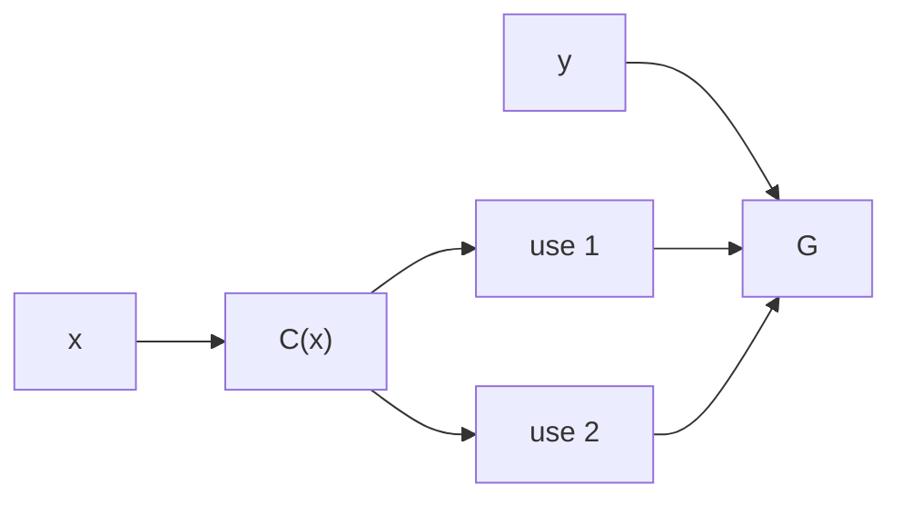
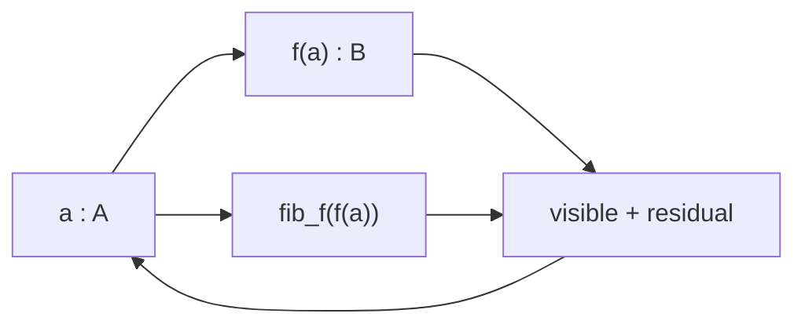
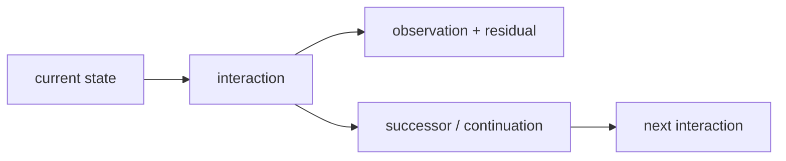

# Bend, HVM, and Computational Univalence

## Interaction nets are back — with the proof system inside the reducer

The pre-release Bend2/HVM4 branch in this repository already runs **computational cubical type theory, Voevodsky univalence, dependent transport, higher composition, fibres, coinductive continuation, and HVM superposition/sharing as one runtime**. Equivalences proved or constructed by the program are executable representation changes; higher identities remain runtime structure; derived transformations re-enter later execution.

The direct consequence for HVM is the one that matters for Bend2: **interaction-net execution is no longer restricted to sharing discovered from the original syntactic reduction graph. Mathematical identity itself participates in reduction.** Equivalent work can be transported instead of recomputed; correlated alternatives remain one shared dependency; only genuinely separate product structure must cross.

For a running object $P$, let $\gamma$ be a lawful interaction path and let $c(e)$ be the physical cost of interaction $e$:

$$
C(\gamma)=\sum_{e\in\gamma}c(e),
\qquad
d(P,Q)=\min_{\gamma:P\leadsto Q}C(\gamma).
$$

The combined system computes over equivalent presentations of $P$ and selects the factored presentation/path requiring minimum cost under the represented cost semantics. With unit interaction cost,

$$
d(P,Q)=\min_{\gamma:P\leadsto Q}|\gamma|.
$$

That is minimum-interaction reduction: the exact quantity that made higher-order interaction nets lose to lower-order variants becomes part of the mathematics executed by the runtime.


This is already implemented against the pre-release `DKormann/Bend2 @ f026483` lineage and HVM4. The full target retains interval expressions, paths, universe paths, dependent type constructors, `coe`, `hcomp`, `Glue`, quotients and unresolved partial compositions at runtime. A basic univalent reduction executes natively:

$$
\mathrm{coe}\big(i\mapsto\mathrm{ua}(\mathrm{not})(i),\mathrm{True}\big)
\leadsto
\mathrm{False}.
$$

The rest of this report is the construction underneath that result. Every step is elementary: distinction, product, sharing, composition, factorization, identity, transport, continuation.

---

## HVM already represents the information geometry

Take the smallest nontrivial distinction,

$$
\mathbf 2=\{0,1\}.
$$

Two uses of the *same* distinction occupy the diagonal

$$
\Delta_{\mathbf2}
=
\{(0,0),(1,1)\}
\subset
\mathbf2\times\mathbf2,
$$

with

$$
\Delta_{\mathbf2}\simeq\mathbf2,
\qquad
\pi_1|_{\Delta}=\pi_2|_{\Delta}.
$$

Two separately varying Boolean coordinates occupy the full product

$$
\mathbf2^2
=
\mathbf2\times\mathbf2
=
\{(0,0),(0,1),(1,0),(1,1)\}.
$$

The product projections

$$
\pi_1,\pi_2:\mathbf2^2\to\mathbf2
$$

are its coordinate directions: an edge in one direction changes $\pi_1$ while preserving $\pi_2$; the other changes $\pi_2$ while preserving $\pi_1$.

```text
 (0,1) -------- (1,1)
   |               |
   |               |
 (0,0) -------- (1,0)
```

The Shannon information of the finite Boolean cube is

$$
H(\mathbf2^n)=\log_2|\mathbf2^n|=n,
$$

while

$$
H(\Delta_{\mathbf2})=\log_2|\Delta_{\mathbf2}|=1.
$$

HVM's labelled DUP/SUP rules preserve exactly this difference. Same-label interaction routes one branching coordinate through its uses,

$$
\mathrm{DUP}_L\bowtie\mathrm{SUP}_L\longrightarrow\text{route},
$$

whereas different labels cross,

$$
\mathrm{DUP}_L\bowtie\mathrm{SUP}_M,\quad L\neq M
\longrightarrow\text{cross},
$$

because both product coordinates remain. Sharing is the faithful representation of the distinction structure before reduction begins.

A square appears for the same reason when two local reductions $r$ and $s$ commute:

```text
        r
   x --------> x_r
   |            |
 s |            | s
   v            v
  x_s -------> x_rs
        r
```

The two boundary paths are sequential schedules of one 2-dimensional dependency cell. Three separately varying commuting reductions generate a cube; higher products continue identically. The interaction net is a computational cell complex.

## Factoring removes distinctions that execution never needed

If

$$
F(x,y)=G(C(x),C(x),y),
$$

then $C(x)$ is one determined value with two uses. The faithful dependency graph contains one $C(x)$:



Two independently evaluated copies introduce a distinction absent from $F$; sharing removes it.

Composition

$$
A\xrightarrow{f}B\xrightarrow{g}C
\qquad\mapsto\qquad
g\circ f:A\to C
$$

builds from factors; factorization reads the same equation backward. Multiplication is one composition law,

$$
60=2^2\cdot3\cdot5.
$$

A prime $p$ is irreducible when $p=ab$ has no nontrivial factorization. A computation is irreducible relative to primitive interactions and cost when no cheaper lawful factorization yields the same demanded observation.

HVM/Lamping-style optimal sharing identifies work through reduction-family structure represented in the net. Two program structures can also be mathematically equivalent without belonging to one syntactic reduction family. Executing that larger identity requires equality itself to reduce.

## Univalence makes representation equivalence executable

Let

$$
e:A\simeq B
$$

be an invertible representation change. Voevodsky univalence gives

$$
(A=_{\mathcal U}B)\simeq(A\simeq B),
$$

hence

$$
\mathrm{ua}(e):A=_{\mathcal U}B.
$$

Computational cubical type theory reduces transport along this identity to the represented equivalence:

$$
\mathrm{transport}(\mathrm{ua}(e),x)\leadsto e(x).
$$

An established representation equivalence is therefore itself an executable representation change.

For $f:A\to A$,

$$
f\mapsto e\circ f\circ e^{-1}:B\to B.
$$

The linear-algebra specialization is change of basis,

$$
[T]_{B'}=P^{-1}[T]_BP.
$$

Compiler representation change and basis change are the same transport law specialized to different structured types.

## Cubical identity retains the geometry of execution

An identity $p:a=_A b$ is represented cubically by

$$
p:I\to A,
\qquad
p(0)=a,
\quad
p(1)=b.
$$

Paths themselves have identities,

$$
p,q:a=_A b,
\qquad
\alpha:p=q.
$$

The HVM commuting square and a cubical 2-cell have the same boundary: two directions and coherence between their composites.

A symmetry is an invertible self-transformation,

$$
\mathrm{Aut}(A)=A\simeq A.
$$

Univalence identifies symmetries with loops in the universe,

$$
\Omega(\mathcal U,A)\simeq\mathrm{Aut}(A).
$$

The object called symmetry in algebra is the object called a loop in homotopy when the ambient type is the universe.

For a varying family

$$
P:I\to\mathcal U,
$$

cubical coercion is

$$
\mathrm{coe}(P,r,s):P(r)\to P(s).
$$

A compatible partial square/cube determines its missing face by Kan composition. `hcomp` composes in a fixed type; `comp` combines composition with transport. Function transport moves the argument backward and result forward; dependent-pair transport moves the first component and then the second in its transported family; path transport constructs the required higher cell; `Glue` realizes universe transport so that `ua(e)` executes $e$.

The continuous constructions use the same elements. A local evolution law

$$
\dot x=F(x)
$$

composes into a trajectory. A connection transports a fibre element along a path,

$$
\mathrm{PT}_\gamma:E_x\to E_y,
$$

and holonomy records residual route dependence. Family, path, local relation, transport and composition are common primitives; cubical and differential geometry retain different additional structure.

## Every observation is exactly a visible result plus its fibre

For

$$
f:A\to B,
$$

define

$$
\mathrm{fib}_f(b)
:=
\sum_{a:A}(f(a)=b).
$$

Every $a:A$ maps to

$$
\big(f(a),(a,\mathrm{refl})\big),
$$

and the stored $a$ gives the inverse. Hence

$$
A\simeq\sum_{b:B}\mathrm{fib}_f(b).
$$

The source is its visible result together with exactly the preimage distinction the result does not determine.



Topology calls this a fibre; type theory reads the dependent sum; execution reads residual/provenance; reversible computation reads the state required to reconstruct the source. The construction is unchanged.

An equivalence has contractible fibres. A many-to-one visible map has nontrivial fibre somewhere. Logical erasure occurs when this residual distinction is discarded rather than retained in the total state, the exact boundary used by reversible computation and Landauer/Bennett.

A unitary physical transformation satisfies

$$
U^\dagger U=I
$$

and preserves total Hilbert-space state structure. An observable exposes selected structure. Linear superposition

$$
|\psi\rangle=\sum_i\alpha_i|i\rangle
$$

combines alternatives before observation; relative amplitudes/phases carry distinctions that independent enumeration would erase. State, transformation, observation and retained distinction are the same elements already present computationally.

## The universal family contains every dependent computation

Let $\mathcal U$ be a universe of types. Its universal family is

$$
\pi:\sum_{X:\mathcal U}X\to\mathcal U.
$$

A dependent family

$$
P:B\to\mathcal U
$$

has total space

$$
\sum_{b:B}P(b).
$$

Every map $f:A\to B$ produces the family

$$
P_f(b)=\mathrm{fib}_f(b),
$$

with

$$
A\simeq\sum_{b:B}P_f(b).
$$

Maps are therefore represented by dependent families already classified by the universe. Equivalences become identities by univalence; identities have higher identities; cubical composition computes them. Every level remains structure in the same universe.

Logic specializes the same terms:

$$
P\Rightarrow Q\equiv P\to Q,
$$

$$
P\land Q\equiv P\times Q,
$$

$$
\exists x:A.P(x)\equiv\sum_{x:A}P(x).
$$

Algebraic structures are carrier types with operations and identities; groups, rings, fields, modules and vector spaces differ by those operations/laws. Number theory studies particular arithmetic structures and factorization. Category theory retains objects, maps, identity and composition; higher categories retain transformations among transformations. Sets are 0-truncated types; quotients add specified identities; analysis adds limiting/continuous structure; topology retains deformation/identity structure. The foundational objects remain types, terms, relations, families, composition and identity.

A new mathematical domain therefore does not require a new runtime species. Its structure is representable in the same universe, and its established equivalences are executable identities.

## Coinduction returns mathematical consequence to execution

A terminating program has type

$$
A\to B.
$$

A continuing process exposes an observation and another process,

$$
X\to O\times X.
$$

The dependent interaction implemented here returns successor, dependent observation/event, exact residual and continuation together. The continuation is again executable structure.



If an interaction constructs a proof, equivalence or transformation, that result is a term consumed by later interaction:

$$
\text{interaction}
\to
\text{mathematical consequence}
\to
\text{new executable interaction}.
$$

The proof system is therefore inside the continuing runtime: inference changes the object subsequently reduced.

## The running Bend2/HVM4 implementation

The implementation is built against `DKormann/Bend2 @ f026483` and HVM4. [`RUNTIME_FULL.md`](./RUNTIME_FULL.md), [`PUSC.md`](./PUSC.md), and [`LIST_TRANSPORT_FIX.md`](./LIST_TRANSPORT_FIX.md) contain the runtime details.

The full target retains interval expressions, path lambdas, universe paths, dependent type constructors, `coe`, `hcomp`, `Glue`, quotient structure and suspended partial compositions. Runtime coercion dispatches on the transported type: functions transport input backward/output forward; dependent pairs transport first component then dependent second; paths build composition squares; universe paths execute represented equivalences.

Unknown faces remain data until later interaction determines them:

```text
partial boundary
      │
      ▼
#HCm{type, faces, base}
      │
      │ later interval information
      ▼
local reduction
```

A superposed type line uses HVM4's own match/superposition behavior. Runtime type dispatch distributes through the superposition while DUP/SUP preserves branch correlation. Cubical semantics and HVM sharing meet inside reduction rather than an external preprocessing pass.

The full runtime has executed forward/backward univalent transport, composite/inverse equivalences, dependent function/pair lines, fibre presentation/retrieval, contraction paths, superposed lines, `Glue`-derived univalence, two-dimensional universe composition and quotient recursion.

The List transport correction shows the compiler boundary concretely:

```text
old:  List(ua(not) @ i) : [True]  → [True]
new:  List(ua(not) @ i) : [True]  → [False]
```

The corrected runtime transports each head through the selected element-type line while preserving the tail and branch correlation. Equality changed the emitted HVM reduction.

## Complete mathematical factoring changes the interaction count

For the running object, the reducer repeatedly encounters only the elementary distinction already visible in DUP/SUP:

$$
\text{identified/correlated structure}\longrightarrow\text{share/route},
$$

$$
\text{separate product structure}\longrightarrow\text{compose/cross}.
$$

Cubical identity, univalence, fibres and inference determine which structure is actually separate.

A proposed cheaper representation