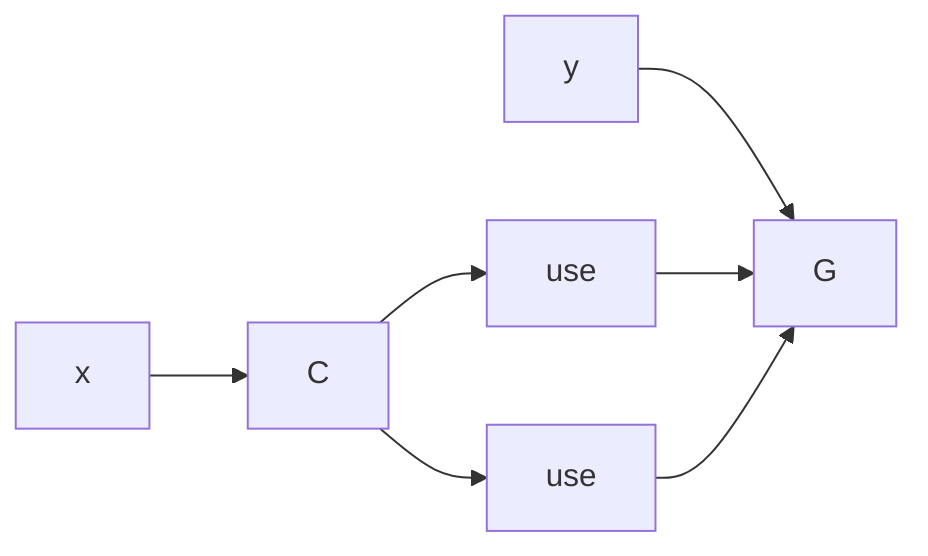

# Bend × HVM × Computational Univalence

## Distinction · bit · Boolean · observation

$$
\mathbf2:=\{0,1\}
$$

**bit · Boolean type · elementary distinction**

$$
f:X\to\mathbf2
$$

**Boolean program · predicate · binary observation**

$$
X\simeq\sum_{b:\mathbf2}\operatorname{fib}_f(b)
$$

**state = observed bit + exact residual state**

The last identity will reappear after `fib` is constructed; it is already the complete information-preserving form of a Boolean decision.

---

## Product · coordinates · cube · Shannon information

$$
\mathbf2^n:=\prod_{i=1}^{n}\mathbf2
$$

**Boolean $n$-cube · product type · $n$ Boolean coordinates**

$$
\pi_i:\mathbf2^n\to\mathbf2
$$

**coordinate projection · Boolean observation**

$$
|\mathbf2^n|=2^n
$$

$$
H(\mathbf2^n):=\log_2|\mathbf2^n|=n
$$

**Shannon information · $n$ binary distinctions**

$$
|X\times Y|=|X||Y|
$$

$$
H(X\times Y)=H(X)+H(Y)
$$

**product composition · additive information**

$$
\Delta_X:X\to X\times X,
\qquad
\Delta_X(x):=(x,x)
$$

**diagonal · duplication · one value, two uses**

For $X=\mathbf2$,

$$
\Delta_{\mathbf2}(\mathbf2)
=
\{(0,0),(1,1)\}
\simeq\mathbf2
$$

and

$$
\pi_1\circ\Delta_{\mathbf2}
=
\pi_2\circ\Delta_{\mathbf2}
=
\operatorname{id}_{\mathbf2}.
$$

**two projections · one varying Boolean coordinate**

By contrast,

$$
\mathbf2\times\mathbf2
=
\{(0,0),(0,1),(1,0),(1,1)\}
$$

contains both coordinate variations.

```text
 (0,1) -------- (1,1)
   |               |
   |               |
 (0,0) -------- (1,0)
```

**square · 2-cube · product of two Boolean coordinates**

---

## DUP/SUP · diagonal/product · sharing

$$
\mathrm{DUP}_L\bowtie\mathrm{SUP}_L
\longrightarrow
\text{route}
$$

$$
\longleftrightarrow
$$

$$
\Delta_X:X\to X\times X
$$

**same label · same branching coordinate · diagonal sharing**

$$
\mathrm{DUP}_L\bowtie\mathrm{SUP}_M,\quad L\neq M
\longrightarrow
\text{cross}
$$

$$
\longleftrightarrow
$$

$$
X\times Y
$$

**distinct labels · product coordinates · crossing**

$$
\text{same dependency}\Rightarrow\text{share}
$$

$$
\text{separate product factors}\Rightarrow\text{compose}
$$

An interaction net is therefore a **computational cell complex**: terms/agents occupy cells; elementary interactions are local relations; commuting local relations generate higher cells.

---

## Composition · factorization · irreducibility

$$
A\xrightarrow{f}B\xrightarrow{g}C
$$

$$
A\xrightarrow{g\circ f}C
$$

**composition · sequential program composition · path concatenation**

$$
F(x,y)=G(C(x),C(x),y)
$$

$$
\Delta\circ C:x\mapsto(C(x),C(x))
$$

**common factor · one computation, two uses**



$$
p=ab
$$

**multiplicative factorization**

$$
p=ab\Rightarrow a\in R^\times\ \lor\ b\in R^\times
$$

**irreducible · prime element**

$$
P=Q\circ R
$$

**program factorization**

$$
\nexists(Q,R)\text{ cheaper nontrivial with }P=Q\circ R
$$

**computational irreducibility relative to the chosen primitive/cost**

Composition and factorization are opposite orientations of the same equation. Prime decomposition, CSE, sharing and program factoring differ by the composition law being factored.

---

## Relation · algebra · category · program

$$
f:A\to B
$$

**map · function · deterministic transformation · program**

$$
\mu:M\times M\to M
$$

**binary operation**

$$
\mu(\mu(x,y),z)=\mu(x,\mu(y,z))
$$

**associativity · equality of two composition trees**

$$
\mu(e,x)=x=\mu(x,e)
$$

**identity element**

$$
\mu(x,x^{-1})=e=\mu(x^{-1},x)
$$

**inverse**

$$
(M,\mu,e,(-)^{-1})
$$

**group · algebraic structure**

$$
\operatorname{id}_A:A\to A,
\qquad
h\circ(g\circ f)=(h\circ g)\circ f
$$

**identity + associative composition · category**

A program, algebraic morphism and categorical arrow are the same elemental object $f:A\to B$ with different retained structure.

---

## Dependent type · family · total space

$$
P:B\to\mathcal U
$$

**dependent type · indexed family · bundle/fibration presentation**

$$
\sum_{b:B}P(b)
$$

**dependent sum · total space**

$$
\prod_{b:B}P(b)
$$

**dependent function · section/product**

$$
P\to Q
$$

**function type · implication**

$$
P\times Q
$$

**product type · conjunction**

$$
\sum_{x:A}P(x)
$$

**dependent pair · existential witness**

$$
\text{proof}\;:=\;\text{term inhabiting the proposition/type}
$$

**logic · type theory · executable term**

---

## Identity · path · homotopy · symmetry

$$
a=_A b
$$

**identity type · path from $a$ to $b$**

Cubically,

$$
p:I\to A,
\qquad
p(0)=a,\quad p(1)=b.
$$

**path · one varying interval coordinate**

$$
p,q:a=_A b
$$

$$
\alpha:p=q
$$

**path between paths · 2-cell · homotopy**

Two composable local transformations:

```text
        r
   x --------> x_r
   |            |
 s |            | s
   v            v
  x_s -------> x_rs
        r
```

$$
r;s=s;r
$$

when the square commutes.

**commuting reductions · coherent parallel composition · 2-cell**

$$
\operatorname{Aut}(A):=(A\simeq A)
$$

**symmetry · invertible self-transformation**

$$
\Omega(\mathcal U,A)\simeq\operatorname{Aut}(A)
$$

**loop in the universe · symmetry of $A$**

---

## Equivalence · univalence · executable representation change

$$
e:A\simeq B
$$

**equivalence · invertible semantics-preserving representation change**

Voevodsky:

$$
\boxed{(A=_{\mathcal U}B)\simeq(A\simeq B)}
$$

**Univalence Axiom · equivalence = identity in the universe**

$$
\operatorname{ua}(e):A=_{\mathcal U}B
$$

**equivalence represented as path**

Cubical computation:

$$
\boxed{\operatorname{transport}(\operatorname{ua}(e),x)\leadsto e(x)}
$$

**identity elimination · representation change · execution**

For $f:A\to A$,

$$
f\mapsto e\circ f\circ e^{-1}:B\to B.
$$

**transport of an endomorphism · conjugation**

For a basis change $P$,

$$
[T]_{B'}=P^{-1}[T]_BP.
$$

**linear-algebraic specialization of the same transport law**

Compiler equivalence no longer requires a theorem-specific rewrite primitive: the equivalence itself supplies the executable path.

---

## `coe` · `hcomp` · `comp` · Kan filling

$$
P:I\to\mathcal U
$$

$$
\operatorname{coe}(P,r,s):P(r)\to P(s)
$$

**varying type · coercion/transport**

$$
\operatorname{hcomp}_A(\varphi,u,a_0):A
$$

**partial boundary + base · homogeneous composition**

$$
\operatorname{comp}_P=\operatorname{coe}+\operatorname{hcomp}
$$

**varying-family composition · Kan filling**

$$
\Pi\text{-transport}:
\text{domain}^{-1}\ ;\ \text{codomain}
$$

**contravariant input · covariant output**

$$
\Sigma\text{-transport}:
(a,b)\mapsto(a',b')
$$

with $b'$ transported in the family indexed by $a'$.

**dependent pair transport**

$$
\operatorname{transport}(\operatorname{ua}(e),x)=e(x)
$$

**`Glue` · computational univalence**

$$
\dot x=F(x)
$$

**local continuous evolution law**

$$
\operatorname{PT}_\gamma:E_x\to E_y
$$

**parallel transport through a geometric family**

$$
\operatorname{Hol}(\gamma)=\operatorname{PT}_\gamma
$$

**holonomy · residual path dependence**

Family, path, local law, transport and composition are the shared elements; discrete cubical and continuous differential constructions specialize them differently.

---

## Fibre · residual · lossless presentation

$$
f:A\to B
$$

$$
\operatorname{fib}_f(b):=
\sum_{a:A}(f(a)=b)
$$

**homotopy fibre · exact preimage with witness · residual relative to observation $b$**

$$
a\mapsto\big(f(a),(a,\operatorname{refl})\big)
$$

$$
A\longrightarrow\sum_{b:B}\operatorname{fib}_f(b)
$$

and

$$
\big(b,(a,p)\big)\mapsto a.
$$

Therefore

$$
\boxed{A\simeq\sum_{b:B}\operatorname{fib}_f(b)}
$$

**source = visible result + exact residual**

$$
f\text{ equivalence}
\iff
\forall b:B,\;\operatorname{fib}_f(b)\text{ contractible}
$$

**invertibility · no unresolved preimage distinction**

$$
f(a_1)=f(a_2),\quad a_1\neq a_2
$$

**many-to-one observation · visible information loss**

$$
\big(f(a),\operatorname{fib}_f(f(a))\big)
$$

**reversible completion · retained provenance · retained distinction**

$$
\text{logical erasure}\;=\;\text{discarded preimage distinction}
$$

**Landauer/Bennett boundary**

---

## Unitary · observable · field · locality

$$
U^\dagger U=I
$$

**unitary evolution · invertible information-preserving transformation**

$$
|\psi\rangle=\sum_i\alpha_i|i\rangle
$$

**linear superposition · one state represented in a basis of alternatives**

$$
O:\mathcal H\to\mathcal O
$$

**observable · projection/readout of state structure**

$$
\phi:M\to V
$$

**field · state/value indexed over spacetime/base $M$**

$$
G\curvearrowright X
$$

**symmetry action**

$$
x\sim g\cdot x
$$

**gauge-equivalent presentations when the observable structure identifies the orbit**

$$
\operatorname{supp}(\text{influence after }n)
\subseteq
\operatorname{Cone}_n
$$

**local interaction · causal/light cone**

$$
S[\gamma]=\int L(\gamma,\dot\gamma)\,dt,
\qquad
\delta S=0
$$

**action · extremal lawful history**

$$
d(x,y)=\inf_{\gamma:x\leadsto y}L(\gamma)
$$

**metric length · geodesic**

State, relation, symmetry, observation, locality, path and composition are unchanged; theoretical physics specifies their physical carriers and laws.

---

## Universal family · maps as families · mathematical closure

$$
\pi:\sum_{X:\mathcal U}X\to\mathcal U
$$

**universal family**

$$
P:B\to\mathcal U
$$

**every dependent family classified by a map into $\mathcal U$**

For every $f:A\to B$,

$$
P_f(b):=\operatorname{fib}_f(b)
$$

and

$$
A\simeq\sum_{b:B}P_f(b).
$$

**map = classified fibre family + total-space projection**

$$
(A=_{\mathcal U}B)\simeq(A\simeq B)
$$

**equivalences internalized as identities**

$$
(p=q),\;(\alpha=\beta),\ldots
$$

**higher identities internalized recursively**

$$
\operatorname{comp}
$$

**compatible higher structure computed internally**

$$
\boxed{
\text{types}\;\supset\;
\text{families}\;\supset\;
\text{maps}\;\supset\;
\text{equivalences}\;\supset\;
\text{identities}\;\supset\;
\text{higher identities}
}
$$

All remain terms/structure of the same universe.

---

## Induction · coinduction · continuation

$$
\mathbb N=\mu X.(1+X)
$$

**inductive fixed point · finite construction**

$$
\operatorname{Stream}(A)=\nu