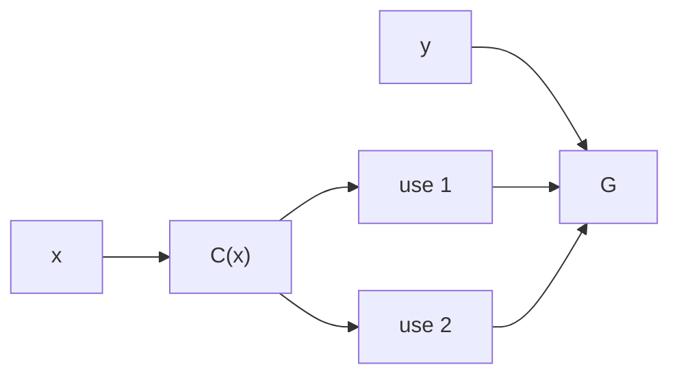
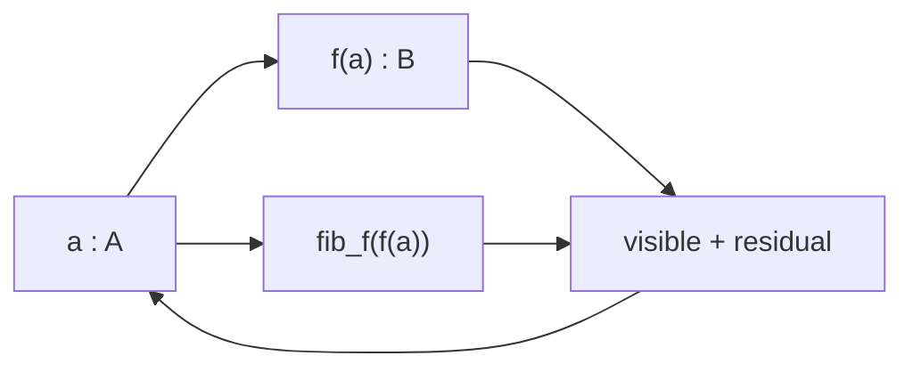
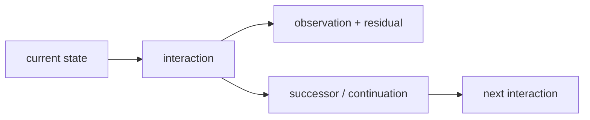

# Bend, HVM, and Computational Univalence

HVM represents computation as local interaction. An active pair rewrites from information available at that pair; disjoint active pairs need no global execution order. DUP makes reuse explicit. SUP makes alternatives explicit. A label records whether two occurrences belong to the same branching structure. These are already enough to expose the mathematical object that the runtime is reducing.

Take the smallest nontrivial distinction,

$$
\mathbf 2=\{0,1\}.
$$

Two uses of the *same* distinction occupy the diagonal

$$
\Delta_{\mathbf2}
=
\{(0,0),(1,1)\}
\subset
\mathbf2\times\mathbf2,
$$

with

$$
\Delta_{\mathbf2}\simeq\mathbf2,
\qquad
\pi_1|_{\Delta}=\pi_2|_{\Delta}.
$$

Two separately varying Boolean coordinates occupy the full product

$$
\mathbf2^2
=
\mathbf2\times\mathbf2
=
\{(0,0),(0,1),(1,0),(1,1)\}.
$$

The two product projections

$$
\pi_1,\pi_2:\mathbf2^2\to\mathbf2
$$

are the two coordinate directions: an edge in one direction changes $\pi_1$ while preserving $\pi_2$; an edge in the other changes $\pi_2$ while preserving $\pi_1$.

```text
 (0,1) -------- (1,1)
   |               |
   |               |
 (0,0) -------- (1,0)
```

The Shannon information of the finite Boolean cube is therefore

$$
H(\mathbf2^n)=\log_2|\mathbf2^n|=\log_2 2^n=n,
$$

while

$$
H(\Delta_{\mathbf2})
=
\log_2|\Delta_{\mathbf2}|
=1.
$$

HVM's labelled DUP/SUP rules preserve exactly this difference. Same-label interaction routes one branching coordinate through its two uses,

$$
\mathrm{DUP}_L\bowtie\mathrm{SUP}_L
\longrightarrow
\text{route},
$$

whereas different labels must cross,

$$
\mathrm{DUP}_L\bowtie\mathrm{SUP}_M,\quad L\neq M,
\longrightarrow
\text{cross},
$$

because both product coordinates remain present. Sharing is therefore not an optimization applied after the computation has been represented: it is the faithful representation of how many distinctions the computation contains.

A square appears for the same reason when two local reductions $r$ and $s$ do not depend on one another:

```text
        r
   x --------> x_r
   |            |
 s |            | s
   v            v
  x_s -------> x_rs
        r
```

The two boundary paths are the two sequential schedules. The square records the computation before either schedule is chosen. Three separately varying reductions generate a cube; higher products continue identically. An interaction net is thus naturally a computational cell complex: local transformations are edges, and compatible independent transformations generate higher cells.

## Factoring removes distinctions that execution never needed

Ordinary code already distinguishes one value used twice from two independently computed values. If

$$
F(x,y)=G(C(x),C(x),y),
$$

then $C(x)$ is one determined value with two uses. The faithful dependency graph contains one node for $C(x)$ and two outgoing uses:



Writing two independent copies of $C(x)$ introduces a degree of freedom absent from $F$. Sharing removes that artificial distinction.

This is factorization in its ordinary mathematical sense. Composition

$$
A\xrightarrow{f}B\xrightarrow{g}C
\qquad\mapsto\qquad
g\circ f:A\to C
$$

builds a transformation from factors; factorization reads the same equation in the opposite direction. Multiplication is one composition law, so

$$
60=2^2\cdot3\cdot5
$$

is the same operation specialized to integers. A prime is irreducible because

$$
p=ab
$$

has no nontrivial factorization. A computation is irreducible relative to a chosen primitive interaction and cost when no cheaper lawful factorization computes the same demanded observation.

HVM/Lamping-style optimal sharing identifies work through reduction-family structure already represented in the net. The general compiler problem is larger: two program structures may be mathematically equivalent without belonging to the same syntactic reduction family. Making *that* identity executable requires equality itself to participate in reduction.

## Univalence makes representation equivalence executable

Every semantics-preserving optimization contains an equivalence. If $A$ and $B$ are two representations of the same structure,

$$
e:A\simeq B
$$

contains the forward map, inverse map, and the identities witnessing that they undo one another. A conventional compiler turns selected such equivalences into separately implemented passes.

Voevodsky's Univalence Axiom internalizes the general operation:

$$
(A=_{\mathcal U}B)\simeq(A\simeq B).
$$

Thus

$$
\mathrm{ua}(e):A=_{\mathcal U}B.
$$

Cubical type theory gives this identity a computation rule:

$$
\mathrm{transport}(\mathrm{ua}(e),x)
\leadsto
e(x).
$$

An established representation equivalence is therefore itself a representation change.

The familiar change-of-basis law is the same transport specialized to linear structure. For $f:A\to A$ and $e:A\simeq B$,

$$
f\mapsto e\circ f\circ e^{-1}:B\to B.
$$

For a basis-change matrix $P$,

$$
[T]_{B'}=P^{-1}[T]_BP.
$$

Nothing new is required for programs: a compiler representation is another coordinate system, and a proved invertible change of coordinates transports every dependent structure carried by it.

## Cubical identity retains the geometry of execution

An identity $p:a=_A b$ is represented cubically as a path over an interval $I$,

$$
p:I\to A,
\qquad
p(0)=a,
\quad
p(1)=b.
$$

Two paths may themselves be related,

$$
p,q:a=_A b,
\qquad
\alpha:p=q,
$$

so identity has the same higher-cell structure already produced by commuting reductions. The HVM square above and a cubical 2-cell have the same boundary data: two directions, four edges, and coherence between the two composites.

A symmetry is an invertible self-transformation,

$$
\mathrm{Aut}(A)=A\simeq A.
$$

Univalence identifies it with a loop at $A$ in the universe,

$$
\Omega(\mathcal U,A)\simeq\mathrm{Aut}(A).
$$

The object called a symmetry in algebra is therefore the object called a loop in homotopy when the ambient space is the univalent universe. Geometry records relations and their composition as paths/cells; algebra records the same relations through operations and laws.

Cubical composition makes the higher cells executable. For a varying family

$$
P:I\to\mathcal U,
$$

transport is

$$
\mathrm{coe}(P,r,s):P(r)\to P(s).
$$

A compatible partial square or cube determines a missing face by Kan composition. `hcomp` composes inside a fixed type; general `comp` combines composition with transport through a varying type. Function transport moves the argument backward and result forward; dependent-pair transport moves the first component and then the second in the transported family; path transport constructs the required higher cell; `Glue` realizes universe-level transport so that `ua(e)` executes $e$.

The continuous notation is built from the same elements. A local evolution law

$$
\dot x=F(x)
$$

composes into a trajectory. A connection transports a fibre element along a path,

$$
\mathrm{PT}_\gamma:E_x\to E_y,
$$

and holonomy records the residual dependence on the route. Cubical and differential geometry differ in structure carried by the paths, not in the elemental vocabulary: family, path, local relation, transport, composition.

## Every observation is exactly a visible result plus its fibre

For any map

$$
f:A\to B,
$$

the fibre over $b:B$ is

$$
\mathrm{fib}_f(b)
:=
\sum_{a:A}(f(a)=b).
$$

Every $a:A$ determines

$$
a
\longmapsto
\big(f(a),(a,\mathrm{refl})\big),
$$

and the stored $a$ gives the inverse. Hence

$$
A\simeq\sum_{b:B}\mathrm{fib}_f(b).
$$

The equation contains the complete information semantics of a deterministic observation: the source is its visible value together with exactly the preimage distinction that the visible value does not determine.



A topologist calls this a fibre. A type theorist reads the dependent sum. A runtime engineer can read residual state or provenance. Reversible computing reads the ancillary state required to reconstruct the source. These names select different uses of the same decomposition.

An equivalence has contractible fibres. A many-to-one visible map has nontrivial fibre somewhere. Logical erasure occurs exactly when that residual distinction is discarded rather than retained in the total state; this is the boundary used by reversible computation and Landauer/Bennett.

The same distinction is physical. A unitary transformation satisfies

$$
U^\dagger U=I
$$

and preserves the total Hilbert-space state structure. An observable exposes selected structure of that state. Linear superposition

$$
|\psi\rangle=\sum_i\alpha_i|i\rangle
$$

combines alternatives before observation; interference is carried by the relative amplitudes/phases that would be lost by replacing the state with independently enumerated visible alternatives. State, transformation, observation and residual distinction are the same elements already present in the computation.

## The universal family contains every dependent computation

Let $\mathcal U$ be a universe of types. Its universal family is

$$
\pi:\sum_{X:\mathcal U}X\to\mathcal U.
$$

A dependent family

$$
P:B\to\mathcal U
$$

assigns a type to each $b:B$, with total space

$$
\sum_{b:B}P(b).
$$

Every map $f:A\to B$ produces exactly such a family,

$$
P_f(b)=\mathrm{fib}_f(b),
$$

and the fibre identity reconstructs its domain:

$$
A\simeq\sum_{b:B}P_f(b).
$$

Maps are therefore represented by dependent families already classified by the universe. Equivalences between their types become identities by univalence. Identities have higher identities. Cubical composition computes with those identities. The constructions remain in the same universe at every level.

The usual mathematical vocabularies specialize this same structure. A proposition is a type whose relevant datum is an inhabitant; implication is a function

$$
P\Rightarrow Q\equiv P\to Q,
$$

conjunction is product

$$
P\land Q\equiv P\times Q,
$$

and existence is dependent sum

$$
\exists x:A.P(x)\equiv\sum_{x:A}P(x).
$$

An algebraic structure is a carrier type with operations and identities; groups, rings, fields, modules and vector spaces differ by those operations and laws. Number theory studies particular arithmetic structures and their factorization. Category theory retains objects, maps, identity and composition; higher categories retain transformations among transformations. Sets are the 0-truncated types whose identity has no higher variation. Quotients add specified identifications. Analysis adds limiting/continuous structure to spaces and maps. Topology retains deformation/identity structure. None changes the foundational elements: types, terms, relations, families, composition and identity.

This is why the universal family matters computationally. A new mathematical domain does not require a new kind of runtime object. Its structures are terms in the same universe, and its proved equivalences are eligible to become executable identities.

## Coinduction returns mathematical consequence to execution

A terminating program has type

$$
A\to B.
$$

A continuing process exposes an observation and another process,

$$
X\to O\times X.
$$

The dependent interaction used here carries more structure: request, successor, dependent observation/event, exact residual and continuation are produced together. The continuation is again an executable object of the same language.



If an interaction constructs a proof, equivalence or transformation, that result is a term. The continuation can execute it. Thus

$$
\text{interaction}
\to
\text{mathematical consequence}
\to
\text{new executable interaction}.
$$

The proof system is no longer a checker beside the runtime. Mathematical inference changes the object subsequently reduced by the runtime.

## The pre-release Bend2/HVM4 runtime already executes the cubical structure

The implementation in this repository is built against the pre-release `DKormann/Bend2 @ f026483` lineage and HVM4. [`RUNTIME_FULL.md`](./RUNTIME_FULL.md) records the full target; [`PUSC.md`](./PUSC.md) records the combined machine; [`LIST_TRANSPORT_FIX.md`](./LIST_TRANSPORT_FIX.md) records one concrete compiler correction.

The full target does not normalize cubical structure away before HVM emission. Runtime terms include interval expressions, path lambdas, universe paths, dependent type constructors, `coe`, `hcomp`, `Glue`, quotient structure and suspended partial compositions.

Runtime coercion dispatches on the type being transported. For a function type it transports the argument backward and the result forward. For a dependent pair it transports the first component and then the dependent second component. For a path it builds the required composition square. For a universe path it executes the represented equivalence.

A partial composition whose face is not yet determined remains a runtime object:

```text
partial boundary
      │
      ▼
#HCm{type, faces, base}
      │
      │ later interval information
      ▼
local reduction
```

A superposed type line uses HVM4's own match/superposition behavior: runtime type dispatch distributes through the superposition while DUP/SUP preserves the branch correlation. Cubical semantics and HVM sharing therefore meet in the reducer rather than in an external preprocessing pass.

The basic univalent reduction runs natively:

$$
\mathrm{coe}
\big(i\mapsto\mathrm{ua}(\mathrm{not})(i),\mathrm{True}\big)
\leadsto
\mathrm{False}.
$$

The full runtime has exercised forward/backward univalent transport, composite and inverse equivalences, dependent function/pair lines, fibre presentation/retrieval, contraction paths, superposed lines, `Glue`-derived univalence, two-dimensional universe composition and quotient recursion.

The List transport bug exposed the exact compiler boundary. The checker transported the element type while the emitted full runtime initially treated `List` as rigid:

```text
old:  List(ua(not) @ i) : [True]  → [True]
new:  List(ua(not) @ i) : [True]  → [False]
```

The corrected runtime transports each head through the selected element-type line while preserving the tail and branch correlation. The fix is not an annotation about equality: it changes the HVM reduction performed by the emitted program.

## Complete mathematical factoring changes the interaction count itself

The running object now carries more