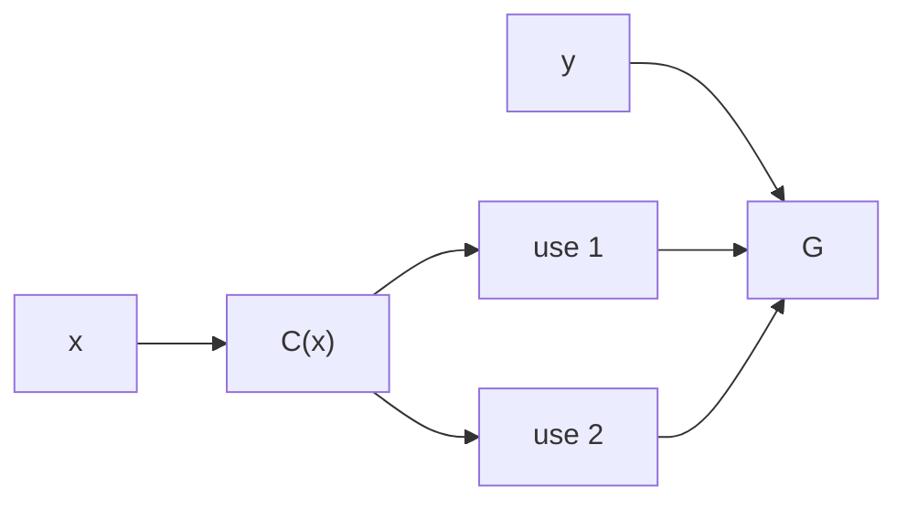
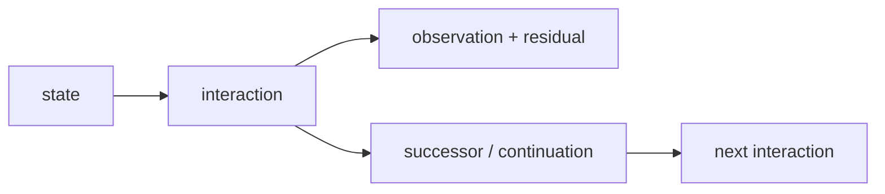
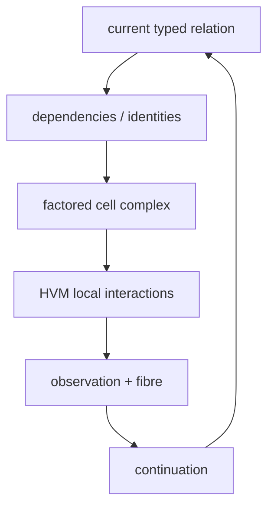

# Bend × HVM × Computational Univalence

A computation begins with a distinction. The smallest nontrivial distinction is

$$
\mathbf 2=\{0,1\}.
$$

A Boolean observation of a state space $X$ is a map

$$
f:X\to\mathbf2.
$$

The map does three things without changing object: it is a Boolean program, a proposition on $X$, and a partition of $X$ into the states observed as $0$ and those observed as $1$. **Logic, information and computation begin with the same distinction and its transformations.**

## Independent distinctions multiply; information adds; dimensions are independence

Take two Boolean observations $x,y$. If $y=x$, their joint values are only

$$
(0,0),(1,1).
$$

There is one independently variable coordinate. If $x$ and $y$ vary independently, their joint values are

$$
\mathbf2\times\mathbf2=\{(0,0),(0,1),(1,0),(1,1)\}.
$$

There are two independently variable coordinates. The product is a square because **dimension counts independent variation**.

For a finite uniform state space $X$, the number of binary distinctions required to identify a state is

$$
H(X)=\log_2|X|.
$$

Independent composition multiplies states,

$$
|X\times Y|=|X||Y|,
$$

therefore it adds information,

$$
H(X\times Y)=H(X)+H(Y).
$$

Correlation removes independent dimensions. In the extreme $Y=X$,

$$
H(X,Y)=H(X).
$$

HVM's labelled DUP/SUP interaction executes exactly this elementary distinction. A duplication meeting the superposition carrying the same dependency does not create a product:

$$
\mathrm{DUP}_L\bowtie\mathrm{SUP}_L\to\text{route}.
$$

Distinct dependencies must both remain:

$$
\mathrm{DUP}_L\bowtie\mathrm{SUP}_M,\quad L\neq M
\to\text{cross}.
$$

The first interaction preserves one dimension; the second constructs the product of two independent dimensions. The interaction net is therefore a computational cell complex: vertices are states, edges are elementary transformations, and higher cells are generated by independent transformations.

```text
        r
   x --------> x_r
   |            |
 s |            | s
   v            v
  x_s -------> x_rs
        r
```

The square is the computation with two independent transformations $r,s$. Its two boundary routes are the two sequential schedules. The cell itself is the dependency structure that both schedules traverse.

## Composition and factorization are one operation viewed in opposite directions

A transformation $f:A\to B$ followed by $g:B\to C$ composes to

$$
g\circ f:A\to C.
$$

Factoring asks for transformations whose composition is the given transformation. Ordinary code already uses this whenever repeated dependence is represented once. If

$$
F(x,y)=G(C(x),C(x),y),
$$

then the two occurrences of $C(x)$ are two uses of one determined value, not two independent values:



Representing $C(x)$ independently twice introduces a dimension absent from $F$; sharing removes that artificial dimension.

A prime is defined by the same relation for multiplication: $p$ is irreducible when

$$
p=ab
$$

forces one factor to be a unit. Thus prime factorization and program factoring are not analogous procedures; both are instances of **decomposing a composite under its composition law until no nontrivial factor remains**.

The corresponding computational irreducibles are distinctions that cannot be factored through already available structure without changing the demanded observation. Every interaction spent on a distinction already determined elsewhere is representation cost rather than necessary computation.

HVM's sharing calculus factors dependencies encoded in its net. The remaining question is therefore exact: **how can every mathematically valid identification of program structure become available to the reducer?**

## Equality becomes executable when equivalence is identity

A compiler optimization replaces one representation by another while preserving the observation that matters. Write such an equivalence

$$
e:A\simeq B.
$$

Dependent type theory makes $A$, $B$, $e$, programs consuming them, and proofs about them terms of one language. Voevodsky's Univalence Axiom identifies equivalence with identity in the universe:

$$
\boxed{(A=_{\mathcal U}B)\simeq(A\simeq B).}
$$

Hence

$$
\mathrm{ua}(e):A=_{\mathcal U}B.
$$

Cubical type theory gives this identity computational content. Transporting $x:A$ along the identity generated by $e$ reduces to applying $e$:

$$
\boxed{\operatorname{transport}(\mathrm{ua}(e),x)\leadsto e(x).}
$$

An equivalence is therefore already the semantics-preserving compiler transformation it proves valid.

For an endomorphism $f:A\to A$, transport across $e:A\simeq B$ gives

$$
f\mapsto e\circ f\circ e^{-1}:B\to B.
$$

Choosing another basis of a vector space gives the familiar specialization

$$
[T]_{B'}=P^{-1}[T]_BP.
$$

A basis change, a compiler representation change and univalent transport are the same operation: **conjugate structure through an invertible change of presentation**.

## Identity has dimensions because transformations compose independently

Cubical equality represents a path $p:a=_A b$ by a term varying over a formal interval $I$:

$$
p(i):A,\qquad p(0)=a,\quad p(1)=b.
$$

Two independent paths generate the square already produced by two independent HVM reductions. Three generate a cube. An equality between two paths is itself a path in the path space:

$$
p,q:a=_A b,\qquad \alpha:p=q.
$$

Higher identity is therefore not additional ontology; it is what remains when relations among transformations are retained rather than flattened to endpoint equality.

A self-equivalence $A\simeq A$ is a symmetry. Univalence turns it into a loop at $A$ in the universe:

$$
\Omega(\mathcal U,A)\simeq\operatorname{Aut}(A).
$$

Topology studies this path structure; algebra studies its composition laws; geometry studies the relations, dimensions and transport carried by the same structure.

## Cubical composition computes whatever a compatible boundary determines

A varying family is a map

$$
P:I\to\mathcal U.
$$

Transport moves an inhabitant through that family:

$$
\operatorname{coe}(P,r,s):P(r)\to P(s).
$$

A square or higher cube may be known on some faces and unknown on another. Kan composition computes the missing face from compatible boundary data. `hcomp` is composition in a fixed type; `coe` is transport with no side faces; general `comp` combines them.

The rules are structural. A function transports its argument backward and result forward. A dependent pair transports its first component and then its second in the transported family. A path transports through the corresponding square. `Glue` supplies the universe rule making

$$
\operatorname{coe}(\mathrm{ua}(e),x)\leadsto e(x).
$$

A differential equation is the continuous elementary version of the same local-to-global structure: a local law

$$
\dot x=F(x)
$$

composes into an evolution. A connection on a bundle transports a fibre element along a path,

$$
v\in E_x\mapsto\operatorname{PT}_\gamma(v)\in E_y,
$$

and holonomy records dependence on the chosen route. These are not imported metaphors; **family, path, local law, composition and transport are the elements from which both constructions are defined**.

## Every observation is exactly output plus fibre

For any map

$$
f:A\to B,
$$

fix $b:B$. The source states observed as $b$, together with the equality witnessing that observation, form

$$
\operatorname{fib}_f(b)=\sum_{a:A}(f(a)=b).
$$

Every $a:A$ determines

$$
\big(f(a),(a,\mathrm{refl})\big):
\sum_{b:B}\operatorname{fib}_f(b),
$$

and projecting the stored source gives the inverse. Therefore

$$
\boxed{A\simeq\sum_{b:B}\operatorname{fib}_f(b).}
$$

Nothing has been appended to the computation. The same source has been coordinatized as **what is visible** and **what the visible coordinate does not determine**.

This single construction is the preimage of topology, the dependent fibre of type theory, residual state of execution, provenance of a trace, conditional distinction of information theory and ancillary state of reversible computation because each phrase asks the same question: *what remains undetermined after this observation?*

If every fibre is contractible, each output has one source up to the relevant identity and $f$ is an equivalence. If a fibre contains independent distinction, the visible map has identified states.

Logical erasure is exactly such many-to-one identification. Carrying the fibre keeps the total presentation reversible; discarding it makes the visible transformation irreversible. Landauer's cost applies when physical implementation irreversibly erases such logical distinction.

Quantum evolution uses the same elementary conservation condition in Hilbert space. A unitary $U$ satisfies

$$
U^\dagger U=I,
$$

so total state distinction is preserved; an observable extracts a coordinate/statistic of that state. Superposition is linear composition before observation, and interference is the dependence created by composing amplitudes before projecting to an outcome. The relevant elements remain state, transformation, composition, observation and preserved distinction.

## The universe classifies the families from which maps, logic and structure are built

Let $\mathcal U$ be a universe of types. Its universal family is

$$
\boxed{\pi:\sum_{X:\mathcal U}X\to\mathcal U.}
$$

A family $P:B\to\mathcal U$ selects a type over each $b:B$; its total space is

$$
\sum_{b:B}P(b).
$$

The fibre family of every map $f:A\to B$ is such a family, and the previous identity gives

$$
A\simeq\sum_{b:B}\operatorname{fib}_f(b).
$$

Thus arbitrary maps are represented by families already classified by the universe. Equivalences between types become identities by univalence; identities have higher identities; cubical composition computes with them.

The standard foundations now require no change of elements. A proposition is a type whose relevant datum is inhabitation. Implication is a function,

$$
P\Rightarrow Q\;\equiv\;P\to Q,
$$

conjunction is product,

$$
P\land Q\;\equiv\;P\times Q,
$$

and existential quantification is dependent sum,

$$
\exists x:A.P(x)\;\equiv\;\sum_{x:A}P(x).
$$

An algebraic structure is a carrier type together with operations and laws. A monoid has $\mu:M\times M\to M$ and a unit satisfying identities; a group adds inverses; rings, fields, modules and vector spaces add operations/laws. A homomorphism preserves them. Number theory studies particular such objects and their factorization. Category theory retains objects, maps, identity and composition; higher categories retain transformations between transformations. A set is a type whose identity has no higher independent structure. A quotient introduces specified identities. Analysis equips spaces of values/functions with limiting structure. None introduces a new foundational species: each selects structure and laws inside the same universe.

The compression is exact:

$$
\boxed{\text{mathematical knowledge}=\text{typed relational structure and its lawful identities}.}
$$

## Coinduction makes the classified object continue

A terminating program has type $A\to B$. A continuing process exposes an observation and another process:

$$
X\to O\times X.
$$

In the dependent interactive construction, a request determines the successor, observation, event/residual and continuation together. The continuation is again an object of the same language.



If an interaction constructs an equivalence, proof or program transformation, that result is a term and can be consumed by the continuation. Hence

$$
\boxed{\text{interaction}\to\text{new relation}\to\text{new executable interaction}.}
$$

Inference is therefore not an external phase. The consequences of the current mathematical object become structure of the next mathematical object.

## HVM executes the resulting factorization

HVM's ordinary sharing relation identifies work through the structure represented by its interaction net. Computational univalence adds arbitrary established equivalence to the executable relation. Cubical composition adds higher coherent identities. Fibres retain distinctions hidden by visible projections. Coinduction lets every derived transformation re-enter execution.

For a running object, the reducer therefore has exactly two elementary cases already present in DUP/SUP:

$$
\text{identified/correlated structure}\to\text{share/route},
$$

$$
\text{independent structure}\to\text{compose/cross}.
$$

Everything else determines which case applies.



The performance quantity that motivated Bend2's move away from interaction nets can therefore be separated as

$$
T(P)=\sum_{e\in\gamma_P}c_{\mathrm{physical}}(e).
$$

The mathematics determines the shortest lawful interaction path $\gamma_P$; the physical runtime determines the cost of each realized interaction.

Define

$$
d(P,Q)=\min_{\gamma:P\leadsto Q}\sum_{e\in\gamma}c(e).
$$

A minimum-cost execution is a geodesic by definition. With unit interaction cost,

$$
d(P,Q)=\min_{\gamma:P\leadsto Q}\#\mathrm{interactions}(\gamma).
$$

A lower bound follows whenever a cheaper projection identifies states the demanded observation separates:

$$
q(x)=q(y),\qquad f(x)\neq f(y)
\quad\Rightarrow\quad
f\text{ does not factor through }q.
$$

Local interactions make this a causal bound: information cannot influence an observation without a path of interactions connecting it. A light cone is exactly the region reachable by those local relations within a given path length. Computational complexity, metric geometry and causal propagation are therefore the same path-length question once their primitive transformations and costs are fixed.

## Boolean programs make the cell complex visible

For $N$ Boolean variables,

$$
Q_N=\mathbf2^N.
$$

An assignment is a vertex; fixing coordinates gives a face. A 3-clause depends on three global coordinates; its violating assignment lifts to a codimension-three cell. Clauses sharing a variable share the same coordinate from the beginning.

For a clause $c:\mathbf2^3\to\mathbf2$,

$$
\mathbf2^3\simeq\sum_{b:\mathbf2}\operatorname{fib}_c(b).
$$

The one-bit observation leaves the remaining distinction in its fibres rather than destroying it.

The cube has $2^N$ vertices, but

$$
|Q_N|=2^N
$$

does not imply $2^N$ interactions: $Q_N$ itself is a factored product. Exponential work is forced only when independent incidence must be materialized after every available identification, transport and sharing