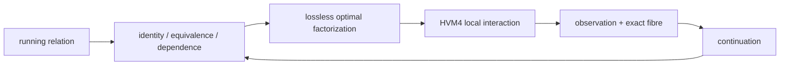

# Bend, HVM, and the Optimal Interaction Calculus

## The result

Bend2 left interaction nets because HOC could not make interaction-net execution as fast as lower-order execution on everyday hardware. The construction implemented in this repository changes that decision at its premise: **arbitrary computation is maintained as a lossless, maximally factored interaction object, and reduction follows the minimum-cost path admitted by its executable identities.**

This is not a proposed optimizer around HVM. Cubical identity, Voevodsky univalence, exact fibre completion, higher composition, SUP/DUP correlation, cost semantics, geodesic reduction, intrinsic rewrite and coinductive re-entry are already joined in the pre-release Bend2/HVM4 integration.

The distinction is exact. Earlier HVM asks for optimal reduction of a presented interaction net. The completed machine also computes the presentation:

```math
\text{program}
\longmapsto
\text{lossless equivalence class of presentations}
\longmapsto
\text{cost-optimal interaction presentation}
\longmapsto
\text{geodesic reduction}.
```

Optimization is not a phase before execution. The representation remains inside the same calculus as the computation; every derived equality or factorization can change subsequent reduction.

For primitive interaction cost $c(e)$ and path $\gamma$,

```math
C(\gamma)=\sum_{e\in\gamma}c(e),
\qquad
d(P,Q)=\min_{\gamma:P\leadsto Q}C(\gamma).
```

With unit interaction cost,

```math
d(P,Q)=\min_{\gamma:P\leadsto Q}|\gamma|.
```

The performance variable that motivated abandoning interaction nets is therefore the variable being minimized by the running mathematics itself.



The rest is the elementary construction of that statement.

---

## One distinction, two uses, two coordinates

The smallest nontrivial distinction is

```math
\mathbf2=\{0,1\}.
```

Two uses of the same distinction occupy the diagonal

```math
\Delta_{\mathbf2}=\{(0,0),(1,1)\}\subset\mathbf2^2,
```

with

```math
\Delta_{\mathbf2}\simeq\mathbf2,
\qquad
\pi_1|_\Delta=\pi_2|_\Delta.
```

Two separately varying Boolean coordinates occupy

```math
\mathbf2^2=\mathbf2\times\mathbf2
=\{(0,0),(0,1),(1,0),(1,1)\}.
```

```text
 (0,1) -------- (1,1)
   |               |
   |               |
 (0,0) -------- (1,0)
```

The product has two coordinate directions because it has two projections that may vary separately. Its finite Shannon information is

```math
H(\mathbf2^n)=\log_2|\mathbf2^n|=n,
```

while

```math
H(\Delta_{\mathbf2})=1.
```

HVM's labelled DUP/SUP interaction preserves this exact structure:

```math
\mathrm{DUP}_L\bowtie\mathrm{SUP}_L\longrightarrow\text{route},
```

```math
\mathrm{DUP}_L\bowtie\mathrm{SUP}_M\longrightarrow\text{cross}
\qquad(L\neq M).
```

Same branching coordinate: diagonal. Separate branching coordinates: product. Sharing is therefore representation of dependence, not bookkeeping after the fact.

Two commuting local transformations generate the same product geometry:

```text
        r
   x --------> x_r
   |            |
 s |            | s
   v            v
  x_s -------> x_rs
        r
```

The boundary paths are two schedules of one 2-cell. Three commuting directions generate a cube. The interaction object is already a computational cell complex.

---

## Composition and factorization

For

```math
A\xrightarrow fB\xrightarrow gC,
```

composition is $g\circ f$. Factorization reads the same equation backward.

If

```math
F(x,y)=G(C(x),C(x),y),
```

$C(x)$ is one determined value with two uses. Representing two independent copies introduces a distinction absent from $F$; sharing removes it.

Multiplication is another composition law:

```math
60=2^2\cdot3\cdot5.
```

A prime is irreducible under that law. A computational distinction is irreducible relative to declared primitive interactions and observation when it admits no cheaper lawful factorization preserving that observation.

Lamping/Lévy sharing factors reduction families already recognized by the representation. The missing operation is larger: **factor by every mathematical identity available to the running object.**

---

## Every visible computation has one exact lossless completion

For any visible map

```math
f:A\to B,
```

define its fibre over $b$:

```math
\mathrm{fib}_f(b)=\sum_{a:A}(f(a)=b).
```

Then

```math
A\simeq\sum_{b:B}\mathrm{fib}_f(b).
```

The source is exactly its visible result plus exactly what that result does not determine.

This is not arbitrary tracing machinery. The repository proves that lawful lossless completion of a fixed visible map is a property: its completion space is contractible. At machine level,

```math
\mathrm{LawfulStep}(A)\simeq(A\to A).
```

An ordinary step and its lossless proof-relevant presentation are equivalent descriptions of the same process. Exact residual structure introduces no independent semantic degree of freedom.

Once $f$ is fixed, lawful invisible evolution is fibrewise. In the set-level specialization,

```math
\mathrm{Flow}(f)\cong\prod_{b:B}\mathrm{End}(\mathrm{fib}_f(b)).
```

Everything that may still vary without changing the visible result lives inside its fibres.

This is why maximal factoring can remain lossless. A distinction may disappear from the visible coordinate precisely when its exact residual remains available in the fibre.

---

## The universe classifies the same object at every scale

Let $\mathcal U$ be a universe of types. Its universal family is

```math
\pi:\sum_{X:\mathcal U}X\to\mathcal U.
```

Every dependent family

```math
P:B\to\mathcal U
```

is classified by this universal family. Every ordinary map $f:A\to B$ already supplies such a family:

```math
P_f(b)=\mathrm{fib}_f(b),
```

and

```math
A\simeq\sum_{b:B}P_f(b).
```

So maps, dependent families, fibres and total spaces are presentations of one construction.

Logic is inside it:

```math
P\Rightarrow Q\equiv P\to Q,
```

```math
P\land Q\equiv P\times Q,
```

```math
\exists x:A.P(x)\equiv\sum_{x:A}P(x).
```

Algebra adds operations and identities to carriers. Category theory retains objects, maps, identity and composition. Topology retains path/deformation structure. Geometry retains relations, coordinates and transport. Analysis adds limiting/continuous structure. Number theory specializes arithmetic structures and their factorization. These are structures inside the same universe, not new foundational species.

---

## Univalence turns equivalence into executable identity

For an equivalence

```math
e:A\simeq B,
```

Voevodsky univalence gives

```math
(A=_{\mathcal U}B)\simeq(A\simeq B),
```

hence a path

```math
\mathrm{ua}(e):A=_{\mathcal U}B.
```

Cubical transport executes it:

```math
\mathrm{coe}(\mathrm{ua}(e),x)\leadsto e(x).
```

Representation equivalence is therefore a runtime transformation, not metadata consumed by a separate optimizer.

For an endomorphism $f:A\to A$,

```math
f\mapsto e\circ f\circ e^{-1}:B\to B.
```

Change of basis is the linear specialization:

```math
[T]_{B'}=P^{-1}[T]_BP.
```

A compiler chart, basis, coordinate system and runtime representation differ only by the structure being transported.

The repository's transported-cost examples make the consequence concrete: one presentation can have exponential cost while an equivalent transported chart has linear cost. Cost of a presentation is therefore not intrinsic cost of the computation. Executable transport makes the cheaper chart an execution path.

---

## Higher identity is executable dependency geometry

Cubically, an identity $p:a=_A b$ is

```math
p:I\to A,
\qquad p(0)=a,
\qquad p(1)=b.
```

Paths have paths:

```math
p,q:a=_A b,
\qquad
\alpha:p=q.
```

The commuting HVM square and the cubical 2-cell have the same boundary structure. Higher identities retain relations among execution paths instead of collapsing them to endpoints.

A symmetry is

```math
\mathrm{Aut}(A)=A\simeq A,
```

and univalence gives

```math
\Omega(\mathcal U,A)\simeq\mathrm{Aut}(A).
```

Algebraic symmetry is a loop in the universe.

For a varying family $P:I\to\mathcal U$,

```math
\mathrm{coe}(P,r,s):P(r)\to P(s).
```

Kan composition fills compatible partial cells. `hcomp` composes in a fixed type; `comp` combines filling and transport. Function transport moves input backward/output forward; dependent-pair transport moves the first component and then its dependent second; path transport constructs the higher cell; `Glue` realizes universe transport.

Differential geometry uses the same elementary objects with continuous structure:

```math
\mathrm{PT}_\gamma:E_x\to E_y.
```

A local differential law

```math
\dot x=F(x)
```

composes into evolution; holonomy records route-dependent transport. Family, path, relation, composition and transport are already present before choosing discrete or continuous presentation.

---

## Physical law is interaction on the same relational object

A physical state is a state; evolution is a transformation; an observable is a map; symmetry is automorphism; a field is an indexed family; locality restricts primitive composition.

Unitary evolution satisfies

```math
U^\dagger U=I,
```

preserving total Hilbert-space distinction. Superposition

```math
|\psi\rangle=\sum_i\alpha_i|i\rangle
```

retains linear relation among alternatives before observation. Gauge-equivalent states are equivalent presentations under the observable structure. Local interaction generates a causal cone by repeated composition. A metric assigns path length; a geodesic minimizes it. An action

```math
S[\gamma]=\int L(\gamma,\dot\gamma)\,dt
```

assigns a scalar to a history; extremal histories satisfy $\delta S=0$.

The same elementary relation is being read computationally, geometrically or physically according to the retained structure and cost.

---

## Coinduction keeps the optimum inside execution

A terminating function has type $A\to B$. A continuing process has the shape

```math
X\to O\times X.
```

The dependent interaction constructed in the repository returns successor, dependent observation/event, exact residual and continuation together. If an interaction derives an equivalence or transformation, that result is again a term available to the continuation.

```math
\text{interaction}
\to
\text{derived relation}
\to
\text{installed transformation}
\to
\text{next interaction}.
```

`IntrinsicRewrite`, self-presentation/contextual installation and productive continuation implement this re-entry. Optimization is therefore an invariant of the evolving object rather than a one-time compiler pass.

The fixed point is operational:

```math
R_t=R_t^*,
\qquad
R_t\longrightarrow R_{t+1},
\qquad
R_{t+1}=R_{t+1}^*,
```

where $R_t^*$ denotes the least-cost faithful presentation under the identities and information available at that state.

---

## HVM4 is the local reducer for the factored object

After the mathematics determines dependence, the local reducer repeatedly sees the two cases HVM already knows:

```math
\text{identified / correlated}\longrightarrow\text{route / share},
```

```math
\text{separate product factors}\longrightarrow\text{cross / compose}.
```

The new machinery changes which distinctions ever reach the second case.

The pre-release integration against `DKormann/Bend2 @ f026483` and HVM4 retains interval expressions, paths, universe paths, dependent constructors, `coe`, `hcomp`, `Glue`, quotient structure and unresolved partial compositions at runtime. See [`RUNTIME_FULL.md`](./RUNTIME_FULL.md), [`PUSC.md`](./PUSC.md) and [`LIST_TRANSPORT_FIX.md`](./LIST_TRANSPORT_FIX.md).

A basic universe transport runs natively:

```math
\mathrm{coe}\big(i\mapsto\mathrm{ua}(\mathrm{not})(i),\mathrm{True}\big)
\leadsto\mathrm{False}.
```

Unknown faces remain runtime structure until information determines them:

```text
partial boundary
      │
      ▼
#HCm{type, faces, base}
      │ later interval information
      ▼
local reduction
```

The List correction demonstrates that this is executable semantics rather than proof annotation:

```text
old: List(ua(not) @ i) : [True] → [True]
new: List(ua(not) @ i) : [True] → [False]
```

The emitted HVM computation changed because dependent transport changed.

---

## Geodesic cost is local and presentation-invariant

A large carrier is not automatically expensive. A large cube may be represented as a product. Exponentially many syntactic objects may collapse under an equivalent chart. A valid lower bound must survive every executable equivalence admitted by the machine.

For a primitive transition $u\to v$ with cost $w(u,v)$, a potential $\Phi$ satisfying

```math
\Phi(t)=0
```

on terminals and

```math
\Phi(u)\le w(u,v)+\Phi(v)
```

on every primitive edge gives, by telescoping,

```math
\Phi(s)\le C(\gamma)
```

for every terminal path $\gamma