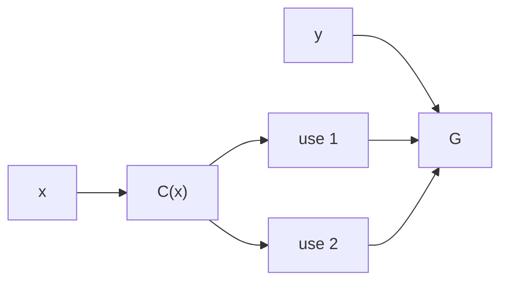
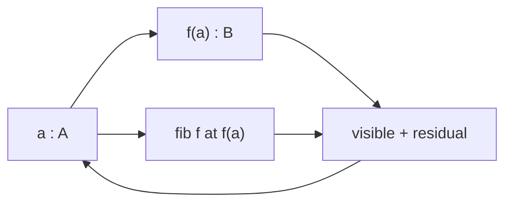
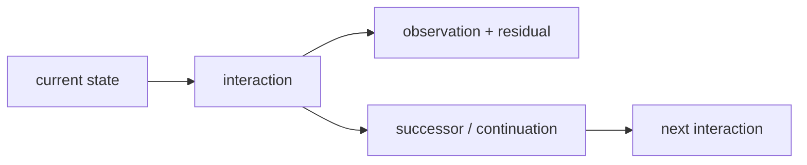

# Bend, HVM, and Computational Univalence

## Interaction nets are back — with the proof system inside the reducer

The pre-release Bend2/HVM4 branch in this repository already runs **computational cubical type theory, Voevodsky univalence, dependent transport, higher composition, fibres, coinductive continuation, and HVM superposition/sharing as one runtime**. Equivalences constructed by the program are executable representation changes; higher identities remain runtime structure; derived transformations re-enter later execution.

The consequence for Bend/HVM is immediate: **sharing is no longer limited to identity visible in the original reduction graph. Mathematical identity itself participates in reduction.** Equivalent work can be transported instead of recomputed; correlated alternatives remain one dependency; only genuinely separate product structure must cross.

For a running object $P$, a lawful interaction path $\gamma$, and physical interaction cost $c(e)$:

```math
C(\gamma)=\sum_{e\in\gamma}c(e),
\qquad
d(P,Q)=\min_{\gamma:P\leadsto Q}C(\gamma).
```

With unit interaction cost:

```math
d(P,Q)=\min_{\gamma:P\leadsto Q}|\gamma|.
```

The combined machine computes over equivalent presentations and executes the minimum-cost faithful factorization under its represented cost semantics. **The quantity that made higher-order interaction nets lose to lower-order variants — required interaction work — is now itself optimized by executable mathematics.**


This is running against the pre-release `DKormann/Bend2 @ f026483` lineage and HVM4. The full target retains interval expressions, paths, universe paths, dependent type constructors, `coe`, `hcomp`, `Glue`, quotients, and unresolved partial compositions at runtime. A basic univalent reduction executes natively:

```math
\mathrm{coe}\big(i\mapsto\mathrm{ua}(\mathrm{not})(i),\mathrm{True}\big)
\leadsto \mathrm{False}.
```

Everything below reconstructs that machine from elementary objects already present in HVM: distinction, product, sharing, composition, identity, transport, and continuation.

---

## HVM already represents the information geometry

The smallest nontrivial distinction is

```math
\mathbf 2=\{0,1\}.
```

Two uses of the *same* distinction occupy the diagonal

```math
\Delta_{\mathbf 2}=\{(0,0),(1,1)\}\subset\mathbf 2\times\mathbf 2,
```

with

```math
\Delta_{\mathbf 2}\simeq\mathbf 2,
\qquad
\pi_1|_{\Delta}=\pi_2|_{\Delta}.
```

Two separately varying Boolean coordinates occupy the full product

```math
\mathbf 2^2=\mathbf 2\times\mathbf 2
=\{(0,0),(0,1),(1,0),(1,1)\}.
```

The projections

```math
\pi_1,\pi_2:\mathbf 2^2\to\mathbf 2
```

are its coordinate directions: one edge direction changes $\pi_1$ while preserving $\pi_2$; the other changes $\pi_2$ while preserving $\pi_1$.

```text
 (0,1) -------- (1,1)
   |               |
   |               |
 (0,0) -------- (1,0)
```

The Shannon information of the Boolean cube is

```math
H(\mathbf 2^n)=\log_2|\mathbf 2^n|=n,
```

while

```math
H(\Delta_{\mathbf 2})=\log_2|\Delta_{\mathbf 2}|=1.
```

HVM's labelled DUP/SUP rules preserve exactly this distinction. Same-label interaction routes one branching coordinate through multiple uses:

```math
\mathrm{DUP}_L\bowtie\mathrm{SUP}_L\longrightarrow\text{route}.
```

Different labels cross because both product coordinates remain:

```math
\mathrm{DUP}_L\bowtie\mathrm{SUP}_M,\quad L\neq M
\longrightarrow\text{cross}.
```

Sharing is therefore part of the representation of information, not merely a scheduling optimization after representation.

Two commuting local reductions $r,s$ produce the same product geometry:

```text
        r
   x --------> x_r
   |            |
 s |            | s
   v            v
  x_s -------> x_rs
        r
```

The two boundary paths are sequential schedules of one 2-cell. Three separately varying commuting reductions generate a cube. An interaction net is naturally a **computational cell complex**.

## Factoring removes distinctions execution never needed

If

```math
F(x,y)=G(C(x),C(x),y),
```

then $C(x)$ is one determined value with two uses:



Two independently evaluated copies introduce a distinction absent from $F$; sharing removes it.

Composition

```math
A\xrightarrow{f}B\xrightarrow{g}C
\quad\mapsto\quad
g\circ f:A\to C
```

builds from factors; factorization reads the same equation backward. Multiplication is one composition law:

```math
60=2^2\cdot3\cdot5.
```

A prime is irreducible because $p=ab$ has no nontrivial factorization. A computation is irreducible relative to its primitive interactions and cost when no cheaper lawful factorization yields the same demanded observation.

Lamping/HVM sharing identifies work through reduction-family structure already represented in the net. Two program structures can also be mathematically equivalent without belonging to one syntactic reduction family. Executing that larger identity requires equality itself to reduce.

## Univalence makes representation equivalence executable

Let

```math
e:A\simeq B
```

be an invertible representation change. Voevodsky univalence gives

```math
(A=_{\mathcal U}B)\simeq(A\simeq B),
```

hence

```math
\mathrm{ua}(e):A=_{\mathcal U}B.
```

Computational cubical type theory reduces transport along this identity to the represented equivalence:

```math
\mathrm{transport}(\mathrm{ua}(e),x)\leadsto e(x).
```

An established representation equivalence is therefore itself an executable representation change.

For $f:A\to A$:

```math
f\mapsto e\circ f\circ e^{-1}:B\to B.
```

Change of basis is the linear specialization:

```math
[T]_{B'}=P^{-1}[T]_B P.
```

Compiler representation change and basis change are the same transport law specialized to different structured types.

## Cubical identity retains the geometry of execution

An identity $p:a=_A b$ is represented cubically by

```math
p:I\to A,
\qquad
p(0)=a,
\quad
p(1)=b.
```

Paths themselves have identities:

```math
p,q:a=_A b,
\qquad
\alpha:p=q.
```

The HVM commuting square and a cubical 2-cell have the same boundary: two directions and coherence between their composites.

A symmetry is an invertible self-transformation:

```math
\mathrm{Aut}(A)=A\simeq A.
```

Univalence identifies symmetries with loops in the universe:

```math
\Omega(\mathcal U,A)\simeq\mathrm{Aut}(A).
```

The object called a symmetry in algebra is the object called a loop in homotopy when the ambient type is the universe.

For a varying family

```math
P:I\to\mathcal U,
```

cubical coercion is

```math
\mathrm{coe}(P,r,s):P(r)\to P(s).
```

A compatible partial square or cube determines its missing face by Kan composition. `hcomp` composes in a fixed type; `comp` combines composition with transport. Function transport moves the argument backward and result forward; dependent-pair transport moves the first component and then the second in its transported family; path transport constructs the required higher cell; `Glue` realizes universe transport so that `ua(e)` executes $e$.

The continuous constructions use the same elements. A local evolution law

```math
\dot x=F(x)
```

composes into a trajectory. A connection transports a fibre element along a path:

```math
\mathrm{PT}_\gamma:E_x\to E_y.
```

Holonomy records residual route dependence. Family, path, local relation, transport, and composition are common primitives; cubical and differential geometry retain different additional structure.

## Every observation is exactly a visible result plus its fibre

For

```math
f:A\to B,
```

define

```math
\mathrm{fib}_f(b):=\sum_{a:A}(f(a)=b).
```

Every $a:A$ maps to

```math
\big(f(a),(a,\mathrm{refl})\big),
```

and the stored $a$ gives the inverse. Hence

```math
A\simeq\sum_{b:B}\mathrm{fib}_f(b).
```

The source is its visible result together with exactly the preimage distinction the result does not determine.



Topology calls this a fibre; type theory reads the dependent sum; execution reads residual/provenance; reversible computation reads the state required to reconstruct the source. The construction is unchanged.

An equivalence has contractible fibres. A many-to-one visible map has a nontrivial fibre. Logical erasure occurs when this residual distinction is discarded rather than retained in the total state — the exact boundary used by reversible computation and Landauer/Bennett.

A unitary physical transformation satisfies

```math
U^\dagger U=I
```

and preserves total Hilbert-space state structure. An observable exposes selected structure. Linear superposition

```math
|\psi\rangle=\sum_i\alpha_i|i\rangle
```

combines alternatives before observation; relative amplitudes/phases retain distinctions that independent enumeration would erase. State, transformation, observation, and retained distinction are the same elements already present computationally.

## The universal family contains every dependent computation

Let $\mathcal U$ be a universe of types. Its universal family is

```math
\pi:\sum_{X:\mathcal U}X\to\mathcal U.
```

A dependent family

```math
P:B\to\mathcal U
```

has total space

```math
\sum_{b:B}P(b).
```

Every map $f:A\to B$ produces the family

```math
P_f(b)=\mathrm{fib}_f(b),
```

with

```math
A\simeq\sum_{b:B}P_f(b).
```

Maps are represented by dependent families already classified by the universe. Equivalences become identities by univalence; identities have higher identities; cubical composition computes them. Every level remains structure in the same universe.

Logic specializes the same terms:

```math
P\Rightarrow Q\equiv P\to Q,
\qquad
P\land Q\equiv P\times Q,
\qquad
\exists x:A.P(x)\equiv\sum_{x:A}P(x).
```

Algebraic structures are carrier types with operations and identities; groups, rings, fields, modules, and vector spaces differ by those operations/laws. Number theory studies particular arithmetic structures and factorization. Category theory retains objects, maps, identity, and composition; higher categories retain transformations among transformations. Sets are 0-truncated types; quotients add specified identities; analysis adds limiting/continuous structure; topology retains deformation/identity structure. The foundational objects remain types, terms, relations, families, composition, and identity.

A new mathematical domain therefore does not require a new runtime species. Its structure is representable in the same universe, and its established equivalences are executable identities.

## Coinduction returns mathematical consequence to execution

A terminating program has type

```math
A\to B.
```

A continuing process exposes an observation and another process:

```math
X\to O\times X.
```

The dependent interaction implemented here returns successor, dependent observation/event, exact residual, and continuation together. The continuation is again executable structure.



If an interaction constructs a proof, equivalence, or transformation, that result is a term consumed by later interaction:

```math
\text{interaction}
\to
\text{mathematical consequence}
\to
\text{new executable interaction}.
```

The proof system is therefore inside the continuing runtime: inference changes the object subsequently reduced.

## The running Bend2/HVM4 implementation

The implementation is built against `DKormann/Bend2 @ f026483` and HVM4. [`RUNTIME_FULL.md`](./RUNTIME_FULL.md), [`PUSC.md`](./PUSC.md), and [`LIST_TRANSPORT_FIX.md`](./LIST_TRANSPORT_FIX.md) contain the runtime details.

The full target retains interval expressions, path lambdas, universe paths, dependent type constructors, `coe`, `hcomp`, `Glue`, quotient structure, and suspended partial compositions. Runtime coercion dispatches on the transported type: functions transport input backward/output forward; dependent pairs transport first component then dependent second; paths build composition squares; universe paths execute represented equivalences.

Unknown faces remain data until later interaction determines them:

```text
partial boundary
      │
      ▼
#HCm{type, faces, base}
      │
      │ later interval information
      ▼
local reduction
```

A superposed type line uses HVM4's own match/superposition behavior. Runtime type dispatch distributes through the superposition while DUP/SUP preserves branch correlation. Cubical semantics and HVM sharing meet inside reduction rather than an external preprocessing pass.

The full runtime has executed forward/backward univalent transport, composite/inverse equivalences, dependent function