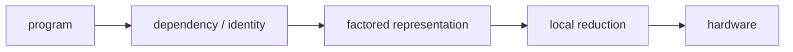
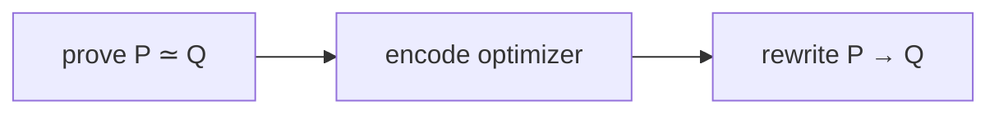
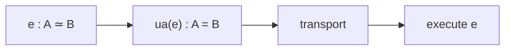
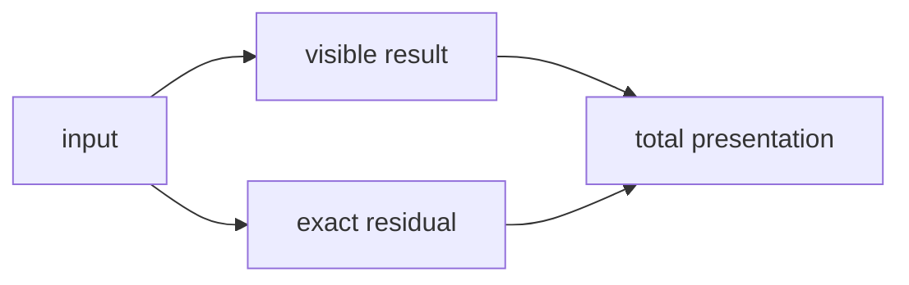
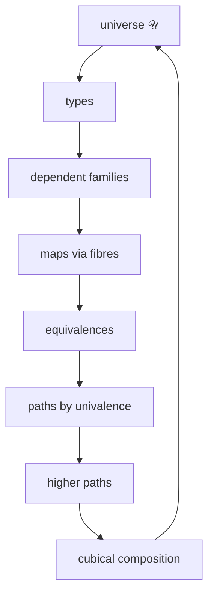
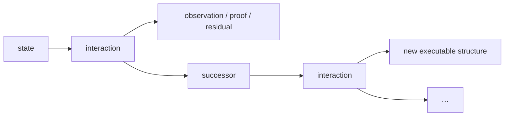
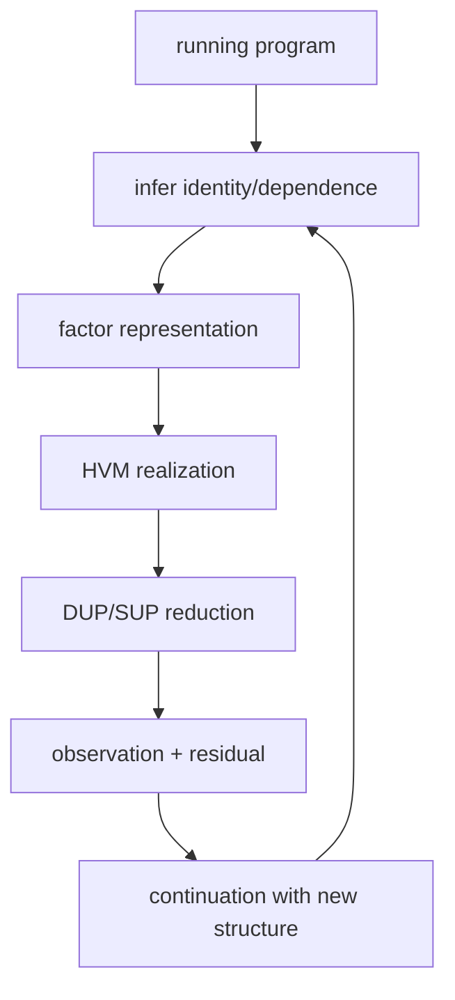

# Bend × HVM × Computational Univalence

> **From optimal sharing to interaction-optimal execution: the machine obtained when HVM-style local reduction is closed under computational identity.**

This note stays in the concept space of Bend/HVM: programs, interaction, sharing, DUP/SUP, reduction, proofs, compilers, GPUs. Mathematics enters only where it names or completes something already present there. The endpoint is not “PL meets topology.” It is that the same small structure generates both.

---

## 0. One problem

Bend/HVM asks how a high-level program becomes a small, massively parallel reduction system and then real hardware. Interaction nets make locality and parallelism structural. DUP/SUP makes sharing structural. Bend2 adds practical closures/allocation, dependent proofs, a trusted kernel, and lower-order CPU/GPU execution.

The reason to leave higher-order interaction nets was concrete: **realized work**. So ask the exact question:

$$
\boxed{\text{Which interactions are actually required by the computation?}}
$$

Parallelism answers *when* independent interactions may run. Optimal sharing answers *which duplicated redex families share*. The construction here asks the more general question:

$$
\boxed{\text{Which apparent distinctions are genuinely independent at all?}}
$$



The claim developed below is that this question is exactly the question of mathematical identity. Once identity itself computes, theorem proving, representation change, sharing and reduction inhabit one machine.

---

## 1. HVM already contains the seed: identify or cross

For labelled duplication and superposition:

$$
\mathrm{DUP}_L\bowtie\mathrm{SUP}_L\to\text{route/annihilate}
$$

while

$$
\mathrm{DUP}_L\bowtie\mathrm{SUP}_M,\quad L\neq M
\to\text{commute/cross}.
$$

Same label means one correlated distinction seen twice. Different labels mean independent distinctions, hence a product.

That is information theory:

$$
Y=X\Rightarrow H(X,Y)=H(X),\qquad
X\perp Y\Rightarrow H(X,Y)=H(X)+H(Y).
$$

It is geometry: one independent binary distinction is one dimension; two form a square; three a cube.

It is factoring:

$$
\boxed{\text{sharing}=\text{factoring dependence}.}
$$

Prime factorization is the elementary arithmetic instance:

$$
60=2^2\cdot3\cdot5.
$$

A program factors similarly:

$$
P=S\circ(P_1\otimes P_2),
$$

where $S$ is shared and $P_1,P_2$ are genuinely independent. Composition builds; factorization exposes irreducibles. An optimizer is a factorization engine.

The dual is computational irreducibility: after every common factor has been extracted, what remains cannot be identified without changing the demanded result. **Paid work is irreducible distinction.**

---

## 2. Compiler equivalence becomes executable identity

Every optimizer depends on equations $P\simeq Q$. CSE, specialization, partial evaluation, memoization, supercompilation, equality saturation and algebraic simplification each exploit a restricted family of equivalences.

Conventionally:



Why require a separately programmed optimizer for every class of equivalence?

Vladimir Voevodsky's **Univalence Axiom** answers at the general level:

$$
\boxed{(A=_{\mathcal U}B)\simeq(A\simeq B).}
$$

An equivalence of representations can be internalized as identity in the universe.

Cubical type theory makes this identity computational. For $e:A\simeq B$,

$$
\mathrm{ua}(e):A=_{\mathcal U}B,
$$

and transport along it computes:

$$
\boxed{\operatorname{transport}(\mathrm{ua}(e),x)\leadsto e(x).}
$$



So the compiler identity is exact:

$$
\boxed{\text{semantics-preserving representation change}=\text{executable identity}.}
$$

Linear algebra already uses the same structure. Change of basis is conjugation:

$$
[T]_{B'}=P^{-1}[T]_B P,
$$

while transporting an endomorphism across $e:A\simeq B$ gives

$$
f\mapsto e\circ f\circ e^{-1}.
$$

Same operation; different native vocabulary.

---

## 3. Why homotopy appears

Once equality is structure, equalities can themselves be equal:

$$
p,q:a=_A b,\qquad \alpha:p=q.
$$

A path is a 1-cell; equality between paths is a 2-cell; higher identities continue. Cubical type theory represents a path by a formal dimension $i:I$:

$$
p(i):A,\qquad p(0)=a,\quad p(1)=b.
$$

Two independent reductions give a square:

```text
        r
   x --------> x_r
   |            |
 s |            | s
   v            v
  x_s -------> x_rs
        r
```

Thus:

$$
\boxed{\text{higher identity}=\text{structured equality of execution paths}.}
$$

Topology and concurrency are studying the same compositional object at different resolutions.

Loops and symmetry coincide under univalence:

$$
\Omega(\mathcal U,A)\simeq\operatorname{Aut}(A).
$$

Algebraic symmetry, topological loops and executable self-equivalence are one structure.

---

## 4. Cubical composition is deterministic reduction from partial structure

Cubical composition fills a compatible partial boundary. `coe` transports through a changing type; `hcomp` composes inside a fixed type; general `comp` combines them:

$$
\operatorname{coe}:(P:I\to\mathcal U)\to P(r)\to P(s).
$$

This is reduction, not search. A dependent function transports its argument backward and result forward. A dependent pair transports its first component and then its second in the transported family. Paths transport through squares. The universe transports through `Glue`/univalence.

$$
\boxed{\text{partial lawful structure}+\text{composition}=\text{further computation}.}
$$

Analysis says the same thing continuously: a local evolution law $\dot x=F(x)$ generates compatible evolution. Differential geometry moves data through varying fibres by parallel transport

$$
v\in T_xM\mapsto\operatorname{PT}_\gamma(v)\in T_yM.
$$

These are distinct constructions with the same semantic operation: coherent transport through a varying family. Curvature/holonomy is precisely the structure left when different transport routes cannot be globally flattened into one.

---

## 5. Every map is visible result plus exact preimage

For any program/function $f:A\to B$ define its homotopy fibre

$$
\operatorname{fib}_f(b)=\sum_{a:A}(f(a)=b).
$$

Then

$$
\boxed{A\simeq\sum_{b:B}\operatorname{fib}_f(b).}
$$

The source is exactly its visible output plus what that output failed to determine.



This one identity is simultaneously topological fibre, dependent sum, runtime residual, provenance, conditional information, ancillary state in reversible computing, and hidden state relative to an observation.

An equivalence has contractible fibres. A non-invertible map has nontrivial fibres somewhere:

$$
\boxed{\text{information loss lives exactly in nontrivial fibres}.}
$$

Logical erasure is many-to-one identification. Retain the fibre and the total presentation remains reconstructible. Drop it and Landauer/Bennett become relevant.

The same distinction appears in physics: total reversible/unitary evolution preserves distinction while a chosen observable may expose only a projection. The visible observation need not be the whole physical/computational state.

---

## 6. The universe closes the construction

The universal family is

$$
\boxed{\pi:\sum_{X:\mathcal U}X\to\mathcal U.}
$$

Every dependent family is classified by it. Every map $f:A\to B$ yields the family $b\mapsto\operatorname{fib}_f(b)$ with

$$
A\simeq\sum_{b:B}\operatorname{fib}_f(b).
$$

Maps, families, fibres, total spaces, equivalences, paths and higher paths inhabit one language.



Logic is already inside:

$$
P\to Q,\qquad
P\land Q\simeq P\times Q,\qquad
\exists x:A.P(x)\simeq\sum_{x:A}P(x).
$$

Algebra is a type carrying operations and laws. Homomorphisms preserve them; automorphisms are structure-preserving equivalences. Category theory is objects, identity, composition, functors and coherent transformations; higher categories continue the same ladder. Sets are the 0-truncated region where equality has no higher distinction. Quotients are explicit identifications.

The fields are not being compared. Their objects have entered the same classifier.

This is the foundational singularity: there is no need to invent a new primitive when the next mathematical object appears. It is another type/family/map/equivalence/path/composition in the same universe.

---

## 7. Coinduction removes the final static boundary

A runtime is generally

$$
\text{state}\to(\text{observation},\text{next state}),
$$

not merely input-to-final-output. The dependent version can return successor, observation, evidence, residual and continuation together.



Coinduction treats the continuing process as one object.

The decisive closure is re-entry:

$$
\boxed{\text{interaction}\to\text{derived transformation}\to\text{later executable operation}.}
$$

A theorem prover is no longer outside the runtime. A proved equivalence becomes transport. A derived specialization becomes an operation. A discovered identity collapses later work.

That is universal inference as execution: whatever follows from the represented structure is itself represented structure and can participate in what follows next.

---

## 8. Back to HVM: optimal sharing becomes optimal representation

A conventional interaction net reduces the graph it is given. Optimal sharing prevents duplicated redex families from being evaluated repeatedly. But mathematical equivalence is broader than syntactic redex-family identity.

If two subcomputations are equivalent, transport can replace recomputation. If 1,000 apparent branches contain only 10 independent distinctions, the representation should expose 10 dimensions, not 1,000 branches. If a new proof identifies a dimension, the runtime should stop paying for it.

$$
\boxed{\text{Lévy/Lamping sharing}\subset
\text{sharing modulo executable mathematical identity}.}
$$

The optimal representation has:

1. determined structure represented once;
2. equivalent structure transported rather than recomputed;
3. correlated alternatives remaining correlated;
4. independent dimensions composing by product;
5. only distinctions relevant to the demanded observation crossed.

DUP/SUP then becomes the physical reduction mechanism for the already-factored mathematical object.



This changes the performance variable that motivated leaving interaction nets:

$$
\boxed{\text{not merely better scheduling; fewer required interactions}.}
$$

---

## 9. Geodesic reduction

Give primitive interactions costs. For execution path $\gamma$,

$$
C(\gamma)=\sum_{e\in\gamma}c(e),
$$

and

$$
\boxed{d(P,Q)=\min_{\gamma:P\leadsto Q}C(\gamma).}
$$

With unit interaction cost,

$$
d(P,Q)=\min_{\gamma:P\leadsto Q}\#\operatorname{interactions}(\gamma).
$$

That is literally a geodesic.

The lower bound is observational separation: if every state reachable within cost $r$ identifies two completions on which the demanded observation differs, no cost-$\le r$ execution can compute it. Locality makes this a causal cone: information cannot influence a result without crossing intervening local interactions.

$$
\boxed{\text{complexity lower bound}=\text{causal/geometric separation}.}
$$

Classical mechanics uses extremal paths; relativity uses geodesics; local field theories use causal propagation. The compiler uses the same mathematics because all are compositions of local transformations under a cost/metric.

---

## 10. Boolean computation is cubical structure, not enumeration

For $N$ bits,

$$
Q_N=\mathbf2^N.
$$

Assignments are vertices; partial assignments are faces. A 3-clause depends on three coordinates; its violating assignment lifts to a codimension-three cell of the global cube. Shared variables are literally shared coordinates.

For $c:\mathbf2^3\to\mathbf2$,

$$
\mathbf2^3\simeq\sum_{b:\mathbf2}\operatorname{fib}_c(b).
$$

The one-bit result does not destroy the dimensions it failed to determine; they remain dependent residual structure.

Crucially,

$$
|Q_N|=2^N\not\Rightarrow\text{cost}=2^N.
$$

A cube is compactly factored. Exponential work is intrinsic only when incidence forces independent crossings after every lawful equivalence, transport and sharing opportunity has been used.

$$
\boxed{\text{irreducibility}=\text{distinctions that still must cross after complete factoring}.}
$$

This is primality at the correct computational level: not “many possibilities,” but structure that admits no cheaper lawful factorization for the demanded observation.

---

## 11. The runtime exists

This is implemented against the pre-release Bend2 lineage `DKormann/Bend2 @ f026483` and HVM4. See [`RUNTIME_FULL.md`](./RUNTIME_FULL.md), [`PUSC.md`](./PUSC.md), and [`LIST_TRANSPORT_FIX.md`](./LIST_TRANSPORT_FIX.md).

The full target keeps cubical structure alive rather than normalizing and erasing it before emission. Runtime objects include interval expressions, path lambdas, universe paths, dependent type constructors, `coe`, `hcomp`, `Glue`, quotient structure and stuck partial