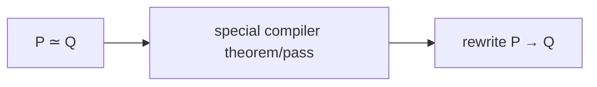
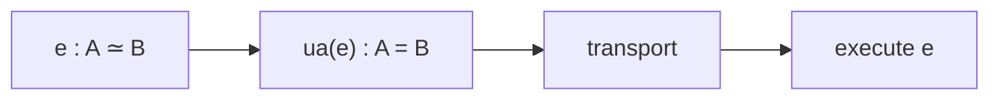
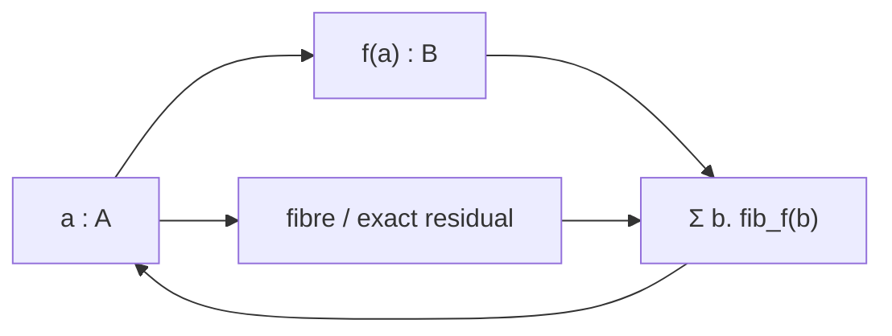
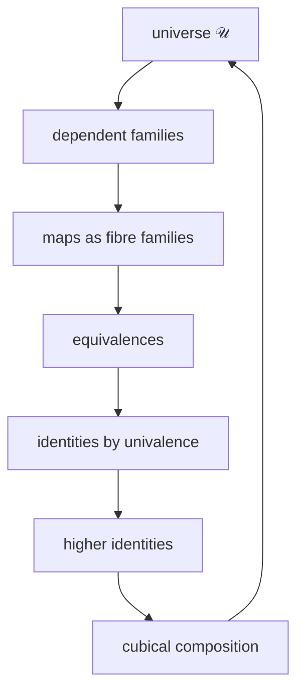
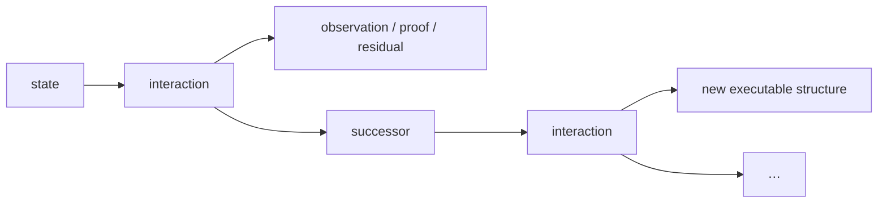
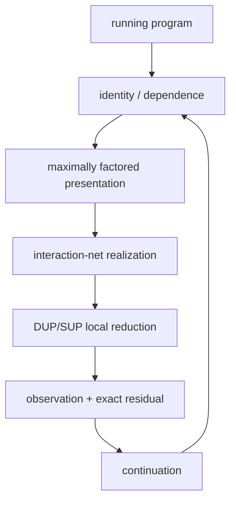

# Bend × HVM × Computational Univalence

> **From optimal sharing to interaction-optimal execution: computational identity as the reduction system.**

Bend and HVM reduce programs by local interaction, with duplication and superposition making sharing and independent computation explicit. Computational cubical type theory supplies the closure: equivalence is executable identity, higher identities compose, and inferred structure remains available during reduction. The combined machine computes over equivalent presentations of a program, factors shared structure, preserves correlation, and crosses only irreducible distinctions.

$$
\boxed{\text{program}\;=\;\text{mathematical object}\;=\;\text{executable relation}}
$$

---

## 1. HVM turns dependence into local reduction

An interaction net represents computation as a graph of agents whose active pairs rewrite locally. Independent active pairs reduce independently; a sequential schedule is a traversal of the dependency structure, not the computation itself.

For labelled duplication and superposition,

$$
\mathrm{DUP}_L\bowtie\mathrm{SUP}_L\to\text{route/annihilate},
$$

while

$$
\mathrm{DUP}_L\bowtie\mathrm{SUP}_M,\;L\neq M
\to\text{commute/cross}.
$$

Same label means one correlated distinction used twice; different labels mean independent distinctions whose product must be represented.

Information theory states the same distinction:

$$
Y=X\Rightarrow H(X,Y)=H(X),
\qquad
X\perp Y\Rightarrow H(X,Y)=H(X)+H(Y).
$$

Geometry states it as dimension: one independent binary distinction is an interval, two form a square, three a cube.

Factoring states it as reuse:

$$
\boxed{\text{sharing}=\text{factoring dependence}.}
$$

Prime factorization is the elementary arithmetic instance,

$$
60=2^2\cdot3\cdot5,
$$

while a program may factor as

$$
P=S\circ(P_1\otimes P_2),
$$

with $S$ represented once and $P_1,P_2$ genuinely independent. Composition builds a whole from factors; factorization recovers the independent generators. Irreducibility is the dual statement: after every lawful common factor has been extracted, the remaining distinction cannot be identified without changing the demanded result.

$$
\boxed{\text{paid work}=\text{irreducible distinction}.}
$$

---

## 2. Voevodsky univalence turns compiler equivalence into executable identity

Every optimizer uses semantic equations $P\simeq Q$. CSE, specialization, partial evaluation, memoization, supercompilation, equality saturation and algebraic simplification each exploit a restricted family of such equations.



Vladimir Voevodsky's Univalence Axiom internalizes the general relation. For types $A,B:\mathcal U$,

$$
\boxed{(A=_{\mathcal U}B)\simeq(A\simeq B).}
$$

An equivalence of representations becomes an identity of representations. Computational cubical type theory gives that identity reduction behavior. For $e:A\simeq B$,

$$
\mathrm{ua}(e):A=_{\mathcal U}B,
$$

and

$$
\boxed{\operatorname{transport}(\mathrm{ua}(e),x)\leadsto e(x).}
$$



Thus

$$
\boxed{\text{semantics-preserving representation change}=\text{executable identity}.}
$$

Linear algebra already uses this operation. A change of basis conjugates an operator,

$$
[T]_{B'}=P^{-1}[T]_BP,
$$

and transport of an endomorphism across $e:A\simeq B$ is

$$
f\mapsto e\circ f\circ e^{-1}.
$$

Change of basis, compiler representation change and univalent transport are the same compositional law at different specializations.

---

## 3. Higher identity is the geometry of independent execution

Cubical type theory represents equality by paths. A path $p:a=_A b$ is a term varying over a formal interval $I$,

$$
p(i):A,\qquad p(0)=a,\quad p(1)=b.
$$

Equalities themselves have identities:

$$
p,q:a=_A b,\qquad \alpha:p=q.
$$

A path is a 1-cell; an identity between paths is a 2-cell; higher identities continue. Two independent reductions generate the first nontrivial cube:

```text
        r
   x --------> x_r
   |            |
 s |            | s
   v            v
  x_s -------> x_rs
        r
```

The square records that the two serializations are boundaries of one independent computation.

$$
\boxed{\text{higher identity}=\text{coherence of execution paths}.}
$$

Topology calls the resulting identity structure homotopy. Algebra calls invertible self-structure symmetry. Univalence identifies the two:

$$
\boxed{\Omega(\mathcal U,A)\simeq\operatorname{Aut}(A).}
$$

A loop in the universe at $A$, a symmetry of $A$, and an executable self-equivalence of $A$ are one object.

---

## 4. Cubical composition computes from partial lawful structure

`coe` transports through a varying type; `hcomp` fills compatible faces inside one type; general `comp` combines transport and filling.

$$
\operatorname{coe}:(P:I\to\mathcal U)\to P(r)\to P(s).
$$

A $\Pi$-type transports its argument contravariantly and result covariantly. A $\Sigma$-type transports the first component and then the dependent second component. A path transports through the corresponding square. `Glue` makes the universe itself computationally fibrant, so transport along `ua(e)` executes $e$.

$$
\boxed{\text{compatible partial structure}+\text{composition}=\text{determined structure}.}
$$

Analysis expresses the continuous specialization by local evolution,

$$
\dot x=F(x),
$$

while differential geometry transports $v\in T_xM$ through a varying tangent family,

$$
v\mapsto\operatorname{PT}_\gamma(v)\in T_yM.
$$

Curvature/holonomy records the residual path dependence when transport around distinct routes does not globally trivialize. Cubical composition is the discrete constructive identity principle underlying the same notions of local compatibility, transport and path coherence.

---

## 5. Every map is its visible result plus its exact fibre

For every $f:A\to B$ and $b:B$,

$$
\operatorname{fib}_f(b)=\sum_{a:A}(f(a)=b).
$$

The total fibre family reconstructs the source:

$$
\boxed{A\simeq\sum_{b:B}\operatorname{fib}_f(b).}
$$

The first projection is exactly $f$. The source is therefore its visible result plus exactly the structure that result does not determine.



The same object is called a homotopy fibre in topology, a dependent preimage in type theory, residual state in execution, provenance in tracing, conditional distinction in information theory and ancillary state in reversible computing.

An equivalence has contractible fibres; a non-invertible map has nontrivial fibres somewhere. Hence

$$
\boxed{\text{information loss}=\text{nontrivial preimage structure hidden by a projection}.}
$$

Logical erasure is many-to-one identification. Retaining the fibre keeps the total presentation reconstructible; discarding it makes the visible transformation logically irreversible, exactly the distinction used by Landauer and Bennett.

Quantum theory uses the same conservation structure: unitary evolution preserves total state distinction,

$$
U^\dagger U=I,
$$

while an observable is a projection of that state into a chosen measurement structure. Losslessness belongs to the total evolution, not necessarily to every visible coordinate.

---

## 6. The universal family places all mathematical structure in one classifier

The universe carries its universal family

$$
\boxed{\pi:\sum_{X:\mathcal U}X\to\mathcal U.}
$$

Every dependent family $P:B\to\mathcal U$ is a pullback of this family. Every map $f:A\to B$ determines the family $b\mapsto\operatorname{fib}_f(b)$ and therefore the presentation

$$
A\simeq\sum_{b:B}\operatorname{fib}_f(b).
$$



Logic is the same language:

$$
P\to Q,
\qquad
P\land Q\simeq P\times Q,
\qquad
\exists x:A.P(x)\simeq\sum_{x:A}P(x).
$$

Algebra is a carrier type with operations and laws; homomorphisms preserve the operations; automorphisms are structure-preserving equivalences. Rings, fields, modules and vector spaces are successive structured types. Number theory specializes these structures to $\mathbb N,\mathbb Z$, quotient rings, fields and their arithmetic; primes are irreducibles under multiplication, exactly the factorization/irreducibility dual already present in reduction.

Category theory extracts identity and composition as primitives; functors preserve them and natural transformations relate such preservations. Higher categories retain transformations between transformations. Homotopy type theory internalizes the invertible higher part as the identity structure of types themselves.

Sets are the 0-truncated types whose identity carries no higher distinction. Quotients are generated identifications. Topology is identity/deformation structure. Geometry adds local/metric structure. Analysis adds limiting and continuous structure. None requires a new foundational kind of object: each is additional structure on types, maps, families, identities and their compositions.

$$
\boxed{\text{mathematical field}=\text{a chosen structure/observation on the same universe}.}
$$

The closure is not a survey of fields; it is the reason another field does not require another foundational primitive.

---

## 7. Coinduction closes mathematics under continuing interaction

A terminating function has type $A\to B$. A continuing system exposes an observation and another system:

$$
X\to O\times X.
$$

The dependent interactive form lets the request determine the observation, event/residual and successor; the successor carries its continuation.



The output of interaction can itself be an equivalence, proof, program or transformation. Because it remains in the same term language, it can participate in the next interaction.

$$
\boxed{\text{interaction}\to\text{mathematical consequence}\to\text{new executable interaction}.}
$$

This is the metacircular closure: inference is not an external analysis of execution; inference changes the executable object on which subsequent inference operates.

$$
\boxed{\text{proof}=\text{transformation}=\text{available computation}.}
$$

---

## 8. Computational univalence extends optimal sharing from syntax to mathematics

A conventional interaction net reduces the graph it is given. Lévy/Lamping optimality prevents duplicated members of one redex family from being independently recomputed. Mathematical identity enlarges the relation under which two pieces of work are the same.

If two subcomputations are equivalent, transport can replace recomputation. If many apparent branches share one dependency, superposition can retain that correlation. If two dimensions are independent, their product must be crossed. If a newly derived identity collapses a dimension, later execution need not pay for it.

$$
\boxed{
\text{optimal sharing of reduction families}
\subset
\text{optimal sharing modulo executable equivalence}
}
$$

The resulting representation satisfies the universal compiler desiderata simultaneously:

- shared/determined structure appears once;
- equivalent representations are connected by executable transport;
- correlated alternatives remain correlated;
- independent dimensions compose rather than masquerading as correlation;
- residual distinctions remain available instead of being destroyed and recomputed;
- newly proved transformations re-enter the running program.



Victor's practical objection to interaction nets was realized performance relative to lower-order variants. This construction changes the first factor in

$$
T(P)\approx N(P)\,C_{\mathrm{interaction}}+\text{machine overhead}:
$$

$N(P)$ is reduced to the interactions required after complete mathematical factoring. The per-interaction cost remains a concrete compiler/runtime/hardware problem.

---

## 9. Geodesic execution is minimum-cost reduction

Let a primitive interaction $e$ have cost $c(e)$. An execution path $\gamma$ has

$$
C(\gamma)=\sum_{e\in\gamma}c(e).
$$

The intrinsic execution distance is

$$
\boxed{d(P,Q)=\min_{\gamma:P\leadsto Q}C(\gamma).}
$$

For unit interaction cost,

$$
d(P,Q)=\min_{\gamma:P\leadsto Q}\#\operatorname{interactions}(\gamma).
$$

A minimum-cost reduction is therefore literally a geodesic in the execution geometry.

A lower bound is an observation obstruction: if a proposed cheaper projection identifies $x,y$ while the demanded result distinguishes them,

$$
q(x)=q(y),\qquad f(x)\neq f(y),
$$

then $f$ cannot factor through $q$. Some additional distinction must be crossed.

Local interaction turns this into a causal/light-cone bound. If information outside the radius reachable in $r$ interactions changes the result, no length-$r$ execution can determine it.

$$
\boxed{\text{complexity lower bound}=\text{required causal separation}.}
$$

Classical action principles, relativistic geodesics and computational minimum-cost paths are specializations of one variational question: which lawful composite realizes the boundary condition at least cost under the relevant metric/action?

---

## 10. Boolean programs expose the cubical geometry directly

For $N$ Boolean variables,

$$
Q_N=\mathbf2^N.
$$

An assignment is a vertex. Fixing coordinates gives a face. A 3-clause depends on three global coordinates; its violating assignment lifts to a codimension-three cell. Clauses sharing a variable literally share a cube coordinate; equality is structural rather than rediscovered after separate evaluation.

For $c:\mathbf2^3\to\mathbf2$,

$$
\mathbf2^3\simeq\sum_{b:\mathbf2}\operatorname{fib}_c(b).
$$

The one-bit clause result