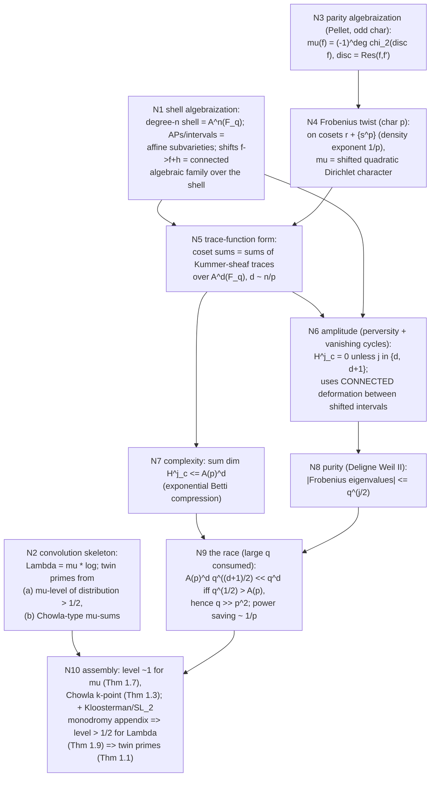

# Proof-diff: integer Chowla against the solved F_q[t] case — a route specification

Workstream B of `DIRECT.md`, executing METALOOP §4 item 2 (the proof-diff
engine) by hand on the nucleus.  Method: dissect the actual proofs of
function-field Chowla / twin primes from primary sources (fetch ledger in
§8), build the dependency DAG, align each node against $\mathbb Z$, and emit
a route specification naming exactly what a faithful transport would require,
together with scoped no-go results only in the categories where they are
proved.  No
sampling; the only computations here are one-line algebra.

Companion notes: `FF.md` (the exact shell pair theorem and the
Sawin–Shusterman fixed-gap asymptotic placed inside it), `ATIYAH.md` §3 (the
solvability triptych), `FOREST.md` (the eigenvector identity
$T_p\lambda=-\lambda$ whose additive consequences are at stake).

## 1. The solved case has two regimes and two different engines

This distinction is load-bearing for the diff and is often compressed in
survey accounts.  Both regimes were read from the primary sources.

### 1.1 Fixed q, growing degree (Sawin–Shusterman [SS20]) — the honest analog of Z

The regime analogous to integer Chowla is: the field $\mathbb F_q$ fixed,
the degree $n \to \infty$ (shell size $X = q^n \to \infty$).  The results
(all verbatim from the arXiv v2 full text, extracted locally):

- **Theorem 1.1 (twin primes).** $p$ odd, $q = p^e$ with $q > 685090\,p^2$:
  for any nonzero $h$, $\#\{f : |f| = X,\ f, f+h \text{ prime}\} \sim
  \mathfrak S_q(h)\, X/\log_q^2 X$, with a power saving.  (Smallest
  instances listed: $\mathbb F_{3^{15}}, \mathbb F_{5^{11}}, \mathbb F_{7^9},
  \mathbb F_{11^8}$.)
- **Theorem 1.3 (Chowla, k-point).** $p$ odd, $k \ge 1$, $q > p^2k^2e^2$:
  $\sum_{|f| \le X} \mu(f{+}h_1)\cdots\mu(f{+}h_k) = o(X)$ for distinct
  $h_i$, with power saving *inversely proportional to $p$*, and shifts
  allowed as large as any fixed power of $X$ (stronger condition on $q$).
- **Theorem 1.4 (super-Burgess).** $q > e^{2/\eta^2}$: nontrivial short
  character sums of length $X \ge |M|^\eta$ for any $\eta > 0$ —
  arbitrarily close to square-root cancellation for $q$ large.  ~~Over
  $\mathbb Z$ the Burgess exponent $1/4$ has never been improved, even
  conditionally.~~ **[seed139, 2026-08-14 — rider struck; the SS20 quotations
  in this section are untouched.** This sentence is not in [SS20]; it is a
  claim about the $\mathbb Z$-side literature appended to a block of verified
  quotations, and it carried no source. The unconditional half is the standard
  open problem and I leave the note free to restate it *with* a source; the
  clause **"even conditionally" has no support and is contradicted in the
  standard downstream application**: `ar5iv.labs.arxiv.org/html/1311.7556`
  (Pollack, *Pólya–Vinogradov and the least quadratic nonresidue*), read today,
  states GRH-conditional bounds of polylogarithmic strength for the least
  quadratic non-residue — "stronger than Ankeny's long-standing GRH bound
  $n_p\ll(\log p)^2$" — against Burgess's power bound in the same sentence.
  Ground, at the generality I can defend: this settles that the rider's
  conditional clause is unsupported and implausible on a reachable source. It
  does **not** settle whether the exponent $1/4$ for short character sums has
  itself been improved under GRH — that needs Iwaniec–Kowalski Thm 5.15 in
  source, a PDF, which does not decode tonight. `SEARCH` item below. Nothing in
  this note's route specification consumes the sentence.]**
- **Theorem 1.7 (level of distribution $\approx 1$ for Möbius).**
- **Theorems 1.8–1.9 (Fouvry–Michel variant; level $\tfrac12 + \delta$,
  $\delta < \tfrac1{126}$, for $\Lambda$).**

Their stated mechanism (Introduction, §1.2): for squarefree $f$, the parity
of the number of prime factors equals the sign of Frobenius permuting the
roots; in odd characteristic this sign is $\chi_2(\mathrm{disc}\, f)$, and
$\mathrm{disc} f = \pm\mathrm{Res}(f, f')$.  In characteristic $p$ the
derivative of $f = r + s^p$ equals the derivative of $r$, so on each coset
$r + \{s^p\}$ the Möbius function *is* an additively shifted quadratic
Dirichlet character: "we view $\mathbb F_q[T]$ as a rank $p$ lattice over
its subring $\mathbb F_q[T^p]$.  Restricting the Möbius function to any
line in this lattice gives a Dirichlet character whose modulus varies with
the line" ~~[SS20 §1.3]~~ **[SS20 §1.2, Remark 1.6 — location corrected by
seed137, 2026-08-14.** Re-read today at `ar5iv.labs.arxiv.org/html/1808.04001`,
which renders in full. The quoted sentence is verbatim in source and is the
first sentence of **Remark 1.6**, inside §1.2 ("The key ingredient — Chowla's
conjecture"); there is no §1.3 carrying it. This is a wrong *address*, not a
wrong quotation, and nothing in this note's mathematics depends on the address —
the preceding clause of this same paragraph already says "Introduction, §1.2"
correctly, sixty words earlier, and that is the pointer to keep. Also re-verified
verbatim at the same fetch, so §1.1's "all verbatim from the arXiv v2 full text"
is sound where I checked it: **Theorem 1.1** *"For an odd prime number $p$, and a
power $q$ of $p$ satisfying $q>685090p^2$, the following holds. For any nonzero
$h\in\mathbb F_q[T]$…"* (§1.1) and **Theorem 1.3** *"For an odd prime number $p$,
an integer $k\ge1$, and a power $q$ of $p$ satisfying $q>p^2k^2e^2$…"* (§1.2) —
both numbers and both thresholds correct as printed here. The Carmon–Rudnick and
Keating–Rudnick rows of §7's ledger are PDF/abstract-grade and were **not**
re-checked: PDFs do not decode in tonight's container.]**

The geometric engine ([SS20] §2–3; exposition [Kow22] §6): the short
interval/coset is the $\mathbb F_q$-point set of an affine space $P_d$ of
growing dimension $d$; the character is the trace function of a product of
Kummer-type sheaves $\mathcal F = \bigotimes_{z} \mathrm{ev}_z^*\mathcal
F_z$; Grothendieck–Lefschetz converts the sum to
$\sum_j (-1)^j \mathrm{tr}(F_k \mid H^j_c)$; then

1. **Amplitude**: $H^j_c(P_{d,\bar k}, \mathcal F) = 0$ unless
   $j \in \{d, d{+}1\}$ — proved by perversity of $\mathcal F[d]$, Artin
   vanishing, excision, and a vanishing-cycles computation comparing the
   $s = 0$ interval to a general interval, after splitting the modulus into
   linear factors so the vanishing locus is simple normal crossings away
   from isolated points ([SS20 §1.2]; [Kow22, Thm 6.3] = [SS "37", Cor.
   3.7, Lemmas 3.4–3.13]).
2. **Complexity**: $\sum_j \dim H^j_c \le$ the coefficient of $B^d$ in
   $\prod_z(\mathrm{rank}(\mathcal F_z)(1{+}B) +
   \mathrm{rank}(\widehat{\mathcal F_z})B)$ — *exponential* in $d$, i.e.
   $C_d \le A^d$; off-the-shelf Betti bounds (Katz, quantitative sheaf
   theory) are super-exponential and would be useless [Kow22 §6].
3. **Purity**: Deligne's Weil II, $|\alpha| \le q^{j/2}$ on $H^j_c$.

The final estimate $C_d\, q^{(d+1)/2}$ beats the trivial $q^d$ iff
(roughly) $q^{1/2} > A$, i.e. per-coordinate cancellation beats
per-coordinate complexity.  **This race is where "q large" is consumed**;
$A = A(p)$ grows with $p$ because conductors of the induced characters
involve the derivative data, whence $q \gg p^2$.

Big monodromy appears in this regime only once: the appendix
(Fouvry–Michel variant) uses the Kloosterman sheaf
$\mathrm{K}\ell_2$ with geometric monodromy $SL_2$ — connected, no
coinvariants — to kill $H^0, H^2$ before applying purity to $H^1$ [SS20,
App. A, eq. (A.27) ff.].  That is a fixed-dimension sum; the
growing-dimension core of the proof runs on
perversity + vanishing cycles + Betti compression, *not* on monodromy.

### 1.2 Large q, fixed degree (Carmon–Rudnick, Keating–Rudnick, Katz)

The earlier function-field parity results live in the opposite regime,
$n$ fixed, $q \to \infty$ — a regime with **no integer analogue at all**
("Note that there is no analogue of this question for integers!"
[Kow22 §3]):

- **Carmon–Rudnick [CR14]**: $\sum_{f \in M_n} \mu(f)\mu(f{+}h) =
  O_n(q^{n-1/2})$, $q$ odd.  Proof: Pellet turns the correlation into the
  quadratic-character sum $\sum \chi_2(\mathrm{disc}(f)\,
  \mathrm{disc}(f{+}h))$ over the coefficient space $\mathbb A^n$;
  generic squarefreeness of the discriminant product reduces to
  one-parameter families; Weil's RH for curves (fixed genus, $q \to
  \infty$) gives the saving.  Carmon extended to characteristic 2 via the
  Swan/Witt-vector variant of Pellet.
- **Keating–Rudnick [KR14]**: variance of primes in short intervals /
  residue classes, resolving function-field Goldston–Montgomery and
  Hooley.  Engine: Dirichlet L-functions mod $T^{m}$ (resp. mod $Q$)
  become characteristic polynomials of unitarized Frobenius conjugacy
  classes $\Theta_\chi$; **Katz's equidistribution theorems** (big
  monodromy of the family of primitive characters) make $\Theta_\chi$
  equidistribute in the full unitary group as $q \to \infty$; the variance
  is then a matrix integral.  This is the clean instance of the pipeline
  *family → trace function → big monodromy → Deligne equidistribution →
  random-matrix answer*.

**Diff-relevant conclusion.** The DAG node "big monodromy → equidistribution"
powers only the large-$q$ regime, whose limit has no integer counterpart.
In the regime that actually models $\mathbb Z$ (fixed field, growing
scale), equidistribution in a monodromy group is *replaced* by the
amplitude + complexity package.  Any honest transport target for integer
Chowla is the §1.1 package, not the §1.2 one.

## 2. The dependency DAG of the fixed-q proof

Consumption points, stated exactly:

- **Characteristic p is consumed twice**: at N3 (odd characteristic for
  $\chi_2(\mathrm{disc})$; char 2 needs the Swan/Witt variant) and — the
  essential one — at N4: $\ker(d/dT) \supseteq \mathbb F_q[T^p]$ has
  *relative density exponent* $1/p$ in each shell
  ($q^{\lceil n/p\rceil}$-many polynomials per coset datum out of $q^n$).
  In characteristic 0 the kernel of $d/dt$ is the constants: **the route
  dies already over $\mathbb C[t]$**, a function field with all of
  algebraic geometry available.  The parity barrier is crossed by
  *inseparability*, not by "being a function field."
- **Large q is consumed once**, at N9, quantitatively $q > 685090\,p^2$
  (twin primes) / $q > p^2k^2e^2$ (k-point Chowla): per-coordinate
  square-root cancellation $q^{1/2}$ must beat the per-coordinate Betti
  growth $A(p)$.  SS Remark 1.5: "the relation between Möbius and
  multiplicative characters is less powerful the larger $p$ is, as then
  fewer polynomials share a given derivative.  On the other hand, our
  geometric character sum bounds become stronger as $q$ grows."
- **Deligne's RH is consumed at N8 only** — as purity for auxiliary
  sheaves on growing-dimensional spaces, not as zeros of the base zeta
  (this confirms and sharpens `FF.md` §3's hierarchy).
- **The connected shift family is consumed at N6**: vanishing cycles
  compare the cohomology of the $s = 0$ interval with a general interval —
  a comparison along a connected base.  Discreteness of translations
  would break exactly this node.

## 3. Alignment table: each node against Z

| node | F_q[t] object | integer-side analog | status | proved sense / source |
|---|---|---|---|---|
| N1 shell | $\mathbb A^n(\mathbb F_q)$: shell = points of a variety of relative dimension $n$ over the constant field; degree + leading coeff = algebraic data at $\infty$ | Positive-dimensional schemes such as $\mathbb A^n_{\mathbb Z}$ exist, but $\{1,\dots,X\}$ is an archimedean height truncation of integral points, not the full point set of such a scheme | **scheme exists; required height/cohomology package is not known** | Observation B0 below; cf. `FF.md` §2 (infinity-place) |
| N1' shift family | $h \mapsto f + h$: connected algebraic action ($V_n$ on itself) | $\mathbb G_a/\mathbb Z$ exists and $\mathbb G_a(\mathbb Z) = \mathbb Z$ — the *group* is not what is missing; what is missing is a canonical finite-height shell package on which it acts, with cohomology comparing shifted fibers | unfilled route requirement, not a scheme-theoretic no-go | see §4.1 |
| N2 convolution skeleton | $\Lambda = \mu * \log$, Vaughan-style decompositions | identical (Vaughan, Heath-Brown identities; BV = average level 1/2) | **exists** | classical; the corpus's `LENS_CIRCUIT`/`WIDTH` map this layer |
| N3 Pellet | $\mu(f) = (-1)^{\deg f}\chi_2(\operatorname{Res}(f, f'))$ | needs a derivation of $\mathbb Z$ | **provably absent in Rings** | Lemma B2: $\operatorname{Der}(\mathbb Z) = 0$ |
| N4 Frobenius twist | cosets of $\mathbb F_q[T^p]$, density exponent $1/p$; $\mu$ abelian on each | needs a nontrivial Frobenius-like image or large-kernel derivation; Buium's $p$-derivation $\delta_p(n) = (n - n^p)/p$ is the honest candidate | **the literal Rings mechanism fails; Buium zero fiber collapses** | Lemma B2: the only unital endomorphism is the identity (the canonical but trivial Frobenius lift); for odd $p$, $\delta_p^{-1}(0)\cap\mathbb Z=\{-1,0,1\}$ vs $q^{\lceil n/p\rceil}$ per shell |
| N4' abelian target | shifted quadratic Dirichlet characters in the coset variable | Rank-one targets $\chi(n)n^{it}$ exist, but $\lambda$ is not one and does not pretend to any fixed one | **excluded for this rank-one target class** | Lemma B3 (Chebotarev no-go + pretentious divergence) |
| N5 trace functions | $\ell$-adic sheaves on $\mathbb A^d$, tensor-functorial | explicit formula = the one-variable abelian shadow (primes ↔ zeros); no multi-variable tensor formalism whose traces are $\lambda(n{+}h_1)\cdots\lambda(n{+}h_k)$ | exists-but-weak | `WEIL.md`, exp5a; Weil explicit formula |
| N6 amplitude | perversity, Artin vanishing, vanishing cycles | needs a t-structure on a coefficient category over an N1 height-shell package | no known object supplying this route | — |
| N7 complexity | Betti bounds $\le A^d$ | needs a complexity/conductor theory for those coefficient objects; analytic conductor is the one-variable shadow | no known object supplying this route | [Kow22 §6]; Sawin's quantitative sheaf theory is FF-only |
| N8 purity | Deligne Weil II | GRH is the strongest standard abelian spectral input, but no known deduction from it supplies the route's individual level $3/4$; no natural integer sequence is known with such individual level | conjectural input exists; the required route-level consequence is unknown | [Kow22, Rem. 1.4(2)]; the charge-even derivation cone is limited by R0007 / `LENS_CHAITIN` Lemma C1 |
| N9 race | $q^{1/2} > A(p)$ | nothing to race: no $q$ to enlarge (the "constant field of $\mathbb Z$" has one element and cannot grow); no complexity constant to beat | structurally void | the large-$q$ dial is itself part of the missing structure |
| N10 assembly | Thms 1.7 + 1.3 + appendix ⇒ 1.9 ⇒ 1.1 | the assembly layer exists over $\mathbb Z$ and is exactly where all known partial results live (MRT, Tao's log-Chowla) | exists | `FOREST.md` (three exploitation modes) |

The table's summary: **the integer side possesses the analytic skeleton
(N2, N10).  The literal derivative/Frobenius conversion at N3–N4 fails in
Rings, while N1 and N6–N9 name a finite-height geometric/cohomological
package for which no construction is presently supplied.**

## 4. Three critical route gaps, made exact

### 4.1 (i) The connected family deforming translation

Over $\mathbb F_q[t]$ the discrete group of translations is the
$\mathbb F_q$-point group of the *connected* algebraic group
$\mathbb G_a^{n}$ acting on the shell variety, and connectivity is
consumed at N6 (vanishing cycles deform one shift to another).  Over
$\mathbb Z$: the group scheme $\mathbb G_a/\mathbb Z$ has
$\mathbb G_a(\mathbb Z) = \mathbb Z$, so a connected thickening of the
translation *group* exists.  What fails is the pair (space, comparison):

**Observation B0 (the finite-height shell gap; diagnostic, not a
scheme-theoretic impossibility).** Positive-relative-dimensional schemes over
$\mathbb Z$ certainly exist: $\mathbb A^n_{\mathbb Z}$ is the immediate
example, with $\mathbb A^n_{\mathbb Z}(\mathbb Z)=\mathbb Z^n$.  What has no
literal counterpart in the fixed-$q$ proof is the equality
"degree-$n$ shell = all rational points over a finite constant field."  The
integer shell $\{1,\ldots,X\}$ is instead selected from integral points by an
archimedean height inequality.  On the generic fiber, an infinite set of
integers is Zariski dense in $\mathbb A^1_{\mathbb Q}$, and $|n|\le X$ is not
a Zariski condition.  Thus an integer transport needs more than a scheme: it
needs a canonical height truncation or compactification, compatibility of
translation with that truncation, and a cohomology/trace formalism uniform in
$X$.  No such package is constructed here, but its nonexistence in
$\mathrm{Sch}/\mathbb Z$ is **not** claimed.  This is the integer-side face
of the infinity-place distinction isolated in `FF.md` §2.

This is exactly the gap the $\mathbb F_1$ programs aim at, and the honest
inventory is: **Connes–Consani** (arithmetic site, scaling site; the
"square of the arithmetic site" with its Frobenius correspondences
[CC16]; Riemann–Roch for $\overline{\operatorname{Spec}\mathbb Z}$
[CC22, CC23]) supplies a topos in which
$\operatorname{Spec}\mathbb Z$-like objects have Frobenius
*correspondences* and now a genuine Riemann–Roch statement — but no
six-functor coefficient theory, no trace formula computing correlation
sums, no purity theorem.  **Borger** [Bor09]: $\mathbb F_1$-descent =
$\Lambda$-ring structure = coherent Frobenius lifts; on $\mathbb Z$ itself
the canonical lifts are $\psi^p = \mathrm{id}$ (Fermat), i.e. the descent
datum exists and is *trivial exactly where the twist trick needs it
nontrivial*.  **Buium** [Bui05]: $p$-derivations
$\delta_p(n) = (n - n^p)/p$ are the real arithmetic analog of $d/dT$ at
one prime — see Lemma B2 for the kernel collapse.  **Deninger** [Den98]:
a conjectural foliated-dynamical cohomology whose Lefschetz formula is the
explicit formula — the one-body ($k=1$) trace formula only; no pair/Künneth
version is even conjecturally precise.  None of these is known to deliver
P1 below; none is known not to.

The corpus's operator object $\mathbb N \rtimes \mathbb N^\times$
(`CORE_KMS`, `KBOUNDARY`, `GAUGE`) re-enters here legitimately, as
DIRECT.md predicted, and the diff sharpens it: the BC/Toeplitz completion
*does* possess a connected symmetry object — the gauge torus
$\mathbb T^{\mathcal P}$ — but it acts on the *coefficients* (prime
coordinates), and its connectivity **annihilates** the parity charge at the
homotopy/KK level (corrected KBOUNDARY Theorem 4.2 / R0020: every invariant
factoring through the twist's homotopy or KK class agrees with the identity;
GAUGE Theorem F: parity is the protected charge).  In the FF proof the
connected object acts on the *base* (the shift family), and its
connectivity **transports** the charge data between fibers (N6).  Same
ingredient, opposite placement, opposite effect.  $\mathbb Z$'s known
completions are connected in the gauge direction (where connectivity
kills) and discrete in the shift direction (where connectivity is needed).

### 4.2 (ii) The coefficient object ("the Liouville sheaf") and its missing Galois group

What this route asks for, stated as an object class: a category $\mathsf T$ of
coefficients over an N1 height-shell package with (a) a fiber/trace functor assigning
to each scale-$n$ shell point $n$ a "Frobenius class" $\Theta_n$, (b) an
object $\mathcal L_\lambda$ with
$\operatorname{tr}\Theta_n(\mathcal L_\lambda) = \lambda(n)$, (c)
$\otimes$-functoriality so that $k$-point correlations are traces of
$\mathcal L_\lambda^{\otimes\text{shifts}}$, (d) purity.  If $\mathsf T$
is Tannakian its Tannaka group is what "the motivic Galois group of the
Liouville sheaf" would mean; Chowla-by-this-route would be either "the
group is big + equidistribution" (large-$q$ style) or "amplitude +
complexity" (fixed-$q$ style).  No currently specified construction in the
standard motivic, Galois, or automorphic categories provides this package:
their familiar trace formalisms are indexed by *places*, whereas this route
asks for traces on height-truncated integers together with shifted tensor
families.  This is an inventory of a missing construction, not a theorem that
no Tannakian or Arakelov-style enlargement can host it.

### 4.3 (iii) The equidistribution engine

Over $\mathbb F_q[t]$: Deligne purity, plus either Katz big monodromy
(large $q$) or perverse amplitude + exponential Betti bounds (fixed $q$).
Over $\mathbb Z$ the strongest conceivable classical input, GRH, gives
individual level of distribution $1/2$; level $3/4$ for any natural
sequence is unknown *even under GRH* [Kow22, Rem. 1.4(2)], while SS
Theorem 1.7 delivers level $\approx 1$ unconditionally.  So the FF engine
is **strictly stronger than the integer side's dream input**: transport
requires not "RH for $\mathbb Z$" but a purity-plus-amplitude-plus-
complexity package over the missing family — an infinite hierarchy of
RH-type statements, one per auxiliary correlation family, together with
cohomological vanishing making them bite.  In-corpus, the proved form of
this insufficiency is R0007 / `LENS_CHAITIN` Lemma C1: positive
derivations from charge-even (abelian-spectral, sieve-type) axioms certify
no charged conclusion — any engine adequate for P3 must consume the
charge-conversion of P2, exactly as the FF proof consumes Pellet + twist
before its spectral input does any work.

## 5. Elementary no-go lemmas (the "proved senses")

**Lemma B1 (generic-fiber constructibility no-go; narrow form).** Let
$c:\mathbb A^1_{\mathbb Q}\to\{\pm1\}$ be a constructible function, where
the target is discrete.  Then $c(n)$ is eventually constant for integer
points $n\in\mathbb Z\subset\mathbb A^1(\mathbb Q)$; in particular it
cannot equal $\lambda(n)$ for all positive integers.
*Proof.* The irreducible curve $\mathbb A^1_{\mathbb Q}$ has a generic point.
One fiber of the finite constructible partition defined by $c$ contains that
point and therefore contains a nonempty Zariski-open set.  Its complement is
a finite set of closed points, so all but finitely many integer points have
the same value.  But $\lambda(2^k)=(-1)^k$ alternates.  $\square$

This lemma excludes only this finite-valued generic-fiber realization.  It
does not exclude constructible sheaves with place-dependent traces,
archimedean/adelic coefficient objects, or a future height-shell category.

**Lemma B2 (derivation/Frobenius no-go, with the Buium calibration).**
(a) $\operatorname{Der}(\mathbb Z) = 0$: any derivation has
$D(1) = D(1\cdot 1) = 2D(1)$, so $D(1) = 0$, and additivity kills all of
$\mathbb Z$.  Hence no analog of $\operatorname{disc} f =
\pm\operatorname{Res}(f, f')$: node N3 has no transport in Rings.
(b) $\operatorname{End}_{\mathrm{Ring}}(\mathbb Z) = \{\mathrm{id}\}$
(unitality).  The identity is the canonical Frobenius lift modulo every
$p$, but it is **trivial**: its image is all of $\mathbb Z$, so it supplies
no proper large subring and no nontrivial coset decomposition analogous to
$\mathbb F_q[T^p]$.  Thus the literal N4 conversion has no nontrivial
realization in Rings.  (c) The best genuine substitute, Buium's $p$-derivation
$\delta_p(n) = (n - n^p)/p$, has
$\delta_p^{-1}(0) \cap \mathbb Z = \{n : n^p = n\} = \{-1, 0, 1\}$ for
odd $p$: the
fixed-derivative fibers, which over $\mathbb F_q[t]$ have
$q^{\lceil n/p \rceil}$ points per shell (density exponent $1/p$),
collapse to at most one point per shell over $\mathbb Z$.  The twist
trick's fuel — a large kernel of a derivation-like operator — is absent
with this exact quantitative gap.  (d) Calibration: in characteristic 0
function fields ($\mathbb C[t]$), $\ker(d/dt)$ = constants, so N4 fails
there too; the mechanism consumes positive characteristic, not geometry.
$\square$

**Lemma B3 (abelian-realization no-go).** (a) No finite-order Hecke
character (equivalently, no 1-dimensional Artin representation) $\chi$
has $\chi(\mathrm{Frob}_p) = \lambda(p) = -1$ for all $p$ outside a
finite set.  *Proof.* $\chi^2(\mathrm{Frob}_p) = 1$ for all such $p$
forces $\chi^2 = 1$ by Chebotarev; a quadratic character takes value
$+1$ on its split primes, a set of density $1/2 \ne 0$.  $\square$
(b) For every fixed Dirichlet character $\chi$ and $t \in \mathbb R$, the
pretentious distance diverges:
$\mathbb D(\lambda, \chi(n)n^{it}; X)^2 = \sum_{p \le X}
\frac{1 + \operatorname{Re}(\chi(p)p^{-it})}{p} \to \infty$.
For $t = 0$, $\chi$ real this is $\sum_{\chi(p) = 1} 2/p = \infty$
(density $\ge 1/2$ of primes, Dirichlet), and the general case is
classical non-pretentiousness (Granville–Soundararajan; for $t \neq 0$
via $\sum_p (1 - \cos(2t\log p))/p = \infty$).  So $\lambda$ is not,
and does not even weakly pretend to be, a trace of any rank-1 object
$\mathbb Z$ possesses — in sharp contrast to $\mathbb F_q[t]$, where
[SS20, Lemma 3.2] makes $\mu$ *exactly* such a trace on every
$p$-power coset.  $\square$

**Literature no-go (automatic/finite-state completions).** A completely
multiplicative $q$-automatic sequence essentially coincides with a
Dirichlet character ([SP11]; classification completed in
[Li19/AllGoldb]); $\lambda$ is not of that form by Lemma B3(a).
Independently, all automatic sequences are asymptotically orthogonal to
$\mu$ [Mue17].  So the substitution-dynamical completions of the shell
cannot carry the coefficient object either.

## 6. Route requirements and scoped no-go results

**Route specification (per DIRECT.md Workstream B; not an absolute no-go
theorem).**
Fix $k \ge 2$ and $\theta \in (0,1)$.  Call an *SS-transport* any proof of
integer Chowla
$\sum_{n \le X}\lambda(n{+}h_1)\cdots\lambda(n{+}h_k) = o(X)$, uniformly
for $|h_i| \le X^\theta$, that proceeds by the route of §2 (shell
algebraization; parity-to-character conversion on a positive-density
subfamily; trace-formula bound with per-point square-root cancellation
beating an exponential complexity constant).  By definition, an
SS-transport must instantiate functional analogues of the following three
packages.  They need not literally be schemes or sheaves:

- **P1 (completed finite-height shift family).** A scale-dependent object
  whose relevant points are the height-truncated integers
  $\{1,\dots,X\}$, together with a connected deformation or comparison
  mechanism realizing translations $n\mapsto n+h$, $|h|\le X^\theta$,
  such that shifted correlation data extend to one deformable family and
  boundary/height errors are uniformly controlled.
- **P2 (charge-algebraizing coefficient object).** A
  $\otimes$-functorial coefficient object $\mathcal L$ on $X_n$ whose
  pointwise traces recover $\lambda$, together with a positive-density
  family of subobjects of $X_n$ on each of which $\mathcal L$ becomes
  abelian (rank-1, character-type) with controlled conductor — the
  transport of Pellet + Frobenius twist.
- **P3 (spectral engine with compression).** A Lefschetz-type trace
  formula for $H^\bullet$ on $X_n$ and its $B$-deformations, with
  amplitude control (vanishing outside $\le 2$ degrees, via a
  perverse-type t-structure or an invariant-killing connected symmetry
  group), purity (eigenvalue bounds $|\alpha| \le (\mathrm{pt\ mass})^{j/2}$),
  and complexity bounds exponential in scale, jointly yielding a power
  saving uniform in the shifts.

**Scoped failures actually proved by the inputs above.**  These exclude
specific realizations of P2/P3; they do not prove P1 impossible in
$\mathrm{Sch}/\mathbb Z$ or in an enlargement carrying heights.

| # | category | failing clause | proved sense |
|---|---|---|---|
| F1 | finite-valued constructible functions on $\mathbb A^1_{\mathbb Q}$ evaluated at integer points | P2 (literal coefficient function) | Lemma B1: every such function is eventually constant on the integers |
| F2 | ordinary ring derivations, unital endomorphisms of $\mathbb Z$, and Buium's standard $p$-derivation on $\mathbb Z$ | P2 (the literal Pellet/Frobenius conversion) | Lemma B2: $\operatorname{Der}\mathbb Z=0$; the sole Frobenius lift is the trivial identity; for odd $p$, $\delta_p^{-1}(0)=\{-1,0,1\}$; the large-kernel mechanism also fails over $\mathbb C[t]$ |
| F3 | fixed rank-one Dirichlet/Hecke targets $\chi(n)n^{it}$ | P2 (rank-one abelian realization) | Lemma B3: exact Chebotarev obstruction and divergent pretentious distance |
| F4 | completely multiplicative automatic/finite-state coefficient sequences | P2 in that finite-state class | [SP11], [Li19], [Mue17] |
| F5 | the charge-even affine derivation cone formalized in R0007 / `LENS_CHAITIN` | charged conclusions without a P2-type input | Lemma C1 in its stated finite/affine scope; the level-$3/4$ remark is calibration only, not an impossibility theorem |

**Remaining candidate categories $\mathcal D$ (not excluded; none known to
supply P1–P3).** (D1) $\mathbb F_1$-type geometries: Connes–Consani
arithmetic/scaling site and the square of the arithmetic site with its
Frobenius correspondences and Riemann–Roch [CC16, CC22, CC23]; Borger
$\Lambda$-geometry over bases larger than $\mathbb Z$; Durov, Haran,
Deitmar-style monoid geometries (the last provably too rigid for
non-toric data).  (D2) Deninger's foliated dynamical cohomology (would
supply the $k = 1$ trace formula; no pair/Künneth version precise).
(D3) Adelic/noncommutative completions: BC system, adele class space —
carries the dilation action ($\mathbb N \rtimes \mathbb N^\times$ as the
integral shadow of the family, per DIRECT.md), but with connectivity in
the charge-killing direction (§4.1); a completion connected in the
*shift* direction is the unfilled specification.  (D4) Non-abelian
automorphic/Tannakian completions indexed by shells rather than places
(§4.2) — no candidate construction exists.

**Route-local parity conclusion.** Any
SS-transport crosses the parity barrier exactly at P2, and P2's known
realization is inseparability (characteristic $p$); therefore an
$\mathbb F_1$-geometry realizing only characteristic-0-like behavior
would need an additional P2 mechanism beyond the literal transport.  A
faithful copy of the SS route would have to manufacture an arithmetic analog of an inseparable direction — a
"derivation of $\mathbb Z$ with large kernel" — whose nonexistence in
ordinary Rings is Lemma B2.  This names that route's missing structure more finely than
"$\mathbb Z$ lacks a connected deformation of $n \mapsto n{+}1$": even
granted the deformation, $\mathbb Z$ lacks the inseparable direction
along which translation preserves the parity-relevant data.

## 7. Rigor boundary

- Observation B0 is a diagnostic statement, not a no-go theorem.  Lemmas
  B1–B3 hold in the narrow categories stated above (B3(b)'s general case is cited to
  classical pretentiousness literature).  F4's inputs are cited theorems,
  checked against abstracts/texts as recorded in §8.
- The certificate is *route-local*: it constrains SS-transports only.  It
  does not claim integer Chowla needs P1–P3 absolutely (Tao's logarithmic
  2-point proof uses none of them), nor that categories in $\mathcal D$
  cannot work, nor that GRH provably cannot yield level $3/4$
  (unknown, not refuted).
- The failure table excludes only the displayed realizations.  P1 is an
  unfilled height/cohomology specification, not something proved absent from
  $\mathrm{Sch}/\mathbb Z$ or from Arakelov/adelic enlargements.
- The SS/Kowalski proof-architecture claims were read from the full texts
  (local extraction, §8), not from memory; the two-regime split (§1) and
  the placement of big monodromy in the appendix only were verified
  against the SS source directly (App. A, eq. (A.27) context).
- Not claimed as new: Pellet, the twist trick, the vanishing-cycle
  method, the no-go lemmas' ingredients (all classical or in the cited
  papers).  Claimed as (possibly) new: the assembly — the aligned DAG,
  the P1–P3 route specification with scoped failure categories, the
  inseparability corollary, and the gauge-vs-base connectivity diff
  against the corpus's BC results (§4.1).  The corrected route specification
  is registered as R0014; R0010 is retained as the audited historical
  overclaim.

## 8. Fetch ledger

| source | what was used | how verified |
|---|---|---|
| Sawin–Shusterman, *On the Chowla and twin primes conjectures over $\mathbb F_q[T]$*, arXiv:1808.04001v2; Annals 196 (2022) 457–506 | Thms 1.1, 1.3, 1.4, 1.7, 1.8, 1.9 with exact hypotheses; §1.2–1.3 mechanism quotes; App. A monodromy usage | full text fetched 2026-08-11, text-extracted locally (86 kB), quoted passages read verbatim |
| Kowalski, Bourbaki Exp. 1193 (2022) | proof architecture §§4–7; Prop 5.1 (Pellet) with proof; Cor 5.5; Thm 6.3 (amplitude + Betti bound); Rem. 1.4(2) (GRH/level-3/4); §3 large-q digression | full text fetched 2026-08-11, text-extracted locally (55 kB), read in full |
| Carmon–Rudnick, arXiv:1205.1599; Q. J. Math 65 (2014) | large-q 2-point theorem, $O(q^{n-1/2})$, Pellet + Weil-for-curves route | PDF fetched and machine-summarized 2026-08-11; regime cross-checked against Kowalski §3 and SS Rem. 1.6 |
| Keating–Rudnick, arXiv:1204.0708; IMRN 2014 | variance results via Katz equidistribution (big monodromy), large-q regime | abstract fetched; architecture as described is standard and attributed at survey level only |
| Carmon (char 2), Phil. Trans. R. Soc. A (2015) | char-2 extension via Swan/Witt | located via search; used only for the char-2 caveat |
| Schlage-Puchta 2011; Li / Klurman–Kurlberg / Konieczny (arXiv:1903.04385, 1904.04337, 1905.11981); Müllner (Sarnak for automatic) | F4 no-go citations | abstracts checked 2026-08-11 |
| Connes–Consani: Geometry of the Arithmetic Site; square of the arithmetic site; Riemann–Roch for $\overline{\operatorname{Spec}\mathbb Z}$ (arXiv:2205.01391), for the ring $\mathbb Z$ (arXiv:2306.00456); Borger arXiv:0906.3146; Buium, *Arithmetic Differential Equations* (2005); Deninger, Doc. Math. 1998 | honest inventory of candidate categories D | abstracts/titles checked 2026-08-11; no capability beyond what their abstracts claim is attributed |
| in-corpus | `FF.md` (Thm 6.3 placement, infinity-place), `ATIYAH.md` §3, `KBOUNDARY` Thm 4.2, `GAUGE` Thm F, R0007/`LENS_CHAITIN` C1, `WIDTH.md`, `WEIL.md` | read in-repo |

## References

- W. Sawin, M. Shusterman, *On the Chowla and twin primes conjectures over
  $\mathbb F_q[T]$*, Annals of Math. 196 (2022) 457–506; arXiv:1808.04001.
- W. Sawin, M. Shusterman, *Möbius cancellation on polynomial sequences
  and the quadratic Bateman–Horn conjecture over function fields*
  (the "[37]" of Kowalski's exposé; perverse amplitude method).
- E. Kowalski, *Binary additive problems for polynomials over finite
  fields*, Séminaire Bourbaki Exp. 1193, April 2022.
- D. Carmon, Z. Rudnick, *The autocorrelation of the Möbius function and
  Chowla's conjecture for the rational function field*, Q. J. Math. 65
  (2014) 53–61; arXiv:1205.1599.  D. Carmon, char-2 version, Phil. Trans.
  R. Soc. A 373 (2015).
- J. Keating, Z. Rudnick, *The variance of the number of prime polynomials
  in short intervals and in residue classes*, IMRN 2014 (1) 259–288;
  arXiv:1204.0708.  N. Katz, equidistribution companions (IMRN 2013).
- A. Connes, C. Consani, *Geometry of the Arithmetic Site*, Adv. Math.
  (2016); *The square of the arithmetic site and Frobenius
  correspondences*; *Riemann–Roch for $\overline{\operatorname{Spec}
  \mathbb Z}$*, arXiv:2205.01391; *Riemann–Roch for the ring $\mathbb Z$*,
  arXiv:2306.00456.
- J. Borger, *$\Lambda$-rings and the field with one element*,
  arXiv:0906.3146.  A. Buium, *Arithmetic Differential Equations*, AMS
  2005.  C. Deninger, Doc. Math. Extra Vol. ICM 1998 I, 163–186.
- J.-C. Schlage-Puchta, *Completely multiplicative automatic functions*,
  Integers 11 (2011); O. Klurman, P. Kurlberg, arXiv:1905.11981;
  J. Konieczny, arXiv:1904.04337; S. Li, arXiv:1903.04385; C. Müllner,
  *Automatic sequences fulfill the Sarnak conjecture*, Duke Math. J. 166
  (2017).
- A. Granville, K. Soundararajan, pretentious multiplicative function
  theory (distance function and Halász theory).
