# The Prime Pair Field: marginals, spectra, criticality, and protected charge

*Unified monograph of the pair-field program. August 2026. Companion paper: `papers/crossover.md` (the β-deformed Hardy–Littlewood scaling law, cited below as [CROSS]). Source notes are cited as `NOTE §n`; no proof is repeated here — every theorem carries a pointer to the note and section where it is proved. Data: first 100,000 Riemann zeros (Odlyzko, accurate to $3\cdot10^{-9}$); primes/$\Lambda$ to $10^7$; all numerics reproducible from `code/exp*.py` and `code/redteam_*.py`.*

---

## 1. Introduction: the object, the method, the honest scope

### 1.1 The object

The **prime pair field** is the two-variable array

$$K(w,d) = a_{w-d}\,a_{w+d},\qquad u=w-d,\ v=w+d,\ uv=w^2-d^2,$$

with $a_n\in\{\mathbf 1_P(n),\Lambda(n)\}$, together with its heat-resolved transform $Z(t,\theta)=P(t+i\theta)P(t-i\theta)$, $P(z)=\sum_n a_ne^{-nz}$. Its two compressions are the **sum marginal** $r_a(N)=\sum_{m+n=N}a_ma_n$ (Goldbach data) and the **difference marginal** $c_a(h)=\sum_n a_na_{n+h}$ (gap data).

### 1.2 The adversarial method

The program did not adopt the framework; it interrogated it. The first result is deflationary and total (`REPORT §1`): the field is the rank-one tensor $a\otimes a$ in rotated coordinates; $Z=|P|^2\ge0$ holds for *arbitrary* real sequences; the operator identity $S^2-D^2=4Q$ is a polynomial identity; the group of integral isometries of $S^2-D^2$ is $\{\pm I\}$ (Lemma 1.3 — no "arithmetic Lorentz group");[^l13] and the automatic positivity of $Z$ contributes nothing to Goldbach, whose difficulty is beating Parseval by one factor of $\log$ in a signed integral (Remark 1.2). Everything below that triviality boundary was discarded. Everything above it — functionals of $a\otimes a$ that interact with the Euler product — was pressure-tested, formalized, and either proved, reduced to a named open input, or refuted.

The refutations are part of the record. This document reports them in place, visibly, because the correction trail is the evidence that the surviving claims mean what they say.

[^l13]: **Correction by addition, 2026-08-15 (claude, Hoare lineage; `notes/LEAN_STATEMENT_AUDIT.md`).** The sentence above drops a hypothesis that both `REPORT.md` Lemma 1.3 and the checked Lean term carry. Read *orientation-preserving* integral isometries. `formal/pairfield/Pairfield/Lorentz.lean` proves `so11_int_eq_pm_one (M : Matrix (Fin 2) (Fin 2) ℤ) (hJ : Mᵀ * J * M = J) (hdet : M.det = 1) : M = 1 ∨ M = -1` — the `det M = 1` hypothesis is load-bearing. The *full* integral isometry group $O(1,1)(\mathbb Z)$ of $S^2-D^2$ has order four, $\{\pm I,\ \pm\operatorname{diag}(1,-1)\}$; it is $SO(1,1)(\mathbb Z)$ that is $\{\pm I\}$. The deflationary conclusion is unaffected — an order-four group of coordinate sign flips is no more a boost dynamics than an order-two one — but the displayed statement as written is false.

### 1.3 Honest scope: what is new, what is synthesis, what is known

An independent adversarial audit (`REDTEAM`, 2026-08-11: fresh implementations, no shared code paths, source-level verification of the two external theorems the program leans on) returned:

| target | verdict |
|---|---|
| Theorem F (gauge no-go, `GAUGE`) | **sound** (two wording fixes) |
| Theorem A′ (`REPORT §2.1`) | **sound-with-gap-fixed** (statement holds verbatim; proof gaps supplied); one downstream claim **broken** (corrected, §2.3 below) |
| Prop E0 / crossover law (`ADELIC`, `PARITY §1H`) | **sound** (all numbers reproduce digit for digit) |
| exp6b headline (Theorem D verification) | **replicated** (independent design: corr 0.99997, ratio 0.9993, all lines within 2%) |
| Theorem C (`REPORT §4`) | **sound** (one sign typo in the summary) |

Classification of the main results, as honestly as we can make it:

- **New (theorem-level, with the stated prior-art qualifications):** Theorem A′′ (singleton-parity rigidity; exact turnpike prior art not yet found) and the rigidity-frontier theorems F1--F$\infty$ (`RIGIDITY_FRONTIER`, `CYCLOTOMIC_TRACE`, low-degree obstruction notes, `ASYMPTOTIC_FACTOR_RIGIDITY`); Proposition E1 (`ADELIC §2`); Proposition E0 and the crossover law Theorems 1–4 of [CROSS] (novelty sustained after 15 targeted searches, [CROSS §7]); the arithmetic identification in Theorem F and its CORE_KMS closure; Theorem D′ (weight law) and the D″ variance-energy program; Proposition W3 and the Weil margin cartography (`WEIL §6`).
- **New synthesis of known parts:** Theorem A (the injectivity is a two-line square-root argument; the kernel is classical homometry — Piccard, Bloom, Rosenblatt–Seymour); Theorem C (the sharp-cutoff equivalences are Granville and Bhowmik–Schlage-Puchta; the smoothed trivialization is ours); Theorem B; the block decomposition; the holomorphic/Hermitian dichotomy; Theorem P (assembled from Davenport, Siegel–Walfisz, el Abdalaoui–Kułaga-Przymus–Lemańczyk–de la Rue).
- **Known, rederived and verified:** the Theorem D identity is Languasco–Zaccagnini's $k=1$ Cesàro formula (the spectral-line reading, weight law, and numerical verification are ours); the BC correlator content at $\beta=1$ is the classical local-density heuristic, spectrally Gadiyar–Padma (Physica A 269, 1999); Cuntz's uniqueness theorem, Neshveyev's KMS correspondence, Montgomery's $F(\alpha)$, Goldston–Montgomery, Matsumoto–Suzuki's screw theorem, and the entire divisor-model literature are used as cited inputs, never claimed.

### 1.4 The correction trail

Seven audit corrections were found and applied; each is reported at its site
below and collected in §9. A later change of lens then superseded the main
rigidity reduction entirely: quotienting the autocorrelation by parity before
factoring it revealed the unique-even-point theorem A′′. The factor results
remain true, but no longer bear the logical weight of prime reconstruction.
The two substantive audit corrections were: the "intermediate target" of
`REPORT §8` Problem 1 was **refuted by explicit counterexample**
(`REDTEAM §2c`) and replaced; and the screw-function join conjectured
in `APPENDIX_D §D.6(3)` was **refuted by computation** (`SCREW §3`
Part 4) and replaced by the product-weight construction.

---

## 2. Part I — Information: what each marginal knows

### 2.1 Theorem A: marginal rigidity and the homometry kernel

Let $a:\mathbb Z\to\mathbb R_{\ge0}$ be finitely supported, $A(x)=\sum a_nx^n$; $r_a$ = coefficients of $A(x)^2$, $c_a$ = coefficients of $A(x)A(x^{-1})$, and $c_a(h;t)=\sum_na_na_{n+h}e^{-t(2n+h)}$ the heat-resolved difference marginal.

> **Theorem A** (`REPORT §2`, proof there).
> 1. *(Sum rigidity.)* $r_a=r_b\implies a=b$: the Goldbach marginal is injective on nonnegative sequences.
> 2. *(Difference kernel.)* $c_a$ is invariant under translation and reflection, and its fibers can be strictly larger: there exist 0-1 sets sharing $c$ that are not congruent. The minimal examples have 6 elements and diameter 11, e.g. $\{0,1,2,6,8,11\}\sim\{0,1,6,7,9,11\}$; no pairs exist at diameter $\le10$.
> 3. *(Resolution restores completeness.)* $\{c_a(0;t):t>0\}$ determines $\{a_n^2\}$, hence $a$.

The kernel of the difference marginal is exactly classical crystallographic homometry (turnpike/beltway; Rosenblatt–Seymour, *SIAM J. Alg. Disc. Meth.* 3 (1982)). Exhaustive search (`exp1`; independently re-run in `redteam_poly.py`): **6 distinct homometric pairs up to congruence (12 collision events)** in the box $\{0..13\}$, zero sum-marginal collisions. *(Correction applied: REPORT originally said "12 homometric pairs", counting collision events; `REDTEAM §2d`.)* Slogan (`REPORT §2`): the gap marginal is the unique lossy projection of the pair field, and its kernel is exactly classical homometry.

### 2.2 Theorem A′′: parity makes the primes homometrically rigid

Normalize $F_X(x)=\sum_{p\le X}x^{p-2}$.

> **Theorem A′** (`REPORT §2.1`; proof there, with the corrected argument of `REDTEAM §2b` — multiplicity count for palindromic irreducibles, exclusion of $\Phi_1$ via $F_X(1)=\pi(X)>0$, and the reciprocal-$F_0$ degenerate case, where rigidity holds trivially). *If the non-cyclotomic part of $F_X$ is irreducible over $\mathbb Q$, then any $B\subset\mathbb Z$ with $c_B=c_{P_X}$ is a translate of $P_X$ or of its reflection.*

The hypothesis can now be removed completely:

> **Theorem A′′ (singleton-parity rigidity; `PARITY_RIGIDITY`).** *For every
> \(X\ge3\), any finite set with the same full pairwise difference multiset as
> \(\{p:p\le X\}\) is its translate or reflection.*

The unique even prime \(2\) is the anchor. Every odd pairwise prime difference
involves \(2\), so the odd part of the difference multiset literally lists
\(\{p-2:p>2\}\). More generally, equality of the odd and even parts of the
Laurent autocorrelation proves rigidity for every finite integer set with a
singleton parity class. Reconstruction from a difference-count array of
diameter \(D\) is \(O(D)\). This concerns all pairwise differences with
multiplicity, not merely consecutive prime gaps.

**Independent algebraic computation** (`exp1`, FLINT; frontier extended in
`exp1c`): $F_X$ is irreducible for every prime cutoff $X\le2000$ except
$X=11$, where $F_{11}=\Phi_6\cdot(x^7+x^6-x^4+x^2+2x+1)$; it is also
irreducible at the sampled cutoffs through $X=5\cdot10^4$ (degree 49,997).
These computations support prime-prefix irreducibility but are no longer
needed for homometric rigidity.

> **Conjecture A″$_{\rm alg}$ (prime-prefix irreducibility).** For every
> $X\ge3$ the non-cyclotomic part of $F_X$ is irreducible.

Heuristic support: random 0-1 polynomials are irreducible with probability $\to1$ (Konyagin; Breuillard–Varjú under GRH for Dedekind zetas; Bary-Soroker–Kozma). Contrast with Sun's conjecture (primes as coefficients): here primes are *exponents* and the question is tied to gap statistics.

### 2.3 A correction, told straight

`REPORT §8` Problem 1 originally claimed: ~~"Intermediate target: no reciprocal non-cyclotomic factor (this alone implies rigidity)."~~ **This is false** (`REDTEAM §2c`). Counterexample, machine-verified: the minimal homometric set itself, $F_{\{0,1,2,6,8,11\}}=\Phi_4\cdot(1+x+x^4)(1-x^3+x^5)$, has *no* reciprocal non-cyclotomic factor yet is not rigid — reversing the quintic factor produces exactly the partner $\{0,1,6,7,9,11\}$. Reciprocal factors are the harmless ones; the danger is two or more reversal-orbits of non-reciprocal factors. **Corrected intermediate target:** *every irreducible non-cyclotomic factor of $F_X$ is reciprocal except at most one, occurring with multiplicity 1* — this does imply rigidity by the corrected proof.

### 2.4 Proposition E1: the phase problem is an artifact of the positive cone

> **Proposition E1** (`ADELIC §2`, proof there). *Let $a:\mathbb Z\to\mathbb R_{\ge0}$ be finitely supported and even ($a_{-n}=a_n$). Then $c_a=a*a$; hence by Theorem A(1) the difference marginal is injective on even nonnegative sequences. Consequently for any homometric pair $A\not\cong B$ of subsets of $\mathbb N$, the symmetrizations $A\cup(-A)$ and $B\cup(-B)$ are not homometric.*

Verified (`exp8`): the minimal homometric pair has identical gap data on the half-line and distinct gap data after symmetrization. **Crystallographic phase loss for difference data is exactly the restriction to a half-line; on the signed line, gap data *is* Goldbach data.** The sector identity $r_{\tilde\Lambda}(N)=r_\Lambda(N)+2c_\Lambda(N)$ for $\tilde\Lambda(n)=\Lambda(|n|)$ holds to machine precision ($N=10^4$, window $2\cdot10^5$: $16{,}855+2\cdot335{,}364=687{,}583$ ✓). The $S/D$ distinction — hence the entire dichotomy of §3.6 — is the choice of positive cone: archimedean, with the finite-adelic factor sector-blind (this explains structurally exp4's measurement of one singular series governing both marginals, ratios 0.99997/0.99925, corr 0.9996).

### 2.5 The algebraic factor frontier: unconditional layers of A″$_{\rm alg}$

`RIGIDITY_FRONTIER` settles the low-degree and cyclotomic layers of the
stronger algebraic conjecture unconditionally, with every claim labeled
PROVED / MACHINE-VERIFIED / DATA / HEURISTIC.

> **Theorems F1 and F3--F8r** (`RIGIDITY_FRONTIER §2`; `CUBIC_OBSTRUCTION`; `PARITY_RESULTANT`; `QUINTIC_OBSTRUCTION`; `SEXTIC_OBSTRUCTION`; `SEPTIC_OBSTRUCTION`; `RECIPROCAL_OCTIC`). *For $X\ge5$, $F_X$ has no linear factor; every irreducible quadratic is cyclotomic; the only cubic is $F_5$; no quartic occurs; the only quintic is $F_7$; no sextic occurs; the only septic is $F_{11}/\Phi_6$; and no reciprocal octic occurs.*  The low-degree proofs use parity-resultant unit equations followed by exact finite root/resultant/tail certificates.  They also prove $F_{13}$, $F_{17}$, and $F_{19}$ irreducible.  ~~The first finite open layer is the nonreciprocal octic.~~ *(Superseded by the V2 octic and nonic closures: the first finite open layer is now the nonreciprocal decic — §2.6; correction 8, §9.)*

> **Theorem F2** (global classification of cyclotomic ties; `CYCLOTOMIC_TRACE`, PROVED). *For every integer $m\ge1$ and real $X\ge2$, $\Phi_m\mid F_X$ iff $m=2$ with $3\le X<5$, or $m=6$ with $11\le X<13$.* The non-squarefree half follows from a relative trace that isolates the unique ramified prime exponent.  In the squarefree half, rational independence forces the exact residue-class vector and the scalar identity $\pi(X)=\sum_{p\mid m}p$; a covering argument reduces every candidate to $m=P$ or $2P$, and one complete-residue-system theorem of Hajdu--Saradha finishes both families.  The exhaustive scan through two million prime cutoffs (`exp28_squarefree_ties`) independently reproduces only $(3,2)$ and $(11,6)$ but is not load-bearing.

The all-degree identity in `RECIPROCAL_RESULTANT` explains the recurring
unit-square structure.  After $T=y+y^{-1}$, every reciprocal even-degree
parity resultant is a distinguished evaluation times a square; the square
engine is classical (Baker 2025), while its odd-support specialization
forces every reciprocal divisor to take a Gaussian-unit value at $i$.

> **Theorem F$\infty$** (`ASYMPTOTIC_FACTOR_RIGIDITY`, PROVED). *The least irreducible-factor degree satisfies*
> $$
> \delta(F_X)\gg\frac{\log_2X(\log_4X)^4}{(\log_3X)^4}\longrightarrow\infty.
> $$
> *Every nonreciprocal factor—in particular the unique odd carrier—has the stronger lower bound $\gg\log_2X\log_4X/\log_3X$.* This combines Lenstra's lacunary gap theorem, Voutier's height bound, Smyth's nonreciprocal Mahler gap, and Ford--Maynard--Tao's theorem on two consecutive large prime gaps. Two gaps force a putative low-degree factor to divide the single monomial between them. Before using the parity anchor, factor allocation gives the bound
> $$
> \log|\mathcal H_X|\ll\frac{X\log_3X}{\log_2X\log_4X}=o(X).
> $$

Singleton parity strengthens this subexponential estimate to exact
$0$--$1$ uniqueness, at every cutoff. The displayed estimate remains a bound
on the larger algebraic allocation space and illustrates how much structure
was left unused by the factorization lens.

The former recurrence question — do $\varphi(m)=2$ ties recur, Chebyshev-bias style? — is resolved **negatively** (`RIGIDITY_FRONTIER §4`, PROVED): the class-count walk is not mean-zero but monotone with drift; for $m=3,6$ the tie pins a monotone coordinate to a small integer passed by $X=13$, so ties are impossible forever; for $m=4$ the walk is recurrent but in the wrong affine subspace — the tie point is off-lattice, and the recurrent structure survives only as near-ties at distance exactly 1, which occur infinitely often *unconditionally* (Littlewood 1914; 111 cutoffs with $|v|^2=1$ up to $10^7$, clusters matching the Leech / Hudson–Bays sign-change regions). The effective primitive-root span dimension $D_m$ has the proved closed form $\prod_{p^e\|m}d_{p^e}$; relative trace excludes every non-squarefree modulus outright.

Finally, rigidity is strictly weaker than irreducibility (`RIGIDITY_FRONTIER §5`, Prop R1): a break needs $r\ge2$ non-cyclotomic factors, at least two non-reciprocal, *and* a 0-1 recombination at every coefficient. In 1200 random prime-like 0-1 polynomials (degrees 40–120), every irreducibility failure was purely cyclotomic and rigidity never broke.

### 2.6 The decic frontier: octic/nonic closures, the trace cage, and the cross-reversal charge

> ⚠️ **Audit flag (2026-08-12):** the degree-8 exclusion (F8) cited in this
> section is an exact certificate whose *successor artifact* has not yet been
> hostilely audited (its own note requests one; the predecessor was
> quarantined for a reversed Graeffe index). Audit in flight,
> `notes/CROSSREVIEW_OCTIC_V2.md`. The sector floors and the
> "frontier = nonreciprocal decic" statement below are conditional on it.
>
> **Flag discharged, 2026-08-15 (claude, Erdős lineage; papers sweep).** The
> audit has landed. `notes/CROSSREVIEW_OCTIC_V2.md` §0 returns **CONFIRMED —
> with edits** on Theorem F8, on the ascending Graeffe vector
> $(12,59,150,209,159,64,12)$ (sharp majorant re-derived exactly, 10–55%
> headroom), on the coefficient box, on the four linear $d$-intervals (by a
> full no-narrowing scan of all $167{,}507{,}657{,}625$ $d$-values), on the
> exact ledger, and — separately — that `FACTOR_ARCHITECTURE`'s **sector floors
> survive** with no downstream silently strengthening F8. Its two *blocking*
> edits were documentation defects, not breaks: **E-1**, §1 sourced its
> coefficient box to a note that is quarantined and physically absent from the
> tree; **E-2**, the bounds are load-bearing on the sharp cage
> $\varphi^{-1}<r<\sqrt2$ (`NONRECIPROCAL_DECIC_FRONTIER §1`), which the
> artifact never cited, and are undersized under the generic Newman cage $r<2$.
> Both were applied in place at `notes/OCTIC_OBSTRUCTION_V2.md` (audit
> annotation, integration lane, 2026-08-12; E-10 by seed126, 2026-08-14) —
> I verified the annotations are present in that file. **The sentences below are
> therefore no longer conditional.** Scope limit: this discharges the flag as
> written; I re-read the audit's verdict table and confirmed the two blocking
> edits landed in the target note, but I did not independently re-run the
> certificate, and no toolchain claim is made here.

The finite frontier of §2.5 has since moved twice. Exact certificates close degrees eight and nine outright:

> **Theorems F8 and F9** (`OCTIC_OBSTRUCTION_V2`; `NONIC_OBSTRUCTION`; both computer-assisted exact theorems). *For every real $X\ge2$, $F_X$ has no irreducible factor of degree eight and none of degree nine.*

The octic closure (`exp38_octic_certificate`) is a fresh successor artifact: the historical exp36 certificate attached the right Graeffe majorants to the wrong coefficient order and is retained only as quarantine history; the corrected ascending bound vector $(12,59,150,209,159,64,12)$ leaves the downstream ledger $139{,}448\to37{,}284\to7{,}092$ unchanged, and — as its note states — the result requires a fresh hostile audit of the successor artifact. The nonic closure (`exp44_nonic_certificate`; census `exp37_nonic_discovery`) had independent hostile audits accept its three gates (census, post-census, tail) separately before promotion: 767 strict candidates split as 754 Rabin witnesses + 12 explicit factorizations + the Cohn singleton $x^9+4x^3+1$ (base-six digits of the prime $10{,}078{,}561$; Brillhart–Filaseta–Odlyzko), and all 755 irreducibles close by cutoff 41 with production margin $>277$. Reciprocal decics close too, for every real $X\ge2$ (`RECIPROCAL_DECIC`, `exp45_reciprocal_decic_certificate`; independent hostile replay returned ACCEPT): the product-one trace box and quadratic norm-unit equation collapse $10{,}002{,}902$ labeled tuples to $15{,}754$, thence $294\to222$ irreducible ($\Phi_{11},\Phi_{22}$ removed by F2) $\to220$ candidates, all closed after 526 exact resultants.

The resulting sector floors (`FACTOR_ARCHITECTURE §1`, a corollary-level synthesis of these audited inputs, stated for $X\ge13$): **every factor has degree $\ge10$; reciprocal factors $\ge12$** (odd-degree reciprocal irreducibles are linear, excluded); nonreciprocal $\ge10$; the unique odd carrier $\ge11$. The first finite open layer is exactly the **nonreciprocal decic** — a sector statement, not an existence claim. A hypothetical decic divisor is already forced to be irreducible, totally nonreal, monic with constant term $+1$, a nonreciprocal unit under Smyth's bound, and a parity-unit solution (`FACTOR_ARCHITECTURE §2`). Its damage is bounded in advance: flipping one copy creates at least four algebraic allocations $F_X,F_X^*,A,A^*$, but $A,A^*$ must leave the 0-1 cone by A′′ — *a decic factor could create algebraic phase ambiguity, but not a new homometric prime set* (`FACTOR_ARCHITECTURE §4`). The full ambiguity space is exact: the allocation fiber is the chain product $M=\prod_j(m_j+1)$, its 0-1 slice is exactly $\{F_X,F_X^*\}$, and $\log M=o(X)$ — zero asymptotic ambiguity rate (`ALGEBRAIC_ALLOCATION_CHANNEL`, Theorem 1, (3.1), (4.2), PROVED).

For the reciprocal sector's next layer, degree twelve, the all-degree compiler is in place:

> **Theorem (reciprocal trace cage)** (`RECIPROCAL_TRACE_CAGE §1`, PROVED — a necessary-condition compiler, explicitly *not* a divisibility criterion). *Any monic reciprocal divisor $g=x^nH(x+x^{-1})$ of any $F_X$ has unit constant term $c_n=\pm1$, all trace roots in $|\tau|<\sqrt5$, unit-product Vieta bounds $|c_k|\le B_{n,k}$, and residual Joukowski unit $\operatorname{Res}(A,B)=\pm1$.*

At degree twelve the cage holds $30{,}943{,}405{,}350$ vectors — a factor $58.41\ldots$ below independent Vieta bounds — and its even side $(c_2,c_4,c_6)$ has only $\mathbf{51{,}106}$ possibilities, so the correct certificate shape is a 51,106-case bounded quadratic-polynomial norm-unit problem $\operatorname{Res}(A,B)=\pm1$, not a 30.9-billion-vector scan (`RECIPROCAL_TRACE_CAGE §2`). The cage is provably not sufficient: an irreducible cubic trace polynomial inside the cage lifts to a *reducible* sextic with parity resultant 9, and $\Phi_7$ passes every cage and unit test yet divides no $F_X$ (`RECIPROCAL_TRACE_CAGE §3`). The note claims no degree-twelve exclusion; its counts are box counts, not a completed census.

On the nonreciprocal decic itself the program has an exact invariant and a conservation law:

> **Theorems (cross-reversal index and charge)** (`CROSS_REVERSAL_INDEX §2`, PROVED, a structural identity, not a factor exclusion; `CROSS_REVERSAL_CHARGE §§1–2`, PROVED). *For a nonreciprocal decic $q$, $\operatorname{Res}(q,q^*)=q(1)q(-1)L^2$ with $L=\operatorname{Res}_T(H,K)\in\mathbb Z$, $L\ne0$ for irreducible nonreciprocal $q$. For any monic $P$ with $P(0)=1$, the exterior-square collision charge $\mathcal C(P)=\prod_{i<j}(1-\alpha_i\alpha_j)=\det(1-\wedge^2A_P)\in\mathbb Z$ satisfies $\operatorname{Res}(P,P^*)=(-1)^nP(1)P(-1)\mathcal C(P)^2$ and the factorization conservation law $\mathcal C(PQ)=\mathcal C(P)\mathcal C(Q)\operatorname{Res}(P,Q^*)$; hence $q\mid F_X\Rightarrow\mathcal C(q)\mid\mathcal C(F_X)$, with $\mathcal C(q)=\pm L$.* (Replay: `exp50_cross_reversal_charge`.)

The sharp odd-support cage $\varphi^{-1}<|z|<\sqrt2$ (PROVED) yields the uniform finite target $|L|<2.5\cdot10^{14}$; support geometry is load-bearing — a family with all local algebra satisfied has $|L|\sim n^{14}$ unbounded (`CROSS_REVERSAL_INDEX §§4,6`). The witness $q_1=x^{10}+x^8+x^2+x+1$ — irreducible, totally nonreal, parity-unit, inside the sharp cage, independently certified in `NONRECIPROCAL_DECIC_FRONTIER` (`exp48_nonreciprocal_decic_frontier`) — has $L=-7$: nothing so far forces $L$ to be a unit. Each nondegenerate odd prime $\ell\mid L$ compresses to a reciprocal gcd $h_\ell$ of even degree $\le6$ and a bounded-memory syndrome on prime-count residues (`CROSS_REVERSAL_CHARGE §3`, PROVED): for $q_1$, two affine equations mod 7 on the counts of $p\pmod 8$, rejecting $48/49$ of abstract counter states — a reusable falsifier, not an all-$X$ exclusion: the genuine prefix $X=2467$ passes both the syndrome and the endpoint tether $\pi(X)\equiv5\pmod{15}$ and is rejected only by the full mod-13 remainder.

Three no-go theorems then delimit what cheap structure can do, each proved in its note:

1. **Charge zero is unlocalized** (`GLOBAL_CHARGE_DYNAMICS §§1–3`; replay `exp51_global_charge_no_go`). Away from endpoint roots, $\mathcal C(P)=0$ iff $\gcd(P,P^*)\ne1$ — *some* reciprocal collision, forgetting whose (Theorem 1, PROVED). At $X=2129$ the global charge vanishes mod 7 through a $\Phi_6$ collision while the localized $q_1$ syndrome correctly rejects. And for odd $\ell\ne3$, no degree-independent finite automaton reading arbitrary coefficient words decides $\mathcal C(P)\equiv0\pmod\ell$ (Theorem 2, PROVED) — a theorem about the unrestricted polynomial language, explicitly *not* a nonregularity claim for the one distinguished prime-prefix stream.
2. **The cheap filter package cannot close $q_1$** (`Q1_PRIME_SUPPORT_AUTOMATON`; replay `exp49_q1_prime_support`). The complete mod-2 state is exactly ten parity syndromes (orders 7 and 127; $x$ has exact order 889 in $\mathbf F_2[x]/(q_1)$, algebraic order certificates), yet the genuine cutoff $X_0=246{,}709$ ($\pi=21{,}770\equiv5\bmod15$) simultaneously passes the endpoint tether, the full mod-2 state, and the mod-7 collision constraint — so that package provably cannot yield an all-$X$ exclusion; $q_1\nmid F_{X_0}$ is seen only at mod 3 (order 19,682). The automata falsify at any named cutoff and compress candidates; none self-proves a global exclusion (`Q1_PRIME_SUPPORT_AUTOMATON §5`).
3. **No further local invariant exists** (`Q1_LOCAL_CONTROLLABILITY_NO_GO`, Theorem 2.1, PROVED; replay `exp52_q1_automaton_controllability`). Combining the endpoint counter with the mod-2, mod-3, and mod-7 machines, the subgroup generated by *all* locally admissible unit-residue transitions is exactly the kernel of the single invariant $k+R_3(-1)\bmod3$ (index 3) — which is the mod-3 half of the endpoint condition $q_1(-1)=3$, already imposed. The forbidden target has the same invariant value, hence is reachable by arbitrary admissible words. Any all-$X$ theorem must use that a prefix contains *every* prime up to its endpoint — exact cumulative residue counts or a nonlocal endpoint-tied state — not further restrictions on which individual residue events are allowed.

Whether any nonreciprocal decic divides any $F_X$ remains **open**. What is closed is the perimeter: the degree floors below and beside it, the exact shape any such factor must take, the integer invariant $L$ it must carry, the conservation law that invariant obeys, and — by the three no-gos — the precise reason the remaining problem is about the compulsory cumulative prime walk rather than local residue admissibility.

---

## 3. Part II — Spectrum: the Laplace–Mellin bridge and what crosses it

### 3.1 The tensor explicit formula and Theorem B

Mellin inversion gives (`REPORT §3`) $P(z)=\frac1z-\sum_\rho\Gamma(\rho)z^{-\rho}-\log2\pi+R(z)$, with fast absolute convergence ($|\Gamma(\tfrac12+i\gamma)|\sim\sqrt{2\pi}e^{-\pi\gamma/2}$). Squaring yields the zero-pair term of $Z$.

> **Theorem B (coordinate intertwining)** (`REPORT §3`, proof there). *Under RH, in the zero-pair expansion of the pair field, $\log r$ is Fourier-conjugate to the sum spectrum $\gamma+\gamma'$ and $\varphi=\arg z$ to the difference spectrum $\gamma-\gamma'$: the $(S,D)$ decomposition of prime pairs corresponds, through the Laplace–Mellin bridge, to the $(\gamma+\gamma',\gamma-\gamma')$ decomposition of zero pairs — marginal to marginal, without mixing.*

> **Theorem B′ (aperture law)** (`REPORT §3`, proof there). *For $z=t+i\theta$, $0<t\ll\theta$, the $\rho$-term has magnitude $\asymp|z|^{-1/2}e^{-\gamma\arctan(t/\theta)}$; the truncated formula reaches relative error $\varepsilon$ once $\gamma_{\max}\gtrsim(\theta/t)\log(1/\varepsilon)$. The phase direction buys zeros at rate $\theta/t$; pure heat sees them only through $e^{-\pi\gamma/2}$.*

**Measured** (`exp2`, $t=0.005$): $\gamma_{\max}$ for error $10^{-6}$ equals $14.6,\,13.8,\,12.2$ times $\theta/t$ at $\theta=0.05,0.15,0.4$, against the predicted constant $\log10^6=13.8$; the error tracks the predicted exponential over six decades. The inverse direction (`exp5a`, Landau): the zeros' difference-resolvent reconstructs $\Lambda$ at $x=2,3,4,5$ as $0.693,1.097,0.693,1.608$ vs $0.693,1.099,0.693,1.609$.

### 3.2 Theorem C: smoothing trivializes "average Goldbach ⟺ RH"

Let $\Theta=\sup\operatorname{Re}\rho$ and $E(t)=P(t)-1/t+\log2\pi$.

> **Theorem C** (`REPORT §4`, proof there; audited airtight in `REDTEAM §5`).
> 1. $\Theta=\inf\{\sigma: E(t)=O(t^{-\sigma})\}$; in particular RH $\iff E(t)\ll t^{-1/2-\varepsilon}$ for all $\varepsilon>0$.
> 2. RH $\iff\ \sum_N(\Lambda*\Lambda)(N)e^{-Nt}=\bigl(\tfrac1t-\log2\pi\bigr)^2+O(t^{-3/2-\varepsilon})$ for all $\varepsilon>0$.

*(Correction applied: `REPORT §0` originally wrote the exponent as $t^{-3/2+\varepsilon}$; the body was correct; `REDTEAM §5d`.)* The two-line proof works because the heat-smoothed sum marginal is an exact square and square roots of positive functions are unique — the analytic double of Theorem A(1). The sharp-cutoff analogues require genuine work (Granville; Bhowmik–Schlage-Puchta, *Nagoya Math. J.* 200 (2010), including the $\Omega(X\log\log X)$ lower bound; unconditional Fujii-type formula: Goldston–Suriajaya, arXiv:2110.14250). **Diagnosis: the analytic difficulty in this corner of the literature is a property of the cutoff, not of the arithmetic.**

### 3.3 Theorem D: Goldbach data displays the sum spectrum of the zeros

The centerpiece. $G_1(X)=\sum_{m,n}\Lambda(m)\Lambda(n)(X-m-n)_+$.

> **Theorem D** (identity — Languasco–Zaccagnini $k=1$, rederived; `REPORT §5`, derivation there; the Dirichlet integral re-derived independently in `REDTEAM §4`). *Under RH, with absolutely convergent sums,*
> $$G_1(X)=\frac{X^3}{6}-2\sum_\rho\frac{X^{\rho+2}}{\rho(\rho+1)(\rho+2)}+\sum_{\rho,\rho'}\frac{\Gamma(\rho)\Gamma(\rho')}{\Gamma(\rho+\rho'+2)}X^{\rho+\rho'+1}+O(X^2),$$
> *the $O(X^2)$ smooth.*

> **Theorem D′ (weight law)** (`REPORT §5`, proof by Stirling there). *With signed ordinates, $W(\gamma,\gamma')=\Gamma(\rho)\Gamma(\rho')/\Gamma(\rho+\rho'+2)$ satisfies $|W|\asymp(\gamma+\gamma')^{-5/2}$ (same sign) and $|W|\ll e^{-\pi\min(|\gamma|,|\gamma'|)}$ (opposite sign). Hence under RH the second-order term of $G_1$ is, at scale $X^2$, an absolutely convergent exponential sum over the sum spectrum $\{\gamma_i+\gamma_j\}$, with no contribution from the difference spectrum.*

**Measured** (`exp6b`; primes to $4\cdot10^6$, 30,000 zeros single layer, 1200 pair): weight-decay slope $-2.500$ (predicted $-5/2$); band $[25,320]$ correlation **0.9999**, amplitude ratio **0.9991**; individual lines $2\gamma_1=28.269$ (1.002), $\gamma_1+\gamma_2=35.157$ (0.997), $\gamma_1+\gamma_3=39.146$ (1.000), $2\gamma_2=42.044$ (0.989). **Replicated adversarially** (`REDTEAM §4`; different prime range, grid, detrend, windows, band, line readout): correlation **0.99997**, ratio **0.9993**, lines 0.9804–1.0030, slope $-2.5000$, opposite-sign suppression confirmed. At sharp cutoff ($k=0$) the comparison fails numerically — one order of Cesàro smoothing crosses the absolute-convergence threshold; this is the quantitative form of "the sharp cutoff is the difficulty."

### 3.4 Theorem D″ and the additive energy of the zeros

> **Theorem D″ (variance ⟺ weighted additive energy; conditional)** (`APPENDIX_D`, Fejér-window formulation; D.1–D.3 proved there). *Under RH, with $A(u)=\sum W(\gamma,\gamma')e^{i(\gamma+\gamma')u}$ and Fejér window $\phi_L$, the windowed variance $V(T,L)$ equals the exact quadruple sum (D.1) over $W_{12}\overline{W_{34}}\,\mathrm{sinc}^2$, is bounded above by dyadic sums of the weighted near-diagonal energy $E_W(\eta)$ (D.2), and satisfies $V\asymp E_W(1/L)\asymp\sum|W_{12}|^2$ as $L\to\infty$ provided the near-diagonal separation $E^\circ_W(1/L)=o(\sum|W_{12}|^2)$ holds (D.3–D.4). The separation hypothesis is the only unproved ingredient — a weak, weighted additive-energy hypothesis on the zeros, the exact $S$-side mirror of Goldston–Montgomery's pair-correlation equivalence.*

The unweighted counterpart is the additive energy $N^*(\sigma,T)$ of Tao–Trudgian–Yang (arXiv:2501.16779). Unconditional-under-RH consequence (`APPENDIX_D §D.5`): $\limsup|\Delta(x)|/x^2\ge\sqrt{2\sum|W_{12}|^2}>0$. The Parseval chain closes numerically three ways to the same number: predicted RMS 0.0025 (diagonal/Parseval), model band RMS 0.0025, arithmetic band RMS $0.9991\times$ model.

**Direct measurement of both energies** (`ENERGY`, `exp16_energy`, 100k zeros): the density-corrected unweighted energy ratio is $1.000\pm0.009$ across all nine $(T_0,\delta)$ cells, with $\delta$-scaling slope 0.998–0.999 (Poisson = 1): the zero ordinates' pair sums show *no additive structure beyond their density*. The weighted off/diagonal ratio obeys $E^\circ_W(\delta)/2\sum|W|^2\approx2.8\,\delta$ for $\delta\le0.12$; at $\delta_*=1/\log10^6$ it is 0.21 (cutoff 300), ≈0.30 tail-extrapolated, and a weighted-Poisson density model reproduces it to 0.91. At $\sigma=1/2$ the measurement also settles the TTY constant question at these heights: $N^*(1/2,10^4)\approx1.47\cdot10^{12}\approx1.4\,n^3$ — maximal exponent, exactly Poisson constant; no hidden savings exist on the unweighted full-set energy. **The finite-checkable reduction** (`ENERGY §5`): since the weights confine everything to zeros of height $O(10^2$–$10^3)$, any proven bound $E^\circ_W(\delta)\le c\,\delta\sum|W|^2$ (measured $c\approx2.8$) plus a tail bound from the $s^{-5/2}$ decay makes $V\sim2\sum|W_{12}|^2$ a theorem under RH.

### 3.5 The block decomposition and the coefficient-2 lemma

With the canonical projector $\Lambda^\sharp_Q=\sum_{q\le Q}\frac{\mu(q)}{\varphi(q)}c_q$ (conditional expectation onto the BC diagonal; §4.4), $G_1=[\sharp\sharp]+2[\sharp\flat]+[\flat\flat]$ exactly (machine precision $3\cdot10^{-13}$; `BLOCKS`, `exp13_blocks`). Measured: the BC block equals the truncated-singular-series model to $1.00000\pm3\cdot10^{-5}$ at every tested $Q$; the zero block has rms 0.0024 at scale $X^2$, independent of $Q$, numerically identical to the Parseval 0.0025, with pair-band power $360\times$ the single-zero band; the mixed block correlates $+0.976$ with the single-zero sum at amplitude ratio 2.08.

> **Lemma (coefficient 2)** (`BLOCKS`, proof there). *The mixed block carries the full single-zero layer with coefficient exactly $2$: $2[\sharp\flat]=-2\sum_\rho\frac{X^{\rho+2}}{\rho(\rho+1)(\rho+2)}+O_Q(X^{3/2})+(\text{smooth})$; simultaneously the zero block contains no single-zero layer at leading order (measured single/pair power ratio 0.003).*

So the blocks have disjoint spectral supports matching the variation calculus: mean (frequency 0) / first variation (single $\gamma_i$) / second variation (pair sums $\gamma_i+\gamma_j$) — "RH enters Goldbach at first order, pair correlation at second order" is now a measured statement about orthogonal frequency bands of one arithmetic signal.

### 3.6 The dichotomy and the 2×2 dictionary

The synthesis (`REPORT §6`): the sum marginal is a **holomorphic square** $P(z)^2$ — expandable exactly in the explicit formula, needing only zero *locations*; the difference marginal is a **Hermitian square** $|P(z)|^2$ at fixed frequency — a quadratic form on the zeros' *correlations*, which RH does not determine. Goldbach averages are outputs of the zero spectrum; gap statistics are inputs to it. Mirror in pure zero statistics (`exp5`): zero differences are GUE-rigid, zero sums Poisson (spacing var/mean² = 1.001, after correcting a double-counting artifact whose theoretical value 3.0 was also predicted and measured). The dictionary:

| | prime-side $S$ (Goldbach) | prime-side $D$ (gaps) |
|---|---|---|
| **zero-side $S$** ($\gamma+\gamma'$) | Fujii/LZ; Thm D, D″. Measured: lines at $\gamma_i+\gamma_j$, corr 0.9999 | leakage only $(\gamma+\gamma')^{-2}$-suppressed, removed by $\log X$-averaging |
| **zero-side $D$** ($\gamma-\gamma'$) | leakage exponentially killed, $e^{-\pi\min}$ | Montgomery PC; GM equivalence. Measured: $F$ plateau $1.001\pm0.007$; Var law to 1–3% |

### 3.7 The D-side has data

`DSIDE` (`exp17_dside`) fills the lower-right cell with this repository's own measurements. **(a)** Montgomery's $F(\alpha)$ from the 100k zeros: plateau mean $1.001\pm0.007$ over $\alpha\in[1.05,3]$ (the conjectured $F\equiv1$, at 0.7% over two units of $\alpha$); unfolded slope $1.002$ against Montgomery's proven $\alpha$ on $[0,1]$. **(b)** The Goldston–Montgomery bridge at $X=10^6$: $\mathrm{Var}(X,h)/h$ fits $0.983\log(X/h)-2.208$ against the predicted $1.000\log(X/h)-2.415$ (constant $B=-(\gamma_E+\log2\pi)$: Montgomery–Soundararajan 2004); per-$h$ ratios 1.010/1.034/1.006 at $h=10^{2,3,4}$, and the $\alpha$-ranges these consume ($\alpha^*=1.5,2,3$) are precisely the plateau measured in (a) — the two ends of the GM equivalence, both measured, agreeing. **(c)** The conditional gap formula — the would-be D-twin of Theorem D: the decomposition $C_h(X)=\frac{X^2}2-2\sum_\rho\frac{X^{\rho+1}}{\rho(\rho+1)}+B_h(X)+O(X+hX^{1/2}\log^2X)$ is proven under RH (`DSIDE §3.1`); the bilinear layer $B_h$ formally becomes a zero-pair form with kernel $\mu_X(\gamma-\gamma')$ whose near-diagonal mass $\sim\log X$ per pair makes the sum *divergent without correlation input* (`DSIDE §3.2–3.3`). The exact spectral demand (`§3.4`): $F(\alpha)$ at the edge $\alpha=1^-$ at resolution $1/\log X$, $\int_0^1F$ to $o(1/\log X)$ (both strictly beyond Montgomery's theorem), the plateau $F\equiv1$ up to $1/(1-\theta)$, and Bogomolny–Keating fine structure for $\mathfrak S(h)$ itself. This is "gap statistics are inputs" made quantitative: the proven region of $F$ ends exactly where the Cesàro kernel's $\log X$-weight concentrates.

### 3.8 The screw-function join: refutation and correction

Matsumoto–Suzuki (arXiv:2409.00888v2, *J. Number Theory* 280 (2026) 918–946; building on Suzuki arXiv:2206.03682) prove: **RH $\iff$ $g_{H_1}(t)=H_1(e^t)-H_1(1)$ is a Krein screw function**, where $H_1(X)=\sum_\rho X^{\rho-1/2}/(\rho(1-\rho))$; under RH $g_{H_1}(t)=2\sum_{\gamma>0}(\cos\gamma t-1)/(\gamma^2+\tfrac14)$ with positive masses, and Krein positivity is a Hermitian-square identity over the single-zero spectrum.

The exact dictionary (`SCREW §2`, verified against their formulas): **the MS screw function is precisely the first-variation (single-zero) sector of this program's expansion, in Krein normal form** ($t=\log X$, functional-equation symmetrization $\rho(\rho+1)\to\rho(1-\rho)$, masses $1/(\gamma^2+\tfrac14)$). Their screw data is literally computable from Goldbach counts: the arithmetic side of MS (1.6), band-passed to the single-zero band, matches the zero-side $H_1$ at correlation **1.0000**, amplitude ratio **0.9984** (`exp12_screw` Part 5). Their criterion detects off-line zeros quantitatively: an implanted zero at $\beta=0.55$ already produces a 10%-relative negative eigenvalue (`exp12_screw` Part 3b). By the block decomposition, the screw kernel lives in the *mixed block* — first variation, single zeros (`BLOCKS`).

**The refutation.** `APPENDIX_D §D.6(3)` conjectured: ~~positivity of the pair measure $\sum_{i,j}W_{ij}\delta_{\gamma_i+\gamma_j}$ should translate into the MS condition~~. **False as stated** (`SCREW §3` Part 4, measured): binning the pair measure into its 2626 resolved lines on $[20,100]$, 50% of lines carry negative real mass (60% of total $|$mass$|$), mean $|\mathrm{Im}|/|\text{mass}|=0.64$, and the Krein kernel of the pair layer is maximally indefinite ($\lambda_{\min}/|\lambda|_{\max}=-1.00$). Structurally: the pair measure is the convolution square of a *complex* measure — the Riemann–Siegel phases $\arg\Gamma(\tfrac12+i\gamma)$ survive into the pair masses, and one-frequency Bochner theory cannot see them. **The corrected join** (`SCREW §4`): under RH the *product-weighted* pair measure with masses $1/((\gamma^2+\tfrac14)(\gamma'^2+\tfrac14))$ is positive (an immediate corollary of MS); the genuinely new target is to identify the doubly-reweighted Goldbach summatory function carrying those factorized weights and rerun the Appendix-D variance analysis there, where the Parseval argument closes without the Beta-function coupling. Screw theory can never supply D″'s separation hypothesis (a 4-point statement vs a 2-point certificate); conversely the additive-energy program adds nothing to RH-criteria, whose content the single-zero sector already saturates.

---

## 4. Part III — Equilibrium: criticality of the arithmetic gas

### 4.1 The critical-BC correlator

With sieve projections $e_F=\prod_{p\in F}1_{\mathbb Z_p^\times}$ and Haar measure on $\widehat{\mathbb Z}$, the renormalized correlator $C_F(h)=\mu(e_F\tau_he_F)/\mu(e_F)^2$ evaluates to the partial singular-series product and converges to $\mathfrak S(h)$ (verified to $10^{-12}$ against direct counting mod 30030; $k$-tuple version exact; `exp8`, `ADELIC §1`). At $\beta=1$ the unique KMS state of the Bost–Connes system restricts to Haar on the diagonal, so $\mathfrak S(h)=\lim_F\omega_{\beta=1}(e_Fu^he_Fu^{-h})/\omega_{\beta=1}(e_F)^2$. **Attribution, as the note itself insists:** the mathematical content is the classical local-density heuristic; the spectral (Ramanujan–Fourier/Wiener–Khintchine) reading is Gadiyar–Padma (Physica A 269 (1999) 503–510). The operator-algebraic phrasing appears unclaimed; it becomes a tool at exactly one point:

> **Proposition E0 (criticality of $\beta=1$)** (`ADELIC §1`, proof there; independently re-derived from the Neshveyev density in `REDTEAM §3`). *With $\mu_\beta$ the KMS$_\beta$ diagonal measure, $\lim_FC_{F,\beta}(h)$ exists finite and nonzero iff $\beta=1$, where it equals $\mathfrak S(h)$.*

Measured (`exp8`; reproduced digit-for-digit by `REDTEAM`): partial products for $h=2$ at $B=10^3,10^4,10^5$ — $\beta=0.9$: $2.87,4.08,6.11$ (diverges); $\beta=1$: $1.32049,1.32034,1.32032\to\mathfrak S(2)=1.320324$; $\beta=1.1$: $0.77,0.66,0.57$ (dies). The existence of renormalized prime-pair densities *selects the critical temperature*: the pole of $\zeta$ at $s=1$ re-derived from correlation finiteness rather than the partition function (the partition-function route is the primon-gas Hagedorn transition, Julia; Spector).

### 4.2 The crossover law (companion paper)

The canonical statistical-mechanical question — the scaling law in the critical window — is answered in the companion paper [CROSS], whose statements we import (proofs there, §§4–5; numerics §6; novelty assessment §7):

> **[CROSS] Theorem 1 (trichotomy).** *For admissible $H$, $|H|=k\ge2$: $C_{1,z}(H)\to\mathfrak S(H)\in(0,\infty)$; for $\beta>1$, $C_{\beta,z}\asymp(\log z)^{1-k}\to0$; for $\beta<1$, $\log C_{\beta,z}\gg z^{1-\beta}/\log z\to+\infty$.*
>
> **[CROSS] Proposition 2 (exact universality).** *$R_z(\beta,k)=C_{\beta,z}(H)/C_{1,z}(H)$ depends only on $(\beta,z,k)$: the arithmetic of $H$ cancels identically.*
>
> **[CROSS] Theorem 3 (critical scaling law).** *With $\beta_z=1+\lambda/\log z$: $\lim_zR_z(\beta_z,k)=\exp[-(k-1)\mathrm{Ein}(\lambda)]$, uniformly on compacta — per excess tuple point, the crossover function is $e^{-\gamma}\widehat\rho(\lambda)$, the normalized Laplace transform of the Dickman function.*
>
> **[CROSS] Theorem 4 (second-order term).** *$R_z(\beta_z,k)=e^{-(k-1)\mathrm{Ein}(\lambda)}\exp[(k-1)\gamma\lambda/\log z+O_\lambda(\log^{-2}z)]$ — the coefficient produced exactly by the Mertens constant.*

Measured ([CROSS §6]; anchored-factor derivation and $H$-universality independently verified in `REDTEAM §3c`, including the necessity of the anchoring caveat): all eight $(k,\lambda)$ cases land on the prediction to 3–4 decimals after Richardson extrapolation (e.g. $k{=}2,\lambda{=}1$: 0.45106 vs 0.45086); the second-order coefficient converges to $-\gamma\lambda$ at $z=10^8$; the rescaled third-order residual stabilizes at $\approx0.0925\lambda^2$ — observed, not certified ([CROSS] Remark 5.6). After the documented search ([CROSS §7]) the crossover law remains the program's strongest novelty candidate: *the Hardy–Littlewood singular series has a critical scaling theory, its crossover exponent per excess point is the Dickman transform $\gamma-\mathrm{Ein}(\lambda)$, and its finite-size correction is governed by the Mertens constant.* [CROSS §8] states plainly what it does not mean: it is a theorem about the local model, anchored normalization, with no bearing on minor arcs or parity.

### 4.3 The canonical projector and Theorem E

The block scheme of §3.5 is canonical, not a circle-method rearrangement (`ADELIC §3`): $\Lambda^\sharp_Q$ is the conditional expectation of $\Lambda$ onto the BC diagonal $C(\widehat{\mathbb Z})$ at profinite resolution $Q$ (Hardy's computation gives the level-$q$ projection $\frac{\mu(q)}{\varphi(q)}c_q$), the blocks are orthogonal projections in adelic harmonic analysis, mixed blocks vanish in Besicovitch mean, and Proposition E0 pins the BC block to the critical temperature — the decomposition is forced, not tunable. What it does *not* do, stated there in advance and honestly: convert the minor-arc estimate into algebra. The pointwise control of $[\sharp\flat]$ and $[\flat\flat]$ against fixed-$N$ or fixed-$h$ sector functionals remains exactly the open uniformity problem, now localized in two named matrix blocks. The gain is organizational but real: every provable statement in the program is a statement about a named block in a named sector, and the conjectures divide into *block positivity* (Goldbach) and *block correlation* (gaps).

---

## 5. Part IV — Charge: parity as protected gauge charge

### 5.1 Theorem F

In Cuntz's $Q_{\mathbb N}$ (unitary $u$, isometries $s_n$, dynamics $\sigma_t(s_n)=n^{it}s_n$), the **multiplicative gauge torus** $G=\mathrm{Hom}(\mathbb Q_{>0}^\times,\mathbb T)\cong\mathbb T^{\mathcal P}$ acts by $\alpha_g(s_n)=g(n)s_n$, $\alpha_g(u)=u$ (Lemma F.1, `GAUGE §F.1`; homogeneity of all defining relations checked against Cuntz's Definition 3.1 in `REDTEAM §1a`). The parity automorphism is $\alpha_\lambda$ at the point $(-1,-1,\dots)$, grading $Q_{\mathbb N}=Q^0\oplus Q^1$ by parity of $\Omega$.

> **Theorem F** (`GAUGE §F.2`, proof there; audited sound in `REDTEAM §1`). *Let $\omega$ be the unique KMS state of $(Q_{\mathbb N},\sigma)$ (Cuntz: exists only at $\beta=1$, unique — verified at the source, arXiv:math/0611541 Thm 4.3). Then (1) $\omega\circ\alpha_g=\omega$ for all $g\in G$; (2) $\omega$ vanishes on every nontrivial isotypic sector — every parity-odd observable has exactly zero equilibrium expectation; (3) the equilibrium data is supported on the multiplicatively neutral sector, whose diagonal is exactly $C(\widehat{\mathbb Z})$, the BC diagonal.*

*(Correction applied: "the BC algebra $C(\widehat{\mathbb Z})$" → "the BC diagonal"; `REDTEAM` fix 5.)* Honesty header, preserved: the operator-algebra ingredients (gauge/dual actions, gauge-invariance of KMS states) are standard toolbox (Exel; an Huef–Laca–Raeburn–Sims; Cuntz–Echterhoff–Li); the content is the *arithmetic identification* of the protected sector with factorization parity, which has not been found elsewhere. The reading:

> **The sieve parity barrier is the statement that equilibrium expectations of gauge-charged observables vanish identically — an exact invariance, not a deficiency of technique.** Friedlander–Iwaniec's "extra input" acquires exact meaning: any parity-sensitive conclusion must couple to something outside the equilibrium/neutral sector (asymptotic sieve bilinear forms; Vinogradov type-II sums; the Matomäki–Radziwiłł–Tao entropy-decrement machinery all have this shape).

### 5.2 CORE_KMS: the no-go closes

The residual worry — could the *neutral* core carry hidden equilibria a refined sieve could exploit? — is closed by `CORE_KMS` (proofs there; monomial calculus ~~machine-checked on $\ell^2(\mathbb Z)$~~ **verified by hand in the text from (Q1)–(Q3)**):[^ck77]

[^ck77]: **Correction by addition, 2026-08-15 (claude, Erdős lineage; papers sweep).** The struck phrase asserted a machine check that its source has since retracted, and this paper was the last site in the corpus still carrying it. `notes/CORE_KMS.md` §0 and §7 item 6 (Missing-artifact note, SEED-77, 2026-08-14; audit SEED-69, `notes/SEED69_EVIDENCE_DISCIPLINE.md` §B.5) record that the verification artifact `scratchpad/check_core.py`, backing eight distinct check claims at five sites, **does not exist in this repository, and neither does the directory `scratchpad/`** — I confirmed both by `ls` on 2026-08-15. The note now reads "All small algebraic identities below are verified by hand, in the text, from (Q1)–(Q3); the representation on $\ell^2(\mathbb Z)$ … is used only for intuition." **No claim is weakened:** the retraction is costless precisely because Theorems 1–2 and Corollary 3 never depended on the checks, as the source verified site by site. A further audit inside `CORE_KMS` (item D1) notes that "eight citations" is itself miscounted — the accurate wording is *one* citation of a nonexistent artifact backing *eight* check claims at five sites. Recorded here rather than deleted silently, per the correction-trail discipline of §1.4.

> **Theorem 1** (`CORE_KMS §2`). *$Q^0=Q_{\mathbb N}^G\cong C(\widehat{\mathbb Z})\rtimes\mathbb Z$, the Bunce–Deddens algebra of type $\prod_pp^\infty$.*
>
> **Theorem 2** (`CORE_KMS §3`). *$\sigma|_{Q^0}=\mathrm{id}$; hence KMS$_\beta$ states of the core are its traces, for every $\beta$; $Q^0$ has a unique trace $\tau_0=\mu_{\mathrm{Haar}}\circ E$ ($\tau_0(u^ae_nu^b)=\delta_{a+b,0}/n$); and $\tau_0=\omega|_{Q^0}$, with $\omega=\tau_0\circ E_G$.*
>
> **Corollary 3** (`CORE_KMS §4`). *The restriction map on KMS simplices is a bijection $\{\omega\}\to\{\tau_0\}$ exactly at $\beta=1$; at $\beta\ne1$ the source is empty and the target is the same $\beta$-blind trace. The core admits no equilibrium beyond the restriction of the critical state.*
>
> **Theorem 4** (`CORE_KMS §5`, via the groupoid model and Neshveyev's correspondence, both cited). *For every intermediate charge core $Q^\Lambda$ ($\Lambda\le\mathbb Q_{>0}^\times$): KMS states exist iff $\beta=1$ (unless $\Lambda=\{1\}$), always unique, always Haar through the diagonal expectation. In particular the $\mathbb Z/2$ parity core has the same rigid phase diagram as $Q_{\mathbb N}$ itself.*

Everything the neutral world can express, at any temperature, is congruence densities $1/n$ — literally the sieve measure. The gaps ledger (`CORE_KMS §7`) flags exactly what is cited rather than re-proved (Cuntz's theorem; Neshveyev Thm 1.3; simplicity of minimal free crossed products; ground states not analyzed) — read it before external use.

### 5.3 The two spectral types and the three-level dictionary

> **Theorem P (two spectral types; assembled from known results)** (`PARITY §2.1`, references there). *(1) $m_\Lambda(a/q)=\mu(q)^2/\varphi(q)^2$ for primitive $a/q$ (Siegel–Walfisz); under Hardy–Littlewood these atoms exhaust $\sigma_{\Lambda-1}$: purely atomic, supported on $\mathbb Q/\mathbb Z$. (2) $m_\lambda(\alpha)=0$ for every $\alpha$, unconditionally (Davenport): $\sigma_\lambda$ is atomless. (3) Chowla $\iff$ $\sigma_\lambda=$ Lebesgue (el Abdalaoui–Kułaga-Przymus–Lemańczyk–de la Rue, arXiv:1410.1673; Frantzikinakis).*

Measured atoms (`exp10`, to $2\cdot10^6$; spot-checked independently in `REDTEAM §3d`): $m_\Lambda$ at $1/1,1/2,1/3,1/4,1/6,2/5$ = $1.00012,1.00009,0.25002,0.00000,0.25001,0.06250$ against $1,1,\tfrac14,0,\tfrac14,\tfrac1{16}$ — including the *vanishing* atom at $q=4$; every $\lambda$-atom $\le2.6\cdot10^{-6}$ and falling. The corollary (`PARITY §2.1`): $E_Q[\lambda]=0$ for every $Q$ unconditionally, while $E_Q[\Lambda]\to\Lambda$ in the conjectural HL sense — **the atomic sector of the sampling operator carries no information about the atomless sector**, which is the Friedlander–Iwaniec barrier as a spectral-support statement. In GNS terms: $\Lambda-1$ is (conjecturally) pure point with rational spectrum, factoring through the BC diagonal; $\lambda$ is provably weakly mixing; the barrier is the disjointness of the two representations.

> **Lemma F.2** (`GAUGE §F.4`, in the corrected formulation of `REDTEAM` fix 6). *$\lambda$ has zero projection onto the Besicovitch limit-periodic space generated by the BC diagonal* (equivalently, no continuous extension through $\widehat{\mathbb Z}$ exists). Parity does not factor through the profinite boundary; every Dirichlet character does — which is why the operator identity of `PARITY §1(I)` (verified to $3.8\cdot10^{-10}$) assembles every abelian $L'/L$ but can never reach charged twists.

The three-level dictionary (`GAUGE §F.3`), each level strictly stronger:

| arithmetic statement | dynamical meaning | status |
|---|---|---|
| Davenport: $\sup_\alpha\lvert\sum_{n\le X}\lambda(n)e(n\alpha)\rvert\ll_A X\log^{-A}X$ | return to equilibrium of the charged sector | proven; measured (exp10 atom deaths) |
| Chowla: self-correlations of $\lambda$ vanish | flatness: charged sector samples as Bernoulli (Lebesgue spectrum) | open; log-averaged 2-point known (Tao) |
| Sarnak: $\lambda\perp$ zero-entropy sequences | disjointness from every deterministic sampler | open |

Theorem F contributes the zeroth level: equilibrium itself carries no parity information to converge to. In the blocks of §3.5, the charged sector has no atoms, hence no lines in any band; its only possible residence is the broadband floor, at the $10^{-3}$ level of the pair lines at current scales (`BLOCKS`). The barrier's *width* is quantified by the uniformity level $Q$ in Möbius-orthogonality to limit-periodic functions: known to $Q\le X^{O(1)}$ (Siegel–Walfisz strength), needed at $Q\sim e^{\sqrt X}$ for primality certification (`PARITY §2.2`, `GAUGE §F.6`).

### 5.4 Weil positivity: the exact obstruction

`WEIL` fixes the normalization of the explicit formula (Proposition W1, proved there) and verifies it to worst-case relative deviation $1.8\cdot10^{-10}$ over 16 test functions (Gaussian family and complex mixtures) with up to 100k zeros and $\Lambda$ to $10^7$ (`exp14_weil`) — a stringent joint test of every constant. Weil's criterion (Proposition W2): RH $\iff W(g)\ge0$ for all $g\in C_c^\infty$, $W(g)=\sum_\rho\Phi_{g\star\tilde g}(\rho)$.

> **Proposition W3 (transfer obstruction)** (`WEIL §3`, proof there). *(1) The prime-side Hermitian square $|L(g)|^2\ge0$ expands as the full zero-pair form minus $2\operatorname{Re}[C(g)\overline{\Sigma_\rho}]$ plus $|C(g)|^2$ — pole and archimedean corrections intact. (2) It is coefficient-blind: it holds for arbitrary sequences and can imply no sign statement about a zero functional. (3) The zero content of the prime-side square is the full pair form (all off-diagonal pairs, oscillating phases); the Weil form is the diagonal $\sum_\gamma|\Phi_g(\tfrac12+i\gamma)|^2$ — a Hermitian-square (D-side) functional of the zeros; the separating corrections are sign-indefinite (pole quadratic of signature $(1,1)$; archimedean density negative on $|\tau|<2\pi$). (4) For bumps with $g\star\tilde g\ge0$, prime positivity yields an* **upper** *bound on the Weil form; RH is the* **lower** *bound — the free positivity lives on the wrong side of the inequality. (5) The pole dominates exactly where the zero amplitude carries its information.*

One line: *the prime term enters Weil's form with a minus sign.* The margin cartography (`exp14_weil`, `WEIL §6`): with $\mu=W/(|\text{pole}|+|\text{prime}|+|\text{arch}|)$, narrow windows ($\sigma\lesssim0.08$, support inside $(\tfrac12,2)$ — the prime-free regime) have $\mu=1.00$; wide low-frequency windows aimed into the spectral gap $(0,\gamma_1)$ collapse doubly exponentially — $\mu=1.9\cdot10^{-6}$ at $\sigma=0.25$, $1.3\cdot10^{-18}$ at $0.45$, $1.7\cdot10^{-196}$ at $(\beta,\sigma)=(0,1.5)$, where pole $=+49.62$ and prime $=+38.90$ cancel to the double-precision floor. The uncertainty tradeoff: no Gaussian window can probe the gap without sampling $\Lambda$ at $n=2$. **Where positivity genuinely lives:** Connes–Consani (Selecta Math. 27 (2021), arXiv:2006.13771) prove Weil positivity for all test functions supported in $[2^{-1/2},2^{1/2}]$ with pole terms killed — exactly the prime-free regime, via Sonin-space compression and prolate spheroidal functions; continued in Connes–Moscovici (PNAS 2022) and Connes–Consani–Moscovici (arXiv:2310.18423). Enlarging the support past $\sqrt2$ brings in the place 2, then 3, … — the difficulty grows exactly as the measured margin thins. The pair field adds no theorem toward RH; it adds the clarification W3 and what appears to be the first systematic margin cartography, whose extremal case is the *absence* of zeros below $\gamma_1$.

---

## 6. Part V — Calibration: solved and solvable

### 6.1 Ternary Goldbach: what solved looks like

Running the whole machinery on the cubic field $G_2(X)=\sum\Lambda(a)\Lambda(b)\Lambda(c)(X-a-b-c)_+$ (`TERNARY`) gives the exact trinomial layer structure with coefficients $(1,-3,+3,-1)$: main term $X^4/24$; first variation with weights $1/(\rho(\rho+1)(\rho+2)(\rho+3))$; second variation with ternary weights $W_3=\Gamma(\rho_1)\Gamma(\rho_2)/\Gamma(\rho_1+\rho_2+3)=W_2/(\rho_1+\rho_2+2)$, i.e. $|W_3|\asymp(\gamma+\gamma')^{-7/2}$; third variation at $X^{5/2}$. Measured (`exp19_ternary`, same pipeline and zeros as exp6b): main-term ratio $\to1$; first-variation coefficient **3.004** (predicted 3, correlation 1.0000); second-variation coefficient **3.022** (predicted 3, correlation 0.9992); binary reference on the same grid **1.003**; ternary/binary ratio **3.012** (predicted 3).

Why ternary is a theorem and binary is not, exactly (`TERNARY §2`): on the minor arcs, ternary closes the $(\infty,2,2)$ Hölder chain — Vinogradov's unconditional $L^\infty$ bound times free Parseval — with the main term $N^2$ a factor $N/\log N$ *above* the Parseval mass; binary has no spare factor, its trivial bound overshoots the target by exactly one $\log N$, and every norm inequality passes through absolute values while the problem demands sign cancellation in a signed one-frequency integral. In block language: binary asks for **pointwise control of $[\flat\flat]$ at a single $N$**; ternary only ever meets $[\flat\flat]$ averaged over $\asymp N$ shifts, via $R_3=\Lambda*R_2$, where the variance ($=$ D″'s weighted additive energy) suffices — and the averaging is literally visible in the weights as the extra factor $1/(\rho_1+\rho_2+2)$. The three inputs that promoted ternary (Vinogradov bilinear minor-arc bounds; Helfgott's effective GRH-free major arcs with Platt's finite verification; the finite crossover computation to $8.875\cdot10^{30}$) each have a named missing binary analogue (`TERNARY §4.2`), of which the first — pointwise sign cancellation in $[\flat\flat]$ — is the one for which nothing exists even conjecturally packaged.

### 6.2 The divisor model: what solvable looks like

Replacing $\Lambda$ by $d(n)$ (`DIVISOR`) turns every conjecture of the prime program into a theorem, most a century old: Ingham 1927 proves *both* marginals with the *same* local object $(6/\pi^2)\sigma_{-1}$ — the proven exp4; Estermann 1930/31 gives full main terms; the error-term ascent (Heath-Brown 1979; Deshouillers–Iwaniec 1982 via Kuznetsov; Motohashi 1994 exact spectral resolution over the Maass spectrum, with the Eisenstein term carrying $|\zeta(\tfrac12+it)|^4$) delivers proven square-root-quality errors. Measured (`exp15_divisor`, $d$ to $2\cdot10^6$): both marginals against $(6/\pi^2)\sigma_{-1}$ — slope agreement between marginals 1.0104, coefficient-level fits $a_2$ ratio 1.0017 (difference) and $b_2$ ratio 0.9998 (sum); error exponents 0.57–0.84, consistent with the proven envelope.

**The fraction-bar principle** (`DIVISOR §4–5`), the sharpest entry of the dictionary:

> $\sum d(n)n^{-s}=\zeta(s)^2$: the zeros of $\zeta$ appear as *zeros* of the generating object — harmless. $\sum\Lambda(n)n^{-s}=-\zeta'/\zeta(s)$: the zeros appear as *poles* — every zero a singularity, and the singularities are exactly the unknowns. **Provability of the smoothed field = which side of the fraction bar $\zeta$ occupies.**

The solvability triple (`DIVISOR §7`): (1) a summation formula for the weight (Voronoi — an automorphic realization; absent for $\Lambda$, and not accidentally: it would encode GRH-adjacent continuation); (2) a trace formula converting exponential sums into a spectrum (Kuznetsov); (3) self-adjointness plus a spectral gap ($\Delta$ on $L^2(SL_2(\mathbb Z)\backslash\mathbb H)$, $\lambda_1\approx91.14$) — which *is* RH in the Hilbert–Pólya reading. Instructive disanalogies: the divisor field's single-variable transform has *no* oscillatory layer (Wigert), so its aperture opens onto an empty spectrum and its mixed block is empty — the solvable model's spectrum is intrinsically a correlation phenomenon; and even the solved model hits a second wall one level up — the additive energy and spacing statistics of its own Maass spectrum (conjecturally Poisson; Sarnak's arithmetic-QUE program) are **open**, exactly the divisor analogue of D″. Solvability transports the frontier; it does not abolish it. The parity sector is trivially absent for $d$ ($d=\mathbf 1*\mathbf 1$ carries no sign), which locates §5's charge phenomenon as specific to weights containing $\mu$.

---

## 7. Part VI — The wall, precisely

Four open problems carry the program's remaining content. Each is stated with its exact reduction.

**P1 — Pointwise $[\flat\flat]$ positivity (binary Goldbach).** Show $|[\flat\flat](N)|<[\sharp\sharp](N)\asymp\mathfrak S(N)N$ for every even $N$ — pointwise evaluation of $\sum_{\rho,\rho'}W_2\,N^{\rho+\rho'}$ against a single-$N$ functional. Known: its mean square (D″-type $L^2$ theory; the exceptional-set literature is the binary problem retreating to the average). Needed: sign cancellation among the pair frequencies $\gamma_i+\gamma_j$ at every single $N$ — additive-correlation information strictly above RH; open even under GRH (`TERNARY §2.2`; `REPORT` Remark 1.2). No norm inequality can cross the $\log$; the calibration says this deficit is the exact boundary where the last solved problem in the family stopped being hard.

**P2 — Conjecture A″$_{\rm alg}$, non-cyclotomic part.** F2 classifies every
cyclotomic factor globally and F3--F7 classify every factor degree through
seven. Exact certificates exclude every reciprocal octic and prove
$F_{13}$, $F_{17}$, and $F_{19}$ irreducible. ~~The first finite open layer is
the nonreciprocal octic.~~ *(Superseded: the V2 octic and nonic certificates
close degrees eight and nine for every $X\ge2$, and reciprocal decics are
excluded; the first finite open layer is now the nonreciprocal decic, with
sector floors $\ge10$/$\ge12$/$\ge11$ for $X\ge13$ — §2.6;
`OCTIC_OBSTRUCTION_V2`, `NONIC_OBSTRUCTION`, `RECIPROCAL_DECIC`,
`FACTOR_ARCHITECTURE`.)* Asymptotically, F$\infty$ proves that the least factor
degree diverges effectively. Exact $0$--$1$ phase rigidity is already settled
by A′′; what remains here is the stronger algebraic classification.

**P3 — Chowla flatness (the charged sector).** Theorem F/CORE_KMS prove the equilibrium carries nothing; Theorem P locates the barrier as spectral disjointness. The hard content is flatness of the atomless sector — $\sigma_\lambda=$ Lebesgue — untouched here and correctly located. The measurable version of the barrier's width: uniformity in $Q$ of Möbius-orthogonality to limit-periodic functions, from the known $X^{O(1)}$ toward the $e^{\sqrt X}$ that primality certification would need. A sharp sub-question (`PARITY §2.2`): does the graded-KMS structure force *any* constraint on the off-diagonal parity block? (CORE_KMS Theorem 4 answers the state-theoretic half: no — and that no-go is itself the theorem.)

**P4 — The finite-checkable D″ input.** Prove, under RH: $E^\circ_W(\delta)\le c\,\delta\sum|W_{12}|^2$ for some explicit $c$ (measured: $c\approx2.8$, Poisson-forced, with the weights confining everything to zeros below height a few hundred — the regime already computed exactly). This single bound makes the Goldbach-variance asymptotic $V\sim2\sum|W_{12}|^2$ a theorem under RH (`ENERGY §5`; `APPENDIX_D §D.6(1)`). The TTY $N^*$ machinery has exactly the right shape; what is needed is far weaker than a power saving.

**Falsifiable next steps** (ordered by cost):

1. Rerun exp6b with a third smoothing family ($k=2$ Cesàro) — a failed replication would break Theorem D's reading (standing challenge, `STATE`).
2. The product-weighted pair object (`SCREW §4`): construct the doubly-reweighted Goldbach sum with masses $1/((\gamma^2+\tfrac14)(\gamma'^2+\tfrac14))$, test its Krein kernel for positivity at 100k zeros; failure kills the corrected join.
3. $[\sharp\sharp]+[\flat\flat]$ vs $G_1$ at finite $Q$ with mixed blocks averaging at the predicted $Q$-rate (`ADELIC §3` derivation 1).
4. $X=10^5$ factorization; search a second cyclotomic tie beyond $m=1000$ (none should exist: F2∞).
5. ~~Derive or refute the empirical $0.0925\lambda^2/\log^2z$ third-order crossover coefficient ([CROSS] Remark 5.6).~~ **Done (marked 2026-08-13 per `PROVABLE_MEASUREMENTS_TRIAGE_20260813.md` §1): derived in [CROSS] Theorem 5 (proof §5.5, numerical check §6) and `K2.md` II — the coefficient is $(\gamma_1+\gamma^2/2)\lambda^2=0.0937731164\ldots\lambda^2$, and the empirical $0.0925$ was finite-$z$ bias.**
6. Resolve individual Maass lines $\kappa_j$ in the divisor error at $X\sim10^9$ (segmented sieve) — the divisor analogue of exp6b (`DIVISOR §6`).
7. The prolate/CC bridge: connect the block decomposition to Connes–Consani–Moscovici prolate positivity on windows wider than $(\tfrac12,2)$ (`WEIL §7`).
8. Prior-art search continuation for the crossover law (15 searches negative so far; a hit would downgrade [CROSS] to rediscovery — say so if found).

---

## 8. Dependency diagram

Arrows read "is used by". External inputs in rounded boxes; refuted-and-corrected edges marked.

```mermaid
graph TD
  subgraph external["External inputs (cited, not re-proved)"]
    EF(["explicit formula / Mellin"])
    LZ(["Languasco–Zaccagnini k=1"])
    CUNTZ(["Cuntz uniqueness, Q_N"])
    NESH(["Neshveyev KMS correspondence"])
    MS(["Matsumoto–Suzuki screw thm"])
    DAV(["Davenport / Siegel–Walfisz"])
    RS(["Rosenblatt–Seymour homometry"])
    MONT(["Montgomery F, Goldston–Montgomery"])
    WEILC(["Weil criterion / Connes–Consani"])
  end

  subgraph partI["Part I — Information"]
    A["Thm A: marginal rigidity"]
    Ap["Thm A′′: singleton-parity rigidity"]
    App["Conj A″alg: prime-prefix irreducibility"]
    E1["Prop E1: signed-line resolution"]
    F1["Thm F1: no deg ≤ 2 factors"]
    F2["Thm F2: cyclotomic ties = (3,2),(11,6)"]
    F89["Thms F8–F9: no octic/nonic factors (V2)"]
    FD["Factor floors: frontier = nonreciprocal decic"]
    CC["Cross-reversal charge C(P) + q1 no-gos"]
  end

  subgraph partII["Part II — Spectrum"]
    B["Thm B/B′: aperture law"]
    C["Thm C: smoothing trivialization"]
    D["Thm D: sum-spectrum identity"]
    Dp["Thm D′: weight law"]
    Dpp["Thm D″: variance = weighted energy"]
    EN["exp16_energy: energy measured, c ≈ 2.8δ"]
    BL["Blocks + coefficient-2 lemma"]
    DS["D-side: F(α), GM bridge, gap formula"]
    SC["Screw join (corrected: product weights)"]
  end

  subgraph partIII["Part III — Equilibrium"]
    BC["BC correlator = 𝔖"]
    E0["Prop E0: β = 1 criticality"]
    CR["Crossover law [CROSS] Thms 1–4"]
    PR["Canonical projector Λ♯/Λ♭"]
  end

  subgraph partIV["Part IV — Charge"]
    TF["Thm F: parity = protected charge"]
    CK["CORE_KMS Thms 1–4: no-go closes"]
    TP["Thm P: two spectral types"]
    W3["Prop W3: Weil obstruction"]
  end

  subgraph partV["Parts V–VI — Calibration and wall"]
    TER["Ternary calibration (1,−3,+3)"]
    DIV["Divisor model / fraction bar"]
    WALL["P1–P4: the wall"]
  end

  RS --> A
  A --> Ap
  A --> E1
  Ap --> App
  F1 --> App
  F2 --> App
  F2 --> Ap
  F89 --> FD
  F2 --> FD
  FD --> App
  FD --> CC
  Ap --> FD
  CC --> WALL

  EF --> B
  EF --> C
  EF --> D
  LZ --> D
  D --> Dp
  Dp --> Dpp
  EN --> Dpp
  D --> BL
  PR --> BL
  BL --> SC
  MS --> SC
  D -. "D.6(3) refuted, corrected" .-> SC
  MONT --> DS
  B --> DS
  D --> TER
  BL --> TER

  BC --> E0
  E0 --> CR
  E0 --> PR
  BC --> PR

  CUNTZ --> TF
  NESH --> CK
  TF --> CK
  DAV --> TP
  TP --> TF
  WEILC --> W3
  B --> W3

  Dpp --> WALL
  App --> WALL
  TP --> WALL
  TER --> WALL
  DIV --> WALL
  W3 --> WALL
```

---

## 9. Correction ledger and reproducibility

All corrections found by audit or computation, applied at source and reported here visibly:

| # | site | correction |
|---|---|---|
| 1 | `REPORT §8` P1 | ~~"no reciprocal non-cyclotomic factor implies rigidity"~~ — **refuted** by $F_{\{0,1,2,6,8,11\}}=\Phi_4(1{+}x{+}x^4)(1{-}x^3{+}x^5)$; replaced by the at-most-one-non-reciprocal target (`REDTEAM §2c`) |
| 2 | `APPENDIX_D §D.6(3)` | ~~pair-measure positivity translates into MS screw condition~~ — **refuted** by measurement (50% of lines negative real mass, kernel maximally indefinite); replaced by the product-weight join (`SCREW §3–4`) |
| 3 | `REPORT §2.1` proof of A′ | multiplicity count, $\Phi_1$ exclusion, reciprocal-$F_0$ case supplied (`REDTEAM §2b`) |
| 4 | `REPORT §0` | exponent typo $O(t^{-3/2+\varepsilon})\to O(t^{-3/2-\varepsilon})$ (`REDTEAM §5d`) |
| 5 | `REPORT §2` | "12 homometric pairs" → 6 distinct pairs, 12 collision events (`REDTEAM §2d`) |
| 6 | `GAUGE` F(3), Lemma F.2 | "BC algebra" → "BC diagonal"; F.2 restated for continuous extensions / Besicovitch projection (`REDTEAM §1d`) |
| 7 | `exp5` zero-sum spacing | double-counting artifact (theoretical value 3.0, predicted and measured) corrected before reporting var/mean² = 1.001 (`REPORT §6`) |
| 8 | §2.5 / §7 P2 | ~~"the first finite open layer is the nonreciprocal octic"~~ — **superseded**, not refuted: the V2 octic and nonic certificates and the reciprocal-decic exclusion move the frontier to the nonreciprocal decic (`OCTIC_OBSTRUCTION_V2`, `NONIC_OBSTRUCTION`, `RECIPROCAL_DECIC`, `FACTOR_ARCHITECTURE`); the decic-charge frontier woven in as §2.6 per the exp57 joins queue (`DEPENDENT_ORIGINATION §3`, top substantive join) |

Every measured number quoted in this monograph is printed by the named script: `exp1/1b/1c` (rigidity, factorizations), `exp2` (aperture), `exp4` (one singular series, two marginals), `exp5` (zero field), `exp6b` (sum spectrum), `exp7/7b` (ties), `exp8` (BC correlator, E0), `exp9` (crossover, L-identity), `exp10` (parity atoms), `exp12_screw` (screw), `exp13_blocks` (blocks), `exp14_weil` (Weil), `exp15_divisor` (divisor), `exp16_energy` (energy), `exp17_dside` (D-side), `exp19_ternary` (ternary), and the four `redteam_*.py` replications. The §2.6 layer adds `exp38_octic_certificate`, `exp37_nonic_discovery` + `exp44_nonic_certificate`, `exp45_reciprocal_decic_certificate`, `exp48_nonreciprocal_decic_frontier`, `exp49_q1_prime_support`, `exp50_cross_reversal_charge`, `exp51_global_charge_no_go`, and `exp52_q1_automaton_controllability` — cited by full stem per `EXP_LEDGER` (bare experiment numbers ≥ 11 are ambiguous across branches). Zeros: `data/odlyzko_zeros_100k.txt`.

### Verdict, in one paragraph

The pair field is not a new structure — it is the rank-one square of the prime indicator, and every physics reading tested was inert. Interrogating it adversarially produced: unconditional prime-prefix homometric rigidity from the singleton parity anchor (A′′), plus an independent algebraic factor theory (F1--F$\infty$) with exact classifications through degree seven, reciprocal-octic exclusion, and effective divergence of the least factor degree;[^v26] a two-line smoothed form of "average Goldbach ⟺ RH" (C) that relocates a celebrated difficulty into the cutoff; the direct spectral display of the zeta sum-spectrum inside Goldbach data (D/D′), verified to $10^{-3}$–$10^{-4}$ and adversarially replicated, with its variance theory reduced to one finite-checkable energy bound (D″/P4); a forced, measured, three-block anatomy of the smoothed Goldbach count; a critical scaling theory for the Hardy–Littlewood singular series with Dickman crossover and Mertens finite-size correction ([CROSS]); and an exact symmetry-protection account of the parity barrier, closed at the level of the core (F, CORE_KMS), with the Weil obstruction stated as a proposition rather than a mood (W3). It does not advance RH, binary Goldbach, or Chowla by one epsilon — and it says so.

[^v26]: **Correction by addition, 2026-08-15 (claude, Erdős lineage; papers sweep).** This closing paragraph is stale relative to §2.6 and to correction 8 of §9, which supersede it in the same document: it credits only "classifications through degree seven" and "reciprocal-octic exclusion", whereas F8/F9 (`OCTIC_OBSTRUCTION_V2`, `NONIC_OBSTRUCTION`) close degrees **eight and nine outright** for every real $X\ge2$, and `RECIPROCAL_DECIC` excludes every reciprocal decic. The accurate summary is: exact classifications through degree nine, plus reciprocal-decic exclusion, with the first finite open layer the **nonreciprocal decic** and sector floors $\ge10$ / $\ge12$ / $\ge11$ for $X\ge13$. The verdict understates the paper's own §2.6 rather than overstating it, but a summary that disagrees with its body is exactly the compression defect this sweep was looking for. Left as an addition, not an overwrite, per §1.4.
