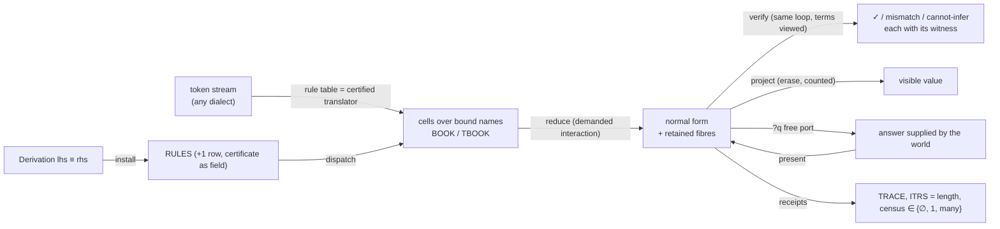
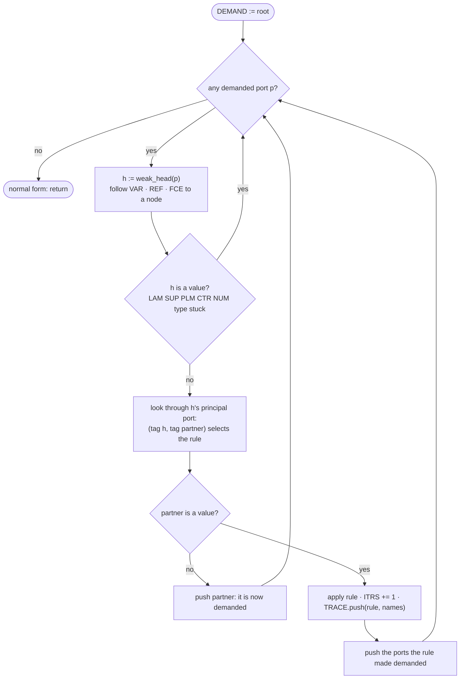
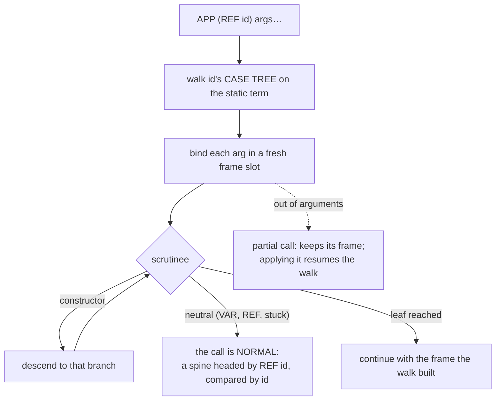

# pusc: the Parallel Univalent Superposition Computer, written once from the construction

## What this directory is, against everything else in the repository

- `formal/`, `fibre/`, `punaragamana/`: the mathematics, checked in Cubical
  Agda. The construction this directory implements. Nothing here is proved;
  every rule below names the checked term it applies.
- `collab/bend2-interactive-cubical/`: the previous chart. A patch on
  DKormann/Bend2 (a Haskell checker with a CCHM layer) emitting to HVM4 (a C
  interaction-calculus runtime) with the cubical reduction transcribed as a
  prelude. It proved the object runs on an interaction net; its audit
  (BOTTOM_UP.md, WIP_FULL_RUNTIME.md on the reverted branch) is why this
  directory exists. Its `.bend` programs are this directory's test suite.
- `machine/`: the earlier Haskell driver of the Agda corpus. Superseded by
  this directory; nothing here depends on it.
- `interactive/`, `research/`, `notes/`, `papers/`, `abstracts/`: readings
  and results, not code paths.

`pusc/` is the one program: Bend2's surface syntax lowered to cells over
bound dimension names, reduced by demanded interaction, checked by the same
reduction, asked questions through free ports, and extended by installing
proven rules. It replaces both the Haskell checker and the HVM4 runtime for
this language, and depends on neither.

This file is the program. Each section is written at the precision of the
code it becomes; the code replaces the pseudocode in place, section by
section, and the section is done when its tests pass. Each section opens
with the theorem it applies (statement, then the checked module) and draws
the mechanism. A line that needs a decision the mathematics does not make is
a defect upstream, not a choice here.

Surface syntax is Bend2's, unchanged. The test oracle for values is Bend2's
own normaliser (`bend f.bend` prints `main`'s normal form); GHC 9.12 is
present, so the baseline is regenerated from it. HVM4 is not in the loop;
the interaction count is this kernel's own metric and is compared only with
itself across schedules.

## The whole picture



One data structure (the heap of cells and frames), one algorithm (pop a
demanded active pair, dispatch on two tags, apply the rule, append the
receipt). Everything else in this file is that loop seen at one kind of
active pair.

## 0. The problem, in one sentence

Given a typed point $(A, a) : \Sigma_{A : \mathsf{Set}_\ell}\, A$ presented as a
cell complex over bound dimension names, reduce every demanded active pair
until none remains, retaining every fibre, and let the same reduction check
the point, answer questions on it, and install proven rules into itself.

**Theorem (the law, One §1).** For every $f : A \to B$,

$$
\mathrm{Graph}(f) := \sum_{a:A}\sum_{b:B}(f\,a \equiv b),\qquad
\mathrm{Graph}(f) \simeq A,\qquad
\mathrm{Graph}(f) \simeq \sum_{b:B}\mathrm{fib}_f(b),
$$

hence $\mathrm{law} : A \simeq \sum_{b:B}\mathrm{fib}_f(b)$ with
$\mathrm{present}(a) = (f\,a,\ a,\ \mathsf{refl})$, first projection $f$
definitionally, and $\mathrm{transport}(\mathrm{ua}\ \mathrm{law})\,a \equiv
\mathrm{present}(a)$ by $\mathrm{ua}\beta$.

**Theorem (uniqueness, One §2).** $\mathrm{isContr}(\mathrm{Lossless}\ f)$, so
$\mathrm{Machine}\,A \simeq (A \to A)$: a lossless machine on $A$ is a self-map.

**Theorem (the machine, One §14).** $\mathrm{decide} = \mathrm{present}$,
$\mathrm{verify}(b,(a,p)) = a$, and $\mathrm{verify}\circ\mathrm{decide} = \mathrm{id}$
by $\mathsf{refl}$. Finding and checking are the two projections of one
equivalence.

```
            contract Σb (f a ≡ b)                 reassociate, contract Σa (f a ≡ b)
   A   <════════════════════   Σa Σb (f a ≡ b)   ════════════════════>   Σb fib_f(b)
   a                            (a, f a, refl)                            (f a, (a, refl))
   ▲                                                                            │
   └──────────────────────────── verify ◂── decide ──────────────────────────────┘
        retention is free (a singleton)              the visible result is fst, the fibre is what it omits
```

## 1. Data: the heap of cells

**Theorem (labels are bound names).** HVM4 assigns a dup label once per
source binder and every unfolding reuses it; two instances of one definition
therefore share a name and annihilate illegitimately (`probes/label_capture`:
`two(Nat→Nat, λg. two(Nat,g), suc, 0)` is 4 in Core and `λa.#Suc{a}` on stock
HVM4). A dimension name is bound by the binder that introduces it, like a
lambda variable; capture is then impossible by construction.

    word    := u64
    Port    := word                       -- tag:8 | ext:24 | loc:32
    Loc     := u32 index into HEAP        -- HEAP : word[]
    Name    := (frame : Loc, index : u16) -- a BOUND dimension name (§2)
    Level   := u8                         -- universe level, forced tower (Universal)

```
   63      56 55                 32 31                          0
   ┌─────────┬─────────────────────┬─────────────────────────────┐
   │  tag    │        ext          │            loc              │   one Port
   │  8 bits │  arity/op/side/lvl  │  index of the node block    │
   └─────────┴─────────────────────┴─────────────────────────────┘
```

A node is a contiguous block of words at `loc`. `●` marks the principal
port: the one port through which the node interacts, and therefore the one
through which demand enters it. `○` are auxiliary ports.

```
   points and maps                     lines (one notion of dimension)

     ●                 ●                    ●                 ●                 ●
   ┌─┴──┐  slot     ┌──┴──┐             ┌───┴───┐         ┌───┴───┐        ┌───┴───┐
   │VAR │           │ LAM │ code,frame  │ SUP i │         │ PLM i │        │ FCE i │ side ε
   └────┘           └┬───┬┘             └─┬───┬─┘         └───┬───┘        └───┬───┘
                     ○   ○                ○   ○               ○                ○
                    var body           a(i=0) b(i=1)        body             target
                                                                        (a DUP is two FCE, ε=0 and ε=1,
   ┌──┴──┐        ┌──┴──┐                                                on one shared target)
   │ APP │        │ ERA │ ●              ┌─────┐  ┌─────┐  ┌─────┐  ┌────┐
   └┬───┬┘        └─────┘                │ I0  │  │ I1  │  │IVAR │  │ IOP│ op ○ ○   (canonical DNF)
    ●   ○                                └─────┘  └─────┘  └──┬──┘  └────┘
   fun arg                                                    name

   data, types (a type is a point of Set ℓ)          Kan (two primitives; comp is derived)

   ┌─────┐ ● fields ○…   ┌─────┐ ●   ┌─────┐ ●        ┌─────┐       ┌─────┐
   │ CTR │              │ NUM │gmp  │ OP2 │ ○ ○      │ TRP │ ● line, ○ r ○ s ○ x
   └─────┘              └─────┘     └─────┘          └─────┘
   SET ℓ · PI ○○ · SIG ○○ · PATH ○○○ · EQL ○○○      ┌─────┐
   NAT · BOOL · UNIT · EMPTY · LIST ○ · ENUM · NUMTY │ HCM │ ● faces (interval nf), ○ type ○ base
   HTY id ○…  ·  GLU ○ base [(φ,T,e)…]               └─────┘   stuck = a canonical cell
   HCTR id ○params ○fields ○dims   ·  HELIM ● x, ○ motive ○ branches
   GLUE ○ base [(φ,t)…] ○ a   ·   UNGLUE ● g

   judgments and the interaction                     names of definitions

   ┌─────┐                 ┌─────┐                    ┌─────┐
   │ CHK │ ○ type ● term   │ ASK │ q, k  (free port)  │ REF │ ● id   (a value: the NAME)
   └─────┘                 └─────┘                    └─────┘
```

The principal port of `TRP` faces its line, of `HCM` its faces, of `OP2` its
first operand then its second: a rule that needs two heads is two phases,
each an active pair.

    BOOK : StaticTerm[]      -- immutable lowered syntax per definition, de Bruijn levels
    TBOOK: StaticTerm[]      -- its checked type, same form (the @T of the PR)
    RULES: Rule[]            -- the interaction table; install appends (§8)
    TRACE: (rule, name, name)[]  -- receipts; ITRS = length (§6)

### 1.1 Every Bend2 term shape, and what it lowers to

The patched core's `Term` has these constructors and no others (vendored
`Core/Type.hs`). Each row is total; a shape with no row is refused.

    Var / Ref / Sub / Fix / Let         → VAR slot / REF id / (Sub: the term) / REF to itself (a knot, own names) / a descent slot
    Set                                  → SET ℓ  (levels forced by the tower; Bend2's Set:Set is not carried)
    Chk x T                              → CHK T x (kept; projects to x at run)
    Emp EmpM Uni One UniM Bit Bt0 Bt1 BitM
    Nat Zer Suc NatM Lst Nil Con LstM    → CTR cells for points; the M-forms are CASE nodes of static code (§4),
    Enu Sym EnuM Sig Tup SigM              never heap cells: a match on a neutral is a stuck spine
    Eql Rfl EqlM
    Num Val Op2 Op1                      → NUMTY / NUM (gmp) / OP2 / OP2 with a unit operand
    All Lam App                          → PI / LAM (closure) / APP
    Met                                  → refused (an unsolved hole is not a cell)
    Ind Frz                              → identity wrappers in TBOOK (type-level markers), no heap cell
    Loc Log Rwt Pri Pat Frk SupM Sup Era → Loc dropped; Log is an ASK; Rwt is checker-internal and projects to
                                           its term; Pri is a NUM primitive; Pat is flattened to CASE nodes
                                           before lowering (Flatten.hs); Frk is SUP at a fresh name; SupM is
                                           two FCE at the sup's name; Sup is SUP; Era is ERA
    Itv I0 I1 INot IAnd IOr              → the interval cells, canonical DNF
    Pth PLm PAp                          → PATH / PLM / APP-of-PLM (substitution of a dimension)
    Coe Trp                              → TRP (Trp with φ: TRP with a face constraint on its line)
    Ua                                   → the Glue line (notation; lowers to GLU with both coherences kept)
    HCm                                  → HCM
    Glu GlB UnG                          → GLU / GLUE / UNGLUE
    Prt Sys POut                         → cells with a face domain (a partial element)
    Rst InS OutS                         → SUB cells (A[φ ↦ u], inS, outS)
    Tru TIn TSq TRec Cir CBase CLoop CRec
    Quo QCl QEq QSq QRec                 → instances of the HIT schema below; nothing hardcoded
    HTy HCon HEl HRec                    → HTY / HCTR / HELIM (HRec = HELIM with a constant motive)

## 2. Frames, coordinates, descent

**Theorem (retention is free, One §1 `graph≃dom`).**
$\sum_{a:A}\sum_{b:B}(f\,a\equiv b)\simeq A$ by contracting the singleton
$\sum_{b}(f\,a\equiv b)$: a datum determined by $a$ is retained at $a$ at no cost.

**Theorem (descent, One §3).** A value $v : A\to V$ factors through $f$ iff it
is constant on every fibre of $f$; a projection cannot carry a distinction its
fibre identifies.

**Ledger C (exact descent).** C1: nothing coarser than the image of $q$ is
lawful for a computation factoring through $q$. C2: it is performed once per
point of that image, never more.

    Frame := { parent : Loc, depth : u16, dim : DimWord, slots : Coord[] }
    Coord := word                          -- a lazy term word; forced once, written back

```
   λx. λy. h( g(x) , y )          g(x) does not depend on y, so g(x) is a coordinate of the x-frame

   frame₀ (closed)   ──parent──  frame_x { x := ·, s₀ := g(x) }  ──parent──  frame_y { y := · }
                                                 ▲   ▲
                                 APP (λy…) y₁ ───┘   └──── APP (λy…) y₂        two applications at different y
                                                                                  read s₀: ONE point, forced once
```

A closure `LAM code frame` opens by extending a frame with one slot: β is
`frame' = frame ++ [arg]`, the lambda untouched. A variable is `VAR slot`;
forcing it reduces the slot to weak head and writes the head back, so a
determined datum is one point and every use is that point.

Descent (`book_descent`, once per definition at load): every maximal
subterm independent of a binder is bound just outside that binder as a let
slot of the enclosing frame; closed subterms at the top of the definition.
Work independent of `x` is a coordinate of the closure, computed at most
once for all applications (C2); nothing coarser is lawful (C1).

A frame carries `dim`: the faces already taken on its dimensions. A closure
taken on side ε of name `i` is the same closure with `dim` extended by
`i := ε`; its slots are projected lazily by the same face map.

A generic element (the checker's fresh variable for a binder) is a coordinate
of that binder's frame, never a counter name.

## 3. The algorithm: demanded interaction

**Theorem (random descent, `InteractionGeodesic`).** Let $\to$ be a step
relation with the one-step diamond: for all $s\to a$ and $s\to b$, either
$a\equiv b$ or there is $c$ with $a\to c$ and $b\to c$. Then any two complete
reductions from $s$ to a normal form have the same length:

$$
\mathrm{Trace}_n(s,t)\ \wedge\ \mathrm{Trace}_m(s,t)\ \wedge\ \mathrm{Normal}(t)\ \Rightarrow\ n\equiv m .
$$

**Theorem (a machine that asks, One §7).** $\mathrm{Run}(x)\simeq\mathrm{Answers}(x)$;
if every question is contractible, $\mathrm{isContr}(\mathrm{Run}\,x)$. A redex fires
when asked; a closed machine has nothing to ask.



Only active pairs fire; a node whose principal port faces a variable, a
name, or a stuck cell is its own normal form. Demand is monotone: a fibre is
retained, never dropped, so no step removes a demand already made. Two
demanded active pairs are disjoint (a node has one principal port), so the
diamond holds for this relation and every schedule reaches the demanded
normal form in the same number of interactions. That number is the cost of
the program.

```
   the diamond, drawn: two disjoint active pairs P and Q in one net

                 s = [ … P … Q … ]
                 /                \
        fire P  /                  \  fire Q
               ▼                    ▼
        [ … P' … Q … ]         [ … P … Q' … ]           P' still contains no port of Q, and Q none of P'
               \                    /
        fire Q  \                  /  fire P
                 ▼                ▼
                 c = [ … P' … Q' … ]                    the same net, the same two receipts
```

### 3.1 The face map (the whole DUP/SUP algebra)

**Theorem (one dimension).** A superposition `&i{a,b}` is a 1-cell in `i`
given by its faces; a path lambda `<i> t` is a 1-cell in `i` given by a
formula; a dup at `i` is the face map $i := \varepsilon$. Face maps in
different dimensions commute, $\delta_i\delta_j = \delta_j\delta_i$ (the cubical
identities), and a face map on a cell not mentioning its dimension is the
identity (One §1: retention of a determined datum is a singleton).

```
  FCE_i^ε ● ─── ● SUP_i{a, b}        ⟹      a  (ε=0)  or  b  (ε=1)                  annihilate · 0 words

  FCE_i^ε ● ─── ● PLM_i body          ⟹      body[i := ε]                             annihilate

  FCE_i^ε ● ─── ● SUP_j{a, b}  (j≠i)  ⟹      SUP_j{ FCE_i^ε a , FCE_i^ε b }           commute · δᵢδⱼ = δⱼδᵢ

  FCE_i^ε ● ─── ● PLM_j body   (j≠i)  ⟹      PLM_j (FCE_i^ε body)                     commute

  FCE_i^ε ● ─── ● LAM code fr         ⟹      LAM code (fr with dim += i:=ε)           push under the binder

  FCE_i^ε ● ─── ● CTR / type / NUM    ⟹      the cell itself, shared        if i ∉ names(cell)
                                              CTR{ FCE_i^ε f₁, … }           otherwise

  FCE_i^ε ● ─── ● IVAR i              ⟹      ε ;   IOP / INOT recompute the DNF (§3.4)

  FCE_i^ε ● ─── ○ stuck / VAR          stays: a normal form until the target moves
```

Two instances of one definition never meet at the same name, so the
annihilate case is exactly "branch projection in an already shared fibre"
(DIRECTIONAL_SYNTHESIS): it commutes only because the name names that fibre.

**Two kinds of name, one face map.** PUSC.md separates choice coordinates
from cubical dimensions; the audit says a superposition and a path lambda
are one notion. Both hold. An *interval* name admits the De Morgan terms
(`~i`, `i ∧ j`, `i ∨ j`) because its two faces are joined by a path; a
*choice* name admits only the endpoints and renaming, because its faces are
unrelated. The face map, commutation, sharing and push-under-binder are the
same for both. A superposition is a path lambda over a choice name (Bend's
`fork`), and `&i{a,b} @ (i ∧ j)` is refused while `(<i> t) @ (i ∧ j)` is
substitution.

**The cube category is the operation set on names.** Every operation the
kernel performs on a dimension is a morphism of the De Morgan cube category:
faces (`FCE`), degeneracies (a cell that does not mention the name),
connections (`∧`, `∨`), reversal (`~`), and permutations (renaming). Their
identities are the rules: $\delta_i\delta_j=\delta_j\delta_i$ is commute,
$\delta_i\sigma_i=\mathrm{id}$ is sharing, reversal flips the two faces.

**The braid reading (VeniBandha, CaturamsaBhramana, AnantaVeni; a reading
of checked terms, itself to be checked).** A 2-cell over names $i,j$ has four
corners $\mathsf{Bool}\times\mathsf{Bool}$. The substitution
$(i,j)\mapsto(\sim j,\ i)$ acts on corners as $(a,b)\mapsto(\neg b,a)$, which is
`caturaṃśa`: order four by `refl` (`catur-cakra`), its square the half-turn
$(\neg a,\neg b)$, and it descends to neither projection (§3 collision). The
crossing `veṇī (x,y) = (caturaṃśa y, x)` swaps two adjacent strands and
quarter-turns the one that passes over; Yang–Baxter holds by `refl` and the
generator has exact order eight. INTERACTION.md measured the runtime half: a
question with two answers is a `SUP`, the environment's answer is a face map,
two questions at independent names commute, two at one name are correlated.
So braid statistics is the permutation-with-reversal action on dimension
names, and it is available on the cell complex as renaming.

```
   the square over (i, j) and the quarter turn (i,j) ↦ (~j, i)

        (0,1) ───── (1,1)                 corner (a,b)  ↦  (¬b, a)
          │           │                   (1,1) → (0,1) → (0,0) → (1,0) → (1,1)     one orbit, order four
        (0,0) ───── (1,0)                 each projection sees only ¬ (order two): the turn lives on the pair
```

### 3.2 Application

```
  APP ● ─── ● LAM code fr    , arg x        ⟹   open: run code in fr ++ [x]                       β

  APP ● ─── ● SUP_i{f, g}    , arg x        ⟹   SUP_i{ APP f (FCE_i⁰ x) , APP g (FCE_i¹ x) }     the argument is
                                                                                                    face-mapped at i
  APP ● ─── ● PLM_i body     , arg r        ⟹   body[i := r]      (path application; r an interval term)

  APP ● ─── ● REF id         , args…        ⟹   the call step (§4)

  APP ● ─── ○ HCTR / stuck                   stuck spine (normal)
```

### 3.3 Erase, and retention

**Theorem (cost and inverse cannot coexist, One §4).** A grading
$\|\cdot\| : M\to\mathbb N$ with $\|e\|=0$ and $\|x\cdot y\|=\|x\|+\|y\|$ on a
structure with right inverses is identically zero. So cost lives in the
retained trace and transport is free; the only thing that costs is forgetting.

```
  ERA ● ─── ● node        ⟹   node removed; ERA onto each of its aux ports          counted, at the projection only
```

```
  and(x, y) with x ⇓ 0.   HVM4 (AND-ZER):                     pusc (retention):

     AND ●──● 0                 ⟹   0                          AND ●──● 0        ⟹   ( 0 , y , refl )
      ○                              y forgotten,               ○                       ▲     ▲
      y                              uncounted                  y                       │     └─ the fibre, retained free,
                                                                                        │        unevaluated (nothing asks)
   count depends on whether y's redexes                                                 └─ the visible result
   fired first: 1 or k+1  → not a property                   erased only when a consumer projects fst and
   of the program                                             forgets the fibre; that erasure is the counted loss
```

Erase fires only where a consumer projects a typed point and forgets its
fibre (printing a value, `fst`, a `Bool → Unit`). Inside a run nothing is
erased; an unreferenced fibre is retained and reclaimed at the projection,
where the erasures are counted as the cost of the loss.

### 3.4 The interval

**Theorem (Visranti, applied to the interval).** Normal forms are the complete
invariant: two interval terms are equal iff their canonical forms are
identical. The interval is the free De Morgan algebra on the names in scope
(CCHM site, `Adhisthana`): reversal `~`, meet `∧`, join `∨`, with
$i\wedge\neg i\neq 0$ and $i\vee\neg i\neq 1$ (no complement law).

    canonical form := an antichain of sorted cubes of literals  i / ~i
    (i ∧ j) ∨ (i ∧ ~j) ∨ j   ⇝   { {i,j}, {i,~j}, {j} }  ⇝ absorption ⇝ { {i,~j}, {j} }
    a face φ is TRUE iff its form is {∅} (I1), FALSE iff it is {} (I0), else undecided

### 3.5 Fill: transp and hcomp

**Theorem (two primitives, `Adhisthana`).** `hcomp` fills a box inside a fixed
type; `transp` moves along a line of types; `comp` is derived from both.
Regularity: a line constant in its dimension transports as the identity.
With bound names this is an occurs check: $k\notin\mathrm{names}(L\,k)$.

**Theorem ($\mathrm{ua}\beta$).** $\mathrm{transport}(\mathrm{ua}\ e)\,x\equiv e\,x$,
a reduction, not a proved path.

```
   TRP L r s x : L(s)                            HCM A [φ₁ ↦ u₁, …] base : A

        L(r) ─────── L ─────── L(s)                     u₁(i=1) ┌───── lid ─────┐ u₂(i=1)     ← the result
         x   ─────────────▶   TRP L r s x                      │               │
                                                          u₁ │    the box     │ u₂            tubes, one per face
   dispatch on the weak head of L at a fresh k:                  │               │
                                                                 └──── base ─────┘  at i = 0
   k ∉ names(L k)          → x                (regularity)
   PI A B                  → λy. TRP (B·k) r s (x (TRP A s r y))              a true face  φⱼ = I1 → the lid is uⱼ(1)
   SIG A B                 → (TRP A r s (fst x), TRP (B over the filled fst) r s (snd x))   all faces I0 → base
   PATH A a b              → the hcomp-conjugation square below              otherwise: the type decides
   GLU …                   → unglue at r, transport the base, correct along     PI/SIG/PATH/NAT/LIST: push in
                             the fibre centre on each face live at s, glue back  SET ℓ: GLU base [φ ↦ (T@1, transpEquiv T)]
   HTY id ps               → push into constructors, each field on its own line  GLU: CCHM composition
   SET ℓ                   → ua ⇒ f / g ; a composite ⇒ sequential               HTY: canonical, HCM stays
   SUP_j A B               → SUP_j{ TRP …A… (FCE_j⁰ x), TRP …B… (FCE_j¹ x) }      neutral: stuck (normal)
   NAT / BOOL / … (rigid)  → x
   stuck                   → TRP stays (normal)

   the PATH case: transport a path p : a ≡ b along a line of types is the square

              TRP a ─────────── TRP p ──────────── TRP b        (at s)
                ▲                                    ▲
             coe │           L, dimension k          │ coe
                 │                                    │
                 a ────────────── p ───────────────── b        (at r)
```

    comp := hcomp after transp;  hfill := the filler.  Neither is primitive.

**The rules as the checker has them (`Core/WHNF.hs`, transcribed once, not twice).**

    TRP L r s x   (whnfCoe)                                 HCM A [φ ↦ u] base   (whnfHCm)
    ─────────────────────────────────────────────────────    ────────────────────────────────────────────────────
    r ≡ s                        → x                          some φ ≡ I1          → u @ I1
    k ∉ names(L k)               → x            (occurs)      all φ ≡ I0           → base
    PI A B   → λy. TRP (λi. B i (TRP A s i y)) r s            SET ℓ  → GLU base [φ ↦ (u@1, transpEquiv u)]
                        (x (TRP A s r y))                     PI A B → λv. HCM (B v) [φ ↦ <j> u@j v] (base v)
    SIG A B  → (TRP A r s a,                                  PATH A e0 e1 → <j> HCM (A j)
                TRP (λi. B i (TRP A r i a)) r s b)                         ([φ ↦ <k> (u@k)@j] ++ [~j ↦ e0, j ↦ e1])
    PATH A u v → <j> HCM (A s j)                                           (base @ j)
                 [~j ↦ <k> TRP (A · 0) (at k) s (u (at k)),   SIG A B → ( HCM A [φ ↦ fst∘u] (fst base),
                   j ↦ <k> TRP (A · 1) (at k) s (v (at k))]                comp (λj. B (hfill A [φ↦fst∘u] (fst base) j))
                 (TRP (λi. A i j) r s (x @ j))                                  [φ ↦ snd∘u] (snd base) )
                 where at k = (~k ∧ r) ∨ (k ∧ s)               NAT/LIST → cap and every tube headed by one
    SUP_j A B → SUP_j{TRP …A… (FCE_j⁰ x), TRP …B… (FCE_j¹ x)}             constructor ⇒ that constructor of the
    GLU (Glue A [φ ↦ (T,e)])                                              composites of its arguments; else stuck
      → a_r  := t on no face at r; e t on a true face; unglue t else   BOOL/ENUM/UNIT → the common nullary ctor
        a1'  := TRP (λi. A i) r s a_r          (forced strictly)      GLU A [ψ ↦ (T,e)]
        t1   := e⁻¹ a1'  on each face live at s                          → glue [ψ ↦ HCM T [φ↦u] base]
        a1   := HCM (A s) [ψ ↦ <j> (sec e t1) @ ~j] a1'                          (HCM A ([φ ↦ unglue∘u] ++
        result glue [ψ ↦ t1] a1                                                    [ψ ↦ <k> e (hfill T [φ↦u] base k)])
    HTY id ps → push into constructors, field m along                          (unglue base))
                its own line given the fields before it;         HTY → canonical, stays
                an HCM cell of the HIT commutes with TRP          neutral → stuck
    ua line   → f (0→1) / g (1→0); composite → sequential
    rigid (NAT, BOOL, UNIT, EMPTY, ENUM, NUMTY, SET, Itv) → x

    transpEquiv u := TRP (λk. Equiv (u@1) (u@~k)) 0 1 (idEquiv (u@1))       pathToEquiv of the reversed tube,
                                                                              computed by TRP through Σ/Π/PATH

**Well-formedness of a system (`Core/Check.hs`, the `HCm` case).** Each tube
`u` on face `φ` is a `j`-line in `A` whose `j = 0` end agrees with the base
on every cell of `φ`'s DNF, with the tube, the base and the type all
restricted to the cell before comparison (a face `~i` fixes `i := 0`, so the
comparison is made after substitution, never at a symbolic `i`). On every
cell of `φ ∧ ψ` two tubes agree, so "any true face wins" is order-independent.
In the kernel these are the conditions under which `HCM` is a cell at all;
the checker states them and the reduction relies on them.

`ua e` is the Glue line `<i> GLU B [(~i, A, e), (i, B, id)]`; it is notation
and lowers to GLU, so there is one univalence (`uaagree.bend` shows the two
the PR carries are not definitionally equal).

## 4. The static book and the call step

**Theorem (Visranti).** Derivability is decided by two normalisations and a
`refl`; `nf` is defined by exactly the clauses the rules perform. A stuck
call's normal form is canonical and finite on open terms, which is what makes
conversion decidable.



δ (unfolding) is not counted: definitional unfolding is `refl`, transport is
free (One §4). A partial call keeps the frame its walk built; applying it
resumes the walk, so work depending only on early arguments is done once.

**The HIT schema, as cells.** No HIT-specific cell exists. A declaration
`(hit T (p…) (c : TYPE)…)` interns `T` as a type constructor with `nparams`
and stores each constructor's closed type as the definition `c/type`. A point
constructor is a CTR; a path constructor at intervals is an APP spine over a
CTR. Its boundary is not a table: it is read from the type (`hit_ctor_type`
steps the Pi chain through the parameters and fields and the Path chain
through the intervals applied so far; the first literal interval picks the
endpoint of the Path cell reached). The eliminator is a CASE with a motive,
HELIM [scrut, code, frame, motive]; with scrutinee 0 it is a function cell,
so `<j> helim (u@j)` needs no static code; the recursor is HELIM with motive
ERA. Reflection cells CFIELDS/CWITH read a constructor's fields as a list and
rebuild it, which lets `trp/hit` transport fields along their dependent type
lines in the prelude (`whnfCoe`, HTy case). Substitution commutes with
everything, so a face passes into a stuck spine, a CASE, a HELIM, a TRP and an
HCM (the frame records it; the scrutinee and motive carry it).

**The HIT eliminator (`whnfHEl`).**

    HELIM P bs (HCTR c fields dims)   → (bs[c] fields) applied to the dims
    HELIM P bs (SUP_i a b)            → SUP_i{ HELIM (FCE_i⁰ P) (FCE_i⁰ bs) a , HELIM (FCE_i¹ P) (FCE_i¹ bs) b }
    HELIM P bs (HCM T [φ ↦ u] base)   → comp (λj. P (hfill T [φ↦u] base j)) [φ ↦ <j> HELIM P bs (u@j)] (HELIM P bs base)
    HELIM P bs neutral                → stuck
    HREC (no motive) on an HCM cell   → stuck: a composite is a canonical cell of a HIT
    HCTR c fields (…, I0/I1, …)       → the declared endpoint, later dims applied to it

## 5. The host: the typed point, and the machine that asks

**Theorem (`Visvarupa`, HoTT 4.8.3).** $\big(\sum_{E}\, E\to A\big)\simeq(A\to\mathsf{Set}_\ell)$,
the `rightInv` being `ua`; the comparison map is the canonical one by
`refl`; a family is invisible over its base iff every fibre is contractible
(and the statement is about the projection, since a total space can be
equivalent to the base with one fibre empty and one crowded); a tower of
families flattens to one by a computed `flatten`; and `fib π X` lives one
level above `X`, so the classifier is an equivalence across levels. That
size is why the tower is forced and why a cell's type is a cell one level up.

    lower(file):
      read the surface through its rule table (§5.1)
      elaborate bare HIT constructor parameters from the goal (Core.Check.elabFills)
      for each definition: BOOK[id] := static term, TBOOK[id] := static type
      root := CTR Pair [TBOOK[main], BOOK[main]]        -- (A, a) : Σ A. A

```
        @main = #Pair{ @Tmain , @Dmain }          the entry is a point of Σ(A : Set ℓ). A
                        ▲         ▲
                        │         └── the term, a cell
                        └──────────── its checked type, a cell of Set ℓ (the same emitter, the same heap)
```

Nothing the checker needs is erased: annotations stay as CHK, HIT
parameters stay, enum symbols stay as `#s_name`, numeric kinds, equality
endpoints, both ua coherences stay. Unsupported operations are refused
(`refuse, never miscompile`).

**Theorem (the coalgebra, `Fibre.Samvada`).**

$$
\mathrm{ISC}\,w\ \simeq\ \prod_{q : Q\,w}\ \sum_{w' : W}\ \sum_{o : O\,w\,q\,w'}\ \big(E\,w\,q\,w'\,o\times\mathrm{ISC}\,w'\big)
$$

$Q$ is what may be asked at a state, $O$ what is observed, $E$ the
proof-relevant event datum, and the continuation is guarded. A demand is a
strategy $\sigma : \prod_w Q\,w$; a finite demand of length $n$ asks $n$
questions and forces nothing else. The orbit is the trivial-query case
(`det-observe`), every strategy agrees there (`det-strategy-independent`),
and `counter` is an interaction where two strategies disagree at the first
step, so the generalisation is proper. In the kernel: `Q` is the free ports
of the current net, `react` is one round of the loop, and `E` is the receipt.

```mermaid
sequenceDiagram
  participant W as world
  participant K as pusc
  W->>K: file
  K->>K: reduce(root) → typed point (A, a); heap kept
  loop each question
    W->>K: q  (a term, lowered with its own bound names)
    K->>K: root := reduce(APP present [root, q])   One §1 present, §6 carried
    K-->>W: (Σ b:B. fib_q b, (q a, (a, refl))) and ITRS for this question
  end
  Note over K: a free port ASK q k is the general form: reduction stalls at it,<br/>the world supplies a section of q, k continues (One §7)
```

## 5.1 The surface: no metarules are prior; a syntax is a certified translator

README §49: the network does not require one universal internal language, it
requires certified translators. A syntax is a map from token streams to
cells; by One §1 the stream is $\sum_{\text{meaning}}\mathrm{fibre}$, so parsing
is `present` and generation its visible projection, and by §14 they are two
projections of one equivalence. A grammar is therefore a rule table whose
rules carry certificates ("this stream pattern denotes this cell", Alopa's
form), and installing a grammar is the same declaration as installing any
rule (§8). Pāṇini derives form from meaning through ordered rules: that is
$f$; parsing is its fibre. Nothing is fixed before the association.

**Theorem (the tower, `TheTower`).** Five levels, each strictly finer, each
separation a checked term:

$$
\text{cardinality}\ <\ \text{denotation}\ <\ \text{rule set}\ <\ \text{ordered text}\ <\ \text{alphabet order}.
$$

Univalence sits at the level of denotation and is blind to everything above
it by construction. Cost lives at the level of the ordered text.

**Theorem (Laghava underdetermines).** Brevity selects a level set, not a
point: two presentations of one meaning attain the same minimal size, so no
presentation is privileged and diversity of dialects is forced.

**Criterion (sign birth, Hieroglyphics II).**
$\text{चिह्नजन्म} \iff \text{संरचनासंपीडनलाभ} > 0$: a new form is warranted iff it
compresses the rule text by more than it costs.

```
   the tower, and where each thing lives

   level 5  alphabet order       Śivasūtras · pratyāhāra names an interval in two symbols (marker count forced by the antichain)
   level 4  ordered text         the program · anuvṛtti (context inherited = descent lets) · apavāda (text-ordered match)
   level 3  rule set             the grammar as RULES · asiddhatva (a later rule blind to an earlier collapse = a retained dup)
   level 2  denotation           cells up to ua · univalence lives here and sees nothing above
   level 1  cardinality          the census {∅, 1, many}
```

What is forced, and by what:

    the line encodes a graph    a wire crossing the linear order needs a device (name, position,
                                stack); which order is data and which is gauge is the fibre of
                                linearisation (Krama, PairwiseCommutationGivesEveryOrder)
    determinacy or a line       the stream determines the cell up to gauge, or the ambiguity is
                                a SUP at a bound name and later context is the face map that
                                decides it (a stuck composite is "the sentence is not finished")
    the alphabet is an order    a class named as an interval costs two symbols, the marker count
                                is forced by the antichain (Sivasutra, Pratyahara)
    the reader is a term        quotation composes with evaluation up to ≃, never ≡; never
                                collapse the codes (TranscriptDescent, Hieroglyphics II)
    dialects are charts         two presentations of one complex, related by a SUPPLIED `ua`
                                (NONHUMAN_COMMUNICATION: an equivalence is never found in the
                                signal); coherence is that `ua`, diversity is forced (Laghava)

```
   parsing is reduction: token cells meet rule cells at active pairs

   tokens:   [ λ ] [ x ] [ . ] [ f ] [ ( ] [ x ] [ , ] [ x ] [ ) ]        each a CTR cell in a list
   rule:     "λ NAME . TERM"  ↦  LAM   (certificate: this pattern denotes this cell)
             ● ─── ●  the rule's principal port meets the token list's head
   result:   LAM(x, APP(APP f x) x)  with x a coordinate shared by descent      the parse tree is the TRACE

   ambiguity:   [ a ] [ - ] [ b ] [ - ] [ c ]   two rules fire  ⇒  SUP_i{ (a-b)-c , a-(b-c) }
                later context (the next token, a type) is FCE_i^ε: it decides the face

   translation:  dialect₁ ──ua e──▶ dialect₂      e supplied (proved or certified), never inferred from the stream;
                 the translator is e itself, not a program
```

Consequence for the code: the parser is not a program beside the kernel.
What is fixed is the reader for the kernel's own text, the heap serialised
(the identity chart, not a choice). Bend2's grammar is the first dialect: a
rule table written in that text and loaded by install. A second dialect is
another table with a `ua` to the first. Universality is this: any
presentation as rules, any translation as a supplied equivalence; the only
stream it cannot host is one with no determined map, which is not a syntax.

The kernel's own text has the forms the construction forces (named binders
with sharing by descent; `<i> t` and `&i{a,b}` binding one dimension;
`name : A = a`; `lhs = rhs by d`; `?q`; three-valued verdicts; implicitness
iff the argument's fibre is contractible; systems `[φ ↦ u]`; text-ordered
match), but these are properties of the identity chart, not conventions
imposed on any dialect.

## 6. Receipts and the census

**Theorem (Durnaya).** Every $V : \mathsf{Type}\to\mathbf 2$ merges two of
$\bot$, $\mathbf 1$, $\mathbf 2$; the fibre verdict is three-valued or it is a
durnaya. **Theorem (h-level of the receipt).** If the event datum is a
proposition the process space is contractible (deterministic); if it is a
derivation it is not (generative).

**Theorem (initiality, `AdiBija`).** A receiver is a carrier
$\mathrm{Motion}: \mathrm{Tm}\to\mathrm{Tm}\to\mathsf{Type}$ with $\varepsilon$ for
rest and $\triangleleft$ for one step then the rest; `fold` exists for every
receiver and is unique. Soundness, length and every evaluator integral are
this fold at a receiver. The census is a fold over `TRACE`.

    on every rule: ITRS += 1; TRACE.push(rule, name₁, name₂)
    census(f, b) over a fibre: walk the retained fibre
      रिक्तम् (empty) | एकम् (one) | बहु (many)          -- three-valued, never two

```
   TRACE  ▶ (β, –, –) (FCE, i, –) (annihilate, i, i) (commute, i, j) (TRP·PI, k, –) …    ITRS = its length
            └──────────────────── the derivation; a fold over it is any analyzer (AdiBija: every reading is a fold)
```

## 7. Checking is `verify`, on the same loop

**Theorem (One §14).** $\mathrm{verify}\circ\mathrm{decide}=\mathrm{id}$ by `refl`, and
there is no other completion in which a gap could live
(`no-other-completion`). Checking is the other projection of the same
presentation, not a second program.

```
              decide = present                    verify = fst ∘ snd
       a ─────────────────────▶ (f a, (a, refl)) ──────────────────▶ a           refl
       │                             │
       │ run                         │ check: the type A is EVALUATED (a cell); the term a is VIEWED (static)
       ▼                             ▼
     value                    ✓ | mismatch (the residual cell IS the error) | cannot-infer
```

    check(id):
      t := BOOK[id] viewed (never evaluated); A := reduce(TBOOK[id])
      infer/check structurally on the static term with a context of
      coordinates (each binder reflects one generic element, η-long at its
      type: Π → λ of the reflected application, Σ → pair of reflected
      projections, PATH → a line whose faces are the endpoints)
      conversion(u, v) := u and v are the same coordinate, or their weak
        heads agree and their fields convert (canonical points; no primitive
        hides the decision)
      a mismatch is a residual cell: the non-fillable boundary IS the error
      result ∈ { ✓, mismatch, cannot-infer }, each carrying its witness

**As cells (`verify.c`).** A binder's coordinate is a fresh atom whose slot
holds `REFLECT [atom, T]`: the atom made η-long at its type when read (Π → a
λ over the reflected application, Σ → the pair of reflected projections, Path
→ `<i> PAP [p, i, a, b]`, Interval → a dimension name). `PAP` is path
application that keeps the boundary: a literal `i` selects an endpoint, a
symbolic one stays a cell a later face decides, because a reduction that
forgot the boundary would not commute with substitution (the diamond of §3).
A typed definition unfolds, in check mode, to `REFLECT [body, type]`, so
`f x @ i0` reads its endpoint from `f`'s declared type as Core's `epNormCtx`
does. A match rewrites the goal by the substitution cell at the scrutinee's
atom (`FCE` side 2 with a coordinate as name); an equation match rewrites
semantically through the same cell with conversion as the hook. A face
restricts the frame (`RESTRICT`) and the goal (`FCE`), one literal per cell
of the DNF. Conversion is `eq` on cells: whnf both, η for λ/`<i>`/pairs,
constructors field-wise, intervals by canonical form, two stuck eliminators
by same code and convertible frames, else branch-wise on fresh fields with a
depth bound. Regularity is decided by normalisation: `occurs` reduces the
cell as it inspects it (a line constant after reduction is constant), which
is also what makes `J` compute on `refl`.

Every ✓/✗ agrees with Bend2's checker over the corpus including every
`*_mustfail` (3862 of 3862). The recorded Core deviations, where the rules
differ and a disagreement would be allowed and named: a match on a
non-variable scrutinee rewrites the goal but not the context; a
definition unfolds under conversion by its head first (two applications of
one definition with convertible arguments are equal without unfolding, and
the branch-wise comparison of two different stuck eliminators is bounded).

## 8. Install

**Theorem (abstract 43).** $\mathrm{NativeOperation}\simeq\sum_{\text{certificate}}\text{gauge}$,
and $\mathrm{extract}(\mathrm{install}\ d)\equiv d$ by `refl`: install is a section of
extract. **Theorem (abstract 54).** The locus $\sum_{t}(t\equiv\mathrm{lhs})$ of an
installed rule is a contractible cone; install is one Postnikov step.
**Alopa.** A rule is two terms carrying their certificate as a field, so the
run's soundness is its type: $\forall n\,\rho\,t.\ \mathrm{eval}\,\rho\,(\mathrm{normalize}\,n\,rs\,t)\equiv\mathrm{eval}\,\rho\,t$.

The record, as written (`Kernel/ControlledGrammar`):

    NativeOperation := { source target : Tm ;  checked : Derivation source target ;
                         Control : Tm → Type ;  control-sound : Control t → t ≡ source }
    apply t c          = target
    apply-checked t c  : Derivation t (apply t c)        -- by subst along control-sound
    install d          = { source lhs; target rhs; checked d; Control t := (t ≡ lhs); control-sound c := c }

Installing a theorem does not make it globally applicable: its control is
exactly evidence that the current term is its certified source. `advance`
maps enabled futures to checked futures without quotienting, sorting or
deduplicating, and `advance-preserves-branch-count` is the no-premature-
collapse law. `RewriteCertificate` also has `InductionCertificate`, so a rule
may carry an induction (hypothesis steps) as its certificate.

    install(d : Derivation lhs rhs):
      RULES.push({ lhs pattern, rhs, certificate := d })
    an installed rule is dispatched like any other; its cost is a row.

```
   Derivation lhs ≡ rhs  ──install──▶  RULES[n] = { lhs, rhs, d }  ──extract──▶  d      (refl)
                                            │
                                            └── dispatch: a cell matching lhs meets the rule at its principal port
```

## 9. Parallelism

**Theorem (`Fibre.Krama`).** For steps $f,g$ with
$\mathrm{Commutes} := \prod_a f(g\,a)\equiv g(f\,a)$, every interleaving word $w$
satisfies $\mathrm{apply}\,w\,a\equiv f^{\#_L w}(g^{\#_R w}(a))$: the order is
not in the answer, only the counts are (the Mazurkiewicz quotient). Its
failure is retained, not silenced: `suc` and `double` do not commute and two
words with equal counts compute 2 and 1.

Interactions are local (One §8: depth is time, a word's length is its light
cone). Two demanded active pairs commute in Krama's sense by disjointness,
so the redex bag is the only scheduler; any interleaving gives the same
normal form in the same count (§3). Sequential execution is one schedule.
Test: ITRS invariant across schedules.

## 10. Tests and proofs (what decides)

1. Values: every corpus `.bend` with a `main`, value equal to Bend2's
   normal form. Superposed results compared branch by branch.
2. Squares: one `.bend` per rule stating its equation definitionally
   (`kan.bend`, `hit_hcomp.bend`, `supline.bend`, `interval.bend` are the
   existing shape); the file passes only if the rule fires.
3. Must-fails: every registered probe rejected, nothing else.
4. Capture probes: `two∘two` = 4, the triple = 16, cap4 = 4.
5. Sharing regimes (ratios, not absolutes): a transport consumed k times
   costs one transport plus k small increments; one line over N values is
   sublinear in N; N different lines are a constant factor over separate.
6. Checker differential per definition against Bend2's checker.
7. Schedules: ITRS identical under the sequential and the parallel bag.
8. Proofs: each rule's commuting square and cost recurrence is a corpus
   lemma named at the rule (the runtime-correspondence method of
   DIRECTIONAL_SYNTHESIS); the machine's soundness under install is Alopa's
   form, a certificate carried as a field.

## 11. Files

Status. Written and green: 34 kernel checks (`pusc/test.sh`) and the whole
Bend2 corpus (`pusc/bendtest.sh`: every `.bend` under
`collab/bend2-interactive-cubical` and `port/` with a `main`, 124 programs,
value identical to Bend2's own normaliser branch by branch; 12 skipped because
the oracle itself does not check or run them). The checker (`verify.c`, §7)
is compared verdict by verdict with Bend2's checker over the same corpus
including the must-fail probes (`pusc/checktest.sh`, `--to-pusc-unchecked`):
every verdict agrees, 3862 definitions over 150 files. The recorded Core
deviations of §7 are the only places the rules differ, and no corpus
definition falls on them. The Bend dialect is realised as
§5.1 says a dialect must be: a certified translator. Bend2's checker is the
translator and the check is the certificate: `bend FILE --to-pusc`
(`src/Target/Pusc.hs` in `cubical-paths.patch`) writes the checked book as
cells of the kernel's own text, one typed point `(def b/NAME : TYPE = TERM)`
per definition and one `(hit …)` per declared HIT, and `pusc bend FILE` runs
it and presents the value as Bend2 does (collapse order included). No rule of
the language lives in the translator: the emitter is a table of names.

Computes: the face-map algebra without capture, laziness, the De Morgan
interval, regularity, transp/hcomp on Pi, Sig, Path, Nat/Bool/List,
superposed lines and global labels, Glue with `uaβ`, Bend2's 6-ary `ua` as a
universe path, composites in the universe (hcomp in Set through transpEquiv),
general dimension substitution, the HIT schema (endpoints from types,
eliminator, composites, transport along a moving parameter, the checker's
three built-in HITs as instances), fixed points, the four numeric kinds,
partial elements and restriction types. `pusc interact FILE` is the machine that
asks (§5): the entry is the point, each line of the world is a question (a
term) the point presents itself along, and a reduction that stalls at an ASK
cell prints the question and resumes on the world's answer. Not yet: erase at
projection as a counted rule, the tokens-meet-rules parser (the translator is
Bend2's parser for now), install.

    pusc/cell.h      157   the word layout, tags, Name, Frame, Rule, accessors, CtorInfo
    pusc/cell.c     1134   §§1–4, 6, 8, 9: heap, frames+descent, loop+dispatch, face map, application,
                           interval DNF, transp+hcomp dispatch, HIT schema, numbers, printers, collapse
    pusc/prelude.pusc 147  the Kan rows, Glue, transpEquiv, the HIT rows, as data
    pusc/bend.pusc    38   the Bend dialect's rows: transp, ua, the three built-in HITs
    pusc/read.c      257   §5: the reader for the kernel's own text (the identity chart)
    pusc/main.c       70   run | bend | check | interact
    pusc/test.sh      46   the kernel checks
    pusc/bendtest.sh  25   §10.1 over the corpus against Bend2's normaliser
    pusc/checktest.sh 30   §10.6 the checker differential against Bend2's checker
    pusc/verify.c    700   §7: the checker as the other projection of the same loop
    Bend2 src/Target/Pusc.hs  ~200   the checked book as cells (in cubical-paths.patch)
    pusc/book.c     ~150   install (not yet)
